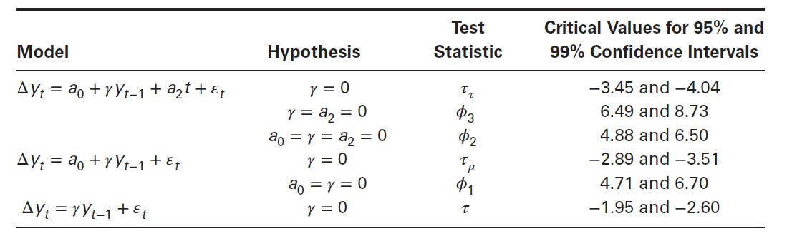
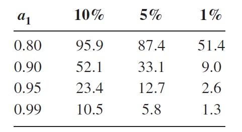
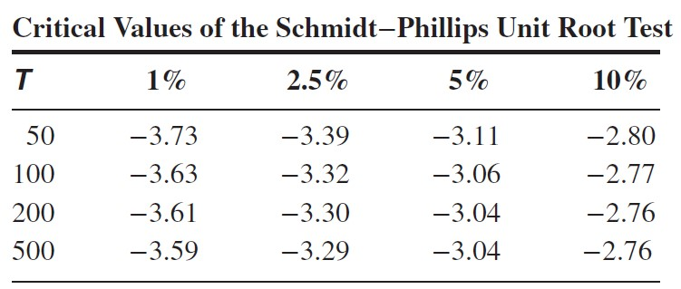

```{r, results='hide', message=FALSE, warning=FALSE}
library(tidyverse)
library(gridExtra) # Arrangning ggplots
library(readr)     # Loading data
library(readxl)    # Loading excel
library(forecast)  
library(dynlm)     # Lagged linear models
library(urca)      # Dickey-Fuller test
library(car)       # Linear hyphothesis testing
library(tseries)   # adf-test

setwd('D:/Users/Vladimir/Desktop/Github/usdrub/code')
```
### 1. Тренд и его модели.


В общем виде, временной ряд с трендом может быть описан следующим образом:
$$ y_t = trend + stationary\ component + noise$$
Основная особенность тренда - это его перманентный эффект на траекторию временного ряда. При этом, временной ряд с трендом может не демонстрировать четко выраженной направленности и не стремиться, например, к некому долгосрочному среднему значению (unit root в качестве примера).

Виды тренда:

1. **Trend stationary** (процесс состоит из тренда и стационарной компоненты, поэтому всегда будет возвращаться к своему долгосрочному значению, при удалении тренда остатки будут представлять собой стационарный временной ряд):
$$y_t = y_0 + \alpha_0t + A(L)\varepsilon_t$$
Пример: $y_t = 0.5t + \varepsilon_t$

2. **Stochastic Trend** (отличие от первого в том, что случайные приращения накапливаются, и поэтому в итоге ряд может унести в любую сторону от стартовой точки; о сумме случайных возмущений можно думать как о стохастическом константном коэффициенте):
$$y_t = y_0 + \alpha_0t + \sum_{i=1}^t \varepsilon_t \\
\bigtriangleup y_t = \alpha_0 + \varepsilon_t\\
var(y_t) = var(\varepsilon_{t-1} + \varepsilon_{t-2} + ...) = t\sigma^2$$
Если убрать из этого уравнения компоненту для детерминистического тренда, получим random walk. Полезно также посчитать ковариацию для двух наблюдений случайного блуждания:
$$E[(y_t − y_0)(y_{t−s} − y_0)] = E[(\varepsilon_t + \varepsilon_t−1 + ... + \varepsilon_1)(\varepsilon_{t−s} + \varepsilon_{t−s−1} + ... + \varepsilon_1)] = \\
E[(\varepsilon_{t−s})^2 + (\varepsilon_{t−s−1})^2 + · · · + (\varepsilon_1)^2]
= (t − s)\sigma^2$$
Итак, в отличие от trend stationary ряда, мы получили, что ковариация двух элементов случайного блуждания зависит от времени. Тогда мы можем посчитать коэффициент корреляции:
$$\rho_s = \frac{(t-s)}{\sqrt{(t-s)t}}=\sqrt{\frac{t-s}{t}}$$
Какую динамику автокорреляции мы ожидаем увидеть, если $t$ велико?
Для находящихся рядом величин а/к будет близка к единице, но по мере роста $s$ автокорреляция будет убывать довольно медленно от единицы из-за корня.
Теперь рассмотрим различные варианты random walk и сравним его с trend stationary рядом:

```{r}
y_0 <- 0 
eps <- rnorm(100, mean=0, sd=1)
nu <- rnorm(100, mean=0, sd=1)
a_0 <- 0.5

rw <- vector(length=101, mode='list')
rw[[1]] <- y_0

rw_drift <- vector(length = 101, mode = 'list')
rw_drift[[1]] <- y_0

rw_noise <- vector(length = 100, mode = 'list')
rw_noise <- cumsum(eps)+nu
rw_noise[[1]] <- y_0

trend_stat <- vector(length = 101, mode = 'list')
trend_stat[[1]] <- y_0


for (i in 2:101){
  rw[[i]] <- rw[[i-1]] + eps[[i-1]]
  rw_drift[[i]] <- rw_drift[[i-1]] + eps[[i-1]] + a_0
  trend_stat[[i]] <- a_0*(i-1) + eps[[i-1]]
}

par(mfrow=c(2,2))
plot(1:101, rw, 
              type='l', xlab='time', main='Random Walk')
plot(1:101, rw_drift, 
              type='l', xlab='time', main='Random Walk + Drift')
plot(1:100, rw_noise, 
              type='l', xlab='time', main='Random Walk + Noise')
plot(1:101, trend_stat, 
              type='l', xlab='time', main='Trend Stationary')
```

Можно выделить следующие спецификации stochastic trend (точнее, random walk):

+ **pure random walk** $y_t = y_{t-1}+\varepsilon_t$
+ **random walk plus drift** $y_t  = y_{t-1}+\alpha_0+\varepsilon_t$
+ **random walk plus noise** $y_t = z_{t-1}+[\alpha_0]+\nu_t,\ z_t = z_{t-1} + \varepsilon_t,\ \bigtriangleup y_t = \varepsilon_t + \bigtriangleup \nu_t$
По-другому можно описать процесс следующим образом:
$$y_t = \sum_{i=1}^{t}\varepsilon_i + \nu_t$$
Для третьего случая прикол в том, что внутри переменной уровня $z_t$ накапливаются только ошибки $\varepsilon_t$, а другая случайная ошибка $\nu_t$ каждый раз "забывается" и добавляется новая.

[Неплохая ссылка, пусть тут будет](http://zoonek2.free.fr/UNIX/48_R/15.html).

Посчитаем коэффициент автокорреляции для random walk plus noise:
$$
var(y_t) = t\sigma^2 + \sigma^2_{\nu}\\
cov(y_t, y_{t-s}) = E(y_t - y_0)(y_{t-s} - y_0) = E(\varepsilon_1
+\varepsilon_2 + ... + \varepsilon_t + \nu_t)(\varepsilon_1
+\varepsilon_2 + ... + \varepsilon_{t-s}+\nu_{t-s}) = \\
(t-s)\sigma^2 \\
corr(y_t, y_{t-s}) = \frac{(t-s)\sigma^2}{\sqrt{(t\sigma^2+\sigma^2_{\nu})
((t-s)\sigma^2+\sigma^2_{\nu})}}
$$
Отсюда видно, что для random walk plus noise коэффициент а/к будет всегда меньше, чем для pure random walk, и это логично - мы внесли в модель дополнительный шум.

Можно по-разному комбинировать модели для случайного блуждания, например, создать trend plus noise model: 
$$
y_t = y_0 + \sum_{i=1}^t \varepsilon_i + a_0 t + \nu_t
$$
Или general trend plus irregular component model:
$$
y_t = y_0 + \sum_{i=1}^t \varepsilon_i + a_0 t + A(L)\nu_t
$$

### 2. Удаление тренда из данных.

Соответственно, есть две процедуры борьбы с трендом:

- *detrending*  - для борьбы с детерминистическим трендом
- *differencing* - для борьбы со стохастическим трендом

#### 2.1 Differencing

Рассмотрим по порядку все версии random walk:

+ pure random walk. Ну тут все понятно, дифференцирование возвращает стационарный ряд перманентных шоков
+ random walk plus drift. Аналогично, после дифференцирования все будет хорошо:
$$
y_t = y_0+\sum_{i=1}^{t}\varepsilon_i + a_0t\\
E(\bigtriangleup y_t) = E(a_0+\varepsilon_t) = a_0\\
var(\bigtriangleup y_t) = \sigma^2_{\varepsilon}\\
cov(\bigtriangleup y_t, \bigtriangleup y_{t-s}) = E(...-a_0)(...-a_0) = 0
$$
+ random walk plus noise model. Тут несколько хитрее:
$$
\bigtriangleup y_t=\varepsilon_t+\bigtriangleup \nu_t\\
E(\bigtriangleup y_t) = E(\varepsilon_t+\bigtriangleup \nu_t) = 0\\
Var(\bigtriangleup y_t) = \sigma^2_{\varepsilon}+2\sigma^2_{\nu}\\
cov(\bigtriangleup y_t, y_{t-1}) = E(\varepsilon_t+\nu_t-\nu_{t-1})
(\varepsilon_{t_1}+\nu_{t-1}-\nu_{t-2}) = -\sigma^2_{\nu}, \\
=0\ при\ s>1\\
corr(\bigtriangleup y_t, \bigtriangleup y_{t-1}) = \frac{-\sigma^2_{\nu}}{\sigma^2_{\varepsilon}+2\sigma^2_{\nu}},\ то\ есть\\
-0.5 < \rho_1 < 0
$$

Мы можем прийти к выводу, что первая разность ведет себя в точности как $MA(1)$ процесс, а значит, вся модель описывается спецификацией $ARIMA(0, 1, 1)$, то есть random walk plus noise представим в таком виде.

Сделаем более общий вывод: $d$-я разность процесса с $d$ единичными корнями стационарна, такой процесс интегрирован степени $d$ и записывается как $I(d)$.  $ARIMA(p, d, q)$ модель имеет $d$ единичных корней, ее $d$-я разность является моделью $ARIMA(p, q)$. 

#### 2.2 Detrending

Выше мы показали, что взятие разности позволяет привести некоторые нестационарные процессы к стационарному виду. Но это не работает для trend stationary процессов, где надо оценить регрессию на тренд, удалить его из данных, и остатки должны быть стационарным процессом. Обычно для тренда берут полином максимально возможной (исходя из информации о данных и предположениях исследователя) степени, далее с помощью $t$-теста и $F$-теста определяют подходяющую степень трендового полинома.

Например, если мы попробуем взять разность от процесса 
$$
y_t= y_0 + a_1t + \varepsilon_t
$$
То увидим, что разность не является ARMA-процессом, то есть она не обратима, так как в ней нет авторегрессионной части, а значит, в MA-компоненте может содержаться единичный корень. **В таком случае, на гистограмме ACF для остатков регрессии мы увидим очень медленное убывание коррелограммы. Дополнительный способ проверить - провести статистический тест на стационарность полученных остатков.**

Почему единичный корень может быть проблемой?

**Спросить Станка**.
[Объяснение, довольно неплохое.](https://stats.stackexchange.com/questions/65716/what-is-the-implication-of-unit-root-of-ma).\
[Объяснение обратимости](https://online.stat.psu.edu/stat510/lesson/2/2.1).
 

Точно так же не работает и удаление тренда из данных со стохастическим трендом, поскольку если вычесть оцененный тренд, то получим все равно кумулятивные нестационарные значения стохастической компоненты.

**Пример с реальным ВВП**.
```{r}
rgdp <- read_excel('data/rgdp.xls')
head(rgdp, 5)

par(mfrow=c(1, 2))
plot(rgdp$DATE, rgdp$RGDP, type='l',
     xlab = 'Квартал', ylab='Реальный ВВП США', 
     main='Динамика ВВП', col='orange')
plot(rgdp$DATE[2:length(rgdp$DATE)],
      diff(log(rgdp$RGDP)), type = 'l',
      xlab = 'Квартал', ylab='', 
      main='Первая разность логарифма', col='blue')

ggtsdisplay(rgdp$RGDP)
ggtsdisplay(diff(log(rgdp$RGDP)))

```
В общем, мы видим, что взятие первой разности приводит данные к стационарному виду, в связи с чем мы можем заключить, что имеет место стохастический тренд. При оценивании модели $AR(1)$ все остатки модели являются белым шумом. Победа!

[Ссылка на сайт Hyndman.](https://otexts.com/fpp3/arima-r.html)
[Ссылка на код в R для книги.](https://github.com/LarsHernandez/Applied-Econometric-Time-Series-WE)

### 3. Unit roots and regression residuals

Рассмотрим обычную линейную регрессию вида 
$$
y_t = \alpha_0+\alpha_1 z_t+ e_t
$$
Возможны следующие варианты:

1. $y_t$,$z_t$ стационарны, стандартные предпосылки линейной регрессии работают.
2. **Spurious Regression**. Пример:
  $$
  y_t = y_{t-1}+\varepsilon_{yt}\\
  z_t = z_{t-1}+\varepsilon_{zt}\\
  cov(\varepsilon_{yt}, \varepsilon_{zt})=0\ for\ any\ t 
  $$
  Как ни удивительно, но в такой ситуации $R^2$ может быть высоким, а коэффициент при регрессоре - значимым (Грэнджер, Ньюболд в 1974 получили в 75% случаев значимые коэффиценты). Почему?
  $$
  e_t = y_t-\alpha_1 z_t \\
  if\ y_0=z_0=0 \\
  e_t = y_t-\alpha_0-\alpha_1 z_t \\
  e_t = \sum_{i=1}^{t}\varepsilon_{yi}-\alpha_1 \sum_{i=1}^{t}\varepsilon_{zi} \\
  var(e_t)\Rightarrow \infty
  $$
  Отсюда можно сделать сразу два вывода: все традиционные статистические тесты бессмысленны, поскольку дисперсия ошибки стремится к бесконечности, и в ошибках будет наблюдаться существенная автокорреляция, поскольку ошибка - это просто сумма шоков.

```{r}
e_y <- rnorm(n=100, mean=0, sd=1) 
e_z <- rnorm(n=100, mean=0, sd=1) 
y <- cumsum(e_y)
z <- cumsum(e_z)
fitted <- lm(y~z)
residuals <- fitted$residuals

par(mfrow=c(2, 2))
plot(x=1:100, y=y, xlab = '', ylab = '', main='Y series', type='l', col='green')
plot(x=1:100, y=z, xlab = '', ylab = '', main='Z series', type='l', col='lightblue')
plot(x=z, y=y, pch=16, col='blue', xlab='Z', ylab='Y', main='Regression line')
abline(lm(y~z))
plot(x=1:100,y=residuals, col='red', type='l', main='Regression residuals')
```
 
$y_t$,$z_t$ нестационарны и интегрированы одного порядка, в остатках есть стохастический тренд. Эта ситуация рассмотрена на графике выше. Можно взять первую разность обоих последовательностей, если, например, они интегрированы первого порядка, привести их к стационарному виду и уже на первых разностях построить нормальную регрессию.

3. **Spurious Regression-2**: ряды интегрированы разного порядка, в остатках стохастический тренд.

4. **Коинтеграция**. $y_t$,$z_t$ нестационарны и интегрированы одного порядка, в остатках нет стохастического тренда. Примеры:
$$
y_t = y_{t-1}+\varepsilon_{yt}\\
z_t = z_{t-1}+\varepsilon_{yt}\\
y_t = \beta z_t
$$
Другой вариант:
$$
y_t = \mu_{t}+\varepsilon_{yt}\\
z_t = \mu_{t}+\varepsilon_{zt}\\
\mu_t = \mu_{t-1} + \varepsilon_{\mu}\\
y_t - z_t = \varepsilon_{yt} - \varepsilon_{zt}
$$
Можно видеть, что ряды интегрированы одного порядка. То есть с идейной точки зрения, коинтеграция возникает тогда, когда при нестационарности рядов у них общий источник происхождения случайной ошибки (которая кумулятивно накапливаются) или один ряд формируется в зависимости от уровней другого, они как бы связаны резиновым жгутом. **В этом случае оценивание линейной регрессионной модели может иметь смысл**.

### 4. Метод Монте-Карло.

При выборе правильного подхода для работы с трендом использование только $ACF$ может привести к ошибке: вполне возможно, что рассматриваемый ряд близок к единичному корню, но все же его не имеет. Нужен статистический тест.

Пример. Допустим, у нас есть $AR(1)$ процесс вида:
$$
y_t = \alpha y_{t-1}+\varepsilon
$$
Если $\alpha<1$, все хорошо и мы используем $OLS$ или $ML$, чтобы оценить коэффициент. А что если $\alpha=1$? Как мы помним, для такой простенькой линейной регрессии коэффицент равен корреляции, то есть автокорреляции первого порядка между $y_t$ и $y_{t-1}$. Как мы помним из расчета выше, 
$$
\rho = corr(y_t, y_{t-1}) = \sqrt{\frac{t-s}{t}} < 1
$$

То есть, мы получим неверную - ниже единицы - оценку $\alpha$. Поскольку дисперсия случайной ошибки возрастает до бесконечности, $t$-тест будет проведен неверно. 
```{r}
err <- rnorm(n=100, mean=0, sd=1)
y <- cumsum(err)
ar1 <- lm(y[2:100]~y[1:99])
print(summary(ar1))
par(mfrow=c(1, 2))
plot(x=1:99, y=ar1$residuals, col='darkorange', type='l', main='Residuals')
acf(y, main='ACF for Y')
```

Мы видим, что коэффициент в регресси находится дальше, чем в двух стандартных отклонениях от единицы, поэтому гипотеза $\alpha=1$ отвергается на любом уровне значимости.

Dickey, Fuller оттолкнулись от того, что хотя гипотеза о равенстве коэффициента единице отвергается, он в терминах стандартного отклонения лежит не так уж и далеко от единицы.

Кроме того, они применили Монте-Карло: генерировали по 100 наблюдений random walk, и так сделали несколько тысяч раз. Также они выбрасывали первые 50 наблюдений, чтобы избавиться от влияния $y_0$. Потом они считали $t$-статистику для гипотезы $\beta_1=0$ в регрессии 
$$
\bigtriangleup y_t = \beta_0 + \beta_1 y_{t-1} + \varepsilon_t\\
\bigtriangleup y_t = \varepsilon_t\ for\ unit\ root
$$
и рисовали распределение этой статистики. То, что оценка будет сходиться к своему истинному значению, гарантирует Закон Больших Чисел, к тому же он обещает нормальное распределение для выборочного среднего при большом числе наблюдений.

```{r}
nburn = 50
n = 100 + nburn
rep = 10000
t.val = NULL
for (i in 1:rep) {
   y = cumsum(rnorm(n,0,1))
   y = y[-c(1:nburn)]
   dy = diff(y)
   lm1 = summary(lm(dy~y[-length(y)]),xaxs="i")
   t.val[i] = lm1$coefficients[2,3]
}

par(mfrow=c(1,1))
plot(density(t.val),
     las=1,xaxs="i",type="l",
     xlab="$t$-statistic",ylab="",main="",col="steelblue4")

```

Сразу заметим критические значения: $99%$ лежат левее $-3.51$ и $95%$ значений лежат левее $-2.89$. 

И все же, почему они гоняли именно такую регрессию? Попробую разобраться самостоятельно. Если выводить $\gamma$ через $OLS$, учитывая истинное уравнение для $y_t$, то выходит, что коэффициент будет ненулевым, маленьким и скорее всего отрицательным. Идея в том, что 
$$
y_t = \alpha y_{t-1}+ \varepsilon_t,\ \alpha=1 \\
\bigtriangleup y_t = \varepsilon_t \\
\bigtriangleup y_t = \beta_0 + \gamma y_{t-1} + \varepsilon_t \\
\Leftrightarrow \gamma = \alpha -1 = 0\ by\ substracting\ y_{t-1}\ from\ both\ sides
$$

Дикий Фуллер также рассмотрел другие уравнения random walk, мало ли что в жизни бывает:
$$
\bigtriangleup y_t = \gamma y_{t-1} + \varepsilon_t \\
\bigtriangleup y_t = \beta_0 + \gamma y_{t-1} + \varepsilon_t \\
\bigtriangleup y_t = \beta_0 + \gamma y_{t-1} + \beta_2 t + \varepsilon_t \\
$$
Естественно, надо учитывать, что ошибочный выбор спецификации random walk в тесте может привести к неверным выводам по итогам тестирования. Для каждой из спецификаций имеется свой набор критических значений, если $t$-статистика меньше критических значений, нулевая гипотеза о существовании единичного корня не отвергается.

В дальнейшем Дикий Фуллер расширил спецификации, добавив в них на всякий случай авторегрессионную часть (вдруг исследуемые процессы случайного блуждания будут иметь еще и стационарную компоненту?). Это не повлияло на критические значения статистик. Такая версия теста была названа **augmented Dickey-Fuller test**:
$$
\bigtriangleup y_t = \gamma y_{t-1} + 
\sum_{i=2}^{p}\beta_i\bigtriangleup y_{t-i+1}+ \varepsilon_t \\
\bigtriangleup y_t = \beta_0 + \gamma y_{t-1}
\sum_{i=2}^{p}\beta_i\bigtriangleup y_{t-i+1} + \varepsilon_t \\
\bigtriangleup y_t = \alpha_0 + \alpha_2 t + \gamma y_{t-1}
\sum_{i=2}^{p}\beta_i\bigtriangleup y_{t-i+1} + \varepsilon_t \\
$$
Критические значения статистики для разных спецификаций уравнения случайного блуждания:



Статистики $\phi_i$ сконструированы как обыкновенные $F$-тесты:
$$
\phi_i = \frac{\displaystyle \frac{SSR(restricted)-SSR(unrestriced)}{r}}
{\displaystyle \frac{SSR_{unrestriced}}{T-k}}
$$
Где $r$-число ограничений, $T$-число наблюдений, $k$ - число параметров в неограниченной модели. Нулевая гипотеза для каждого из уравнений - что все параметры уравнения, а не только $\gamma$, равны нулю. В то же время, статистика $\tau_i$ позволяет просто проверить гипотезу о том, что только $\gamma_i=0$. Например, для первого уравнения оценка коэффициента должна находиться более чем в 3.45 стандартных отклонених от нуля, чтобы нулевая гипотеза о существовании единичного корня могла быть отвергнута.  

Пример.
```{r}
rgdp <- read_excel('data/rgdp.xls')
df.gdp = ur.df(log(rgdp$RGDP),lag=1,type="trend")
summary(df.gdp)
df.gdp@testreg
```

Наблюдаемое значени $t$-статистики $-1.489$, критические - $-3.13$, $-3.42$. На любом уровне значимости не отвергается гипотеза о единичном корне. 


### 7. Улучшения теста Дикого Фуллера.

Чтобы получше разобратья с **augmented Dickey-Fuller test**, рассмотрим авторегрессионный процесс порядка $p$:
$$
yt = a_0 + a_1y_{t−1} + a_2y_{t−2} + a_3y_{t−3} + · · · + a_{p−2}y_{t−p+2}
+ a_{p−1} y_{t−p+1} + a_{p} y_{t−p} + \varepsilon_t
$$
Вычтем и добавим $a_{p} y_{t−p+1}$:

$$
yt = a_0 + a_1y_{t−1} + a_2y_{t−2} + a_3y_{t−3} + · · · \\
+ a_{p−2}y_{t−p+2}
+ [a_{p−1} + a_p]y_{t−p+1} - a_{p} \bigtriangleup y_{t−p+1} + \varepsilon_t
$$

Теперь вычтем и добавим $[a_{p-1}+ a_{p}]y_{t−p+2}$:

$$
yt = a_0 + a_1y_{t−1} + a_2y_{t−2} + a_3y_{t−3} + · · · \\
+ [a_{p−1} + a_p]y_{t−p+2} - a_{p} \bigtriangleup y_{t−p+1} + \varepsilon_t
$$
Продолжая в том же духе, в итоге получим:

$$
\bigtriangleup y_t = a_0 + \gamma y_{t-1}+
\sum_{i=2}^{p}\beta_i \bigtriangleup y_{t-i+1} + \varepsilon_t \\
\gamma = - (1-\sum_{i=1}^{p}a_i),\
\beta_i = \sum_{j=i}^{p}a_j
$$
Если $\gamma=0$, в данных присутствует единичный корень (можно утверждать, что как минимум один корень характеристического многочлена равен единице). При этом мы можем использовать все те же статистики, что и ранее. 

Поскольку тест требует предпосылки, что ошибки независимы и одинаково распределены, возникает 6 проблем:

1. Если выберем неправильный лаг, статистика будет неадекватный. Как правильно выбрать порядок лага для проведения теста Дикого Фуллера?
2. Процесс может содержать и $AR$, и $MA$ компоненты. Нам нужно понять, как определить порядок $MA$.
3. Тест Дики-Фуллера рассматривает только один единичный корень. А что, если их несколько?
4. Как отличить сезонные единичные корни от несезонных, чтобы правильно продифференцировать данные?
5. Если были структурные сдвиги, они могут исказить результаты тестирования. Как протестировать на структурные сдвиги?
6. Как все же понять, включать ли intercept и deterministic trend?


### 7.1 Выбор лага для теста Дикого Фуллера.

Если выбрать слишком мало лагов, в данных может остаться автокорреляция. Тогда остатки модели не будут близки к белому шуму, и стандартная ошибка будет оценена некорректно, что может привести к неверному значению $t$-статистики, и так как число ограничений будет неверным, то могут быть ошибочными и расчеты для $\phi_i$. Как действовать?

1. **General-to-specific approach**. Можно начать с достаточно большого числа лагов и постепенно отбрасывать их в зависимости от $t$-статистик (согласно работе Sims, Stock, Watson (1990) $t$-распределения и $F$-распределения можно в таком случае использовать). Когда мы подберем лаг нужной длины, необходимо построить график остатков и проверить их на отсутствие автокорреляции (Ljung-Box test) и структурных сдвигов. 

**Пример**.
Истинный процесс:
$$
\bigtriangleup y_t = 0.5 + 0.5 \bigtriangleup y_{t-1} +
\bigtriangleup y_{t-3} + \varepsilon_t
$$
Если мы посмотрим на график процесса:
```{r}
data <- read_excel('data/LAGLENGTH.xls')
plot(x=data$time, y=data$Y, type='l', xlab='time', ylab='value',
     main='Stochastic trend with drift and lags')
```

То можем предположить, что ряд либо trend stationary, либо difference stationary. Чтобы разобраться, можно записть расширенное уравнение ADF-теста:
$$
\bigtriangleup y_t = a_0 + \gamma y_{t-1} + a_2 t +
\sum_{i=1}^{p}\beta_i\bigtriangleup y_{t-i} + \varepsilon_t
$$

Если мы сможем отвергнуть нулевую гипотезу, что $\gamma=0$, то процесс trend stationary. Как выбрать лаг? С помощью информационного критерия, он уже встроен в библиотеке `urca`:
```{r}
adf <- ur.df(data$Y, type='trend', selectlags = c('AIC'))
summary(adf)
```

Критерий Акаике выбрал лаг 1, но включим ли мы лаг 3, в данном случае не влияет на результат теста. В любом случае, нулевая гипотза о наличии единичного корня не отвергается.

### 7.1 Учет MA-компоненты для теста Дикого Фуллера.

Как мы помним, обратимый MA-процесс можно переписать в виде бесконечного AR-процесса, последний можно оценить тем же способом, что предложен выше. Работа Said, Dickey (1984) показывает, что не нужно бесконечное число $AR$-лагов, достаточно взять $T^{1/3}$ лагов или меньше.

**Проблема с отрицательными MA-коэффицентами**.

В случае, если процесс содержит отрицательную $MA$-компоненту, это может привести к отказу от нулевой гипотезы (единичный корень) в том случае, когда она на самом деле верна. Почему?

Рассмотрим для примера процесс $ARIMA(0, 1, 1)$ с отрицательной $MA$-компонентой:

$$
y_t = y_{t−1} +\varepsilon_t − \beta_1\varepsilon_{t−1},\  
0 < \beta_1 < 1.
$$

Если мы знаем $y_0$, можно переписать уравнение в следующем виде:

$$
y_t = y_0 + \varepsilon_t + (1-\beta_1)\sum_{i=1}^{t-1}\varepsilon_i
$$
Проблема в том, что, с одной стороны, ряд нестационарный и эффект от шоков $\varepsilon_t$ никогда не сходится к нулю, с другой стороны, для всех последующи периодов эффект именно шока $\varepsilon_t$ убывает, так как 
$\partial y_{t+i}/\partial \varepsilon_t = (1-\beta_1)<1$. Мы также можем рассчитать автоковариацию следующим образом:

$$
\gamma_0 = E[(y_t − y_0)^2] = \sigma^2 + (1 − \beta_1)^2
E[(\varepsilon_{t−1})^2 + \\
(\varepsilon_{t−2})^2 + ... + (\varepsilon_1)^2]=\\
= [1 + (1 − \beta_1)^2(t − 1)]\sigma^2 \\
\gamma_s = E[(y_t − y_0)(y_{t−s} − y_0)]= \\
= E[(\varepsilon_t + (1 − \beta_1)\varepsilon_{t−1} + ... + \\
(1 − \beta_1)\varepsilon_1)(\varepsilon_{t−s} + 
(1 − \beta_1)\varepsilon_{t−s−1} + ... + (1 − \beta_1)\varepsilon_1)= \\
= (1 − \beta_1)[1 + (1 − \beta_1)(t − s − 1)]\sigma^2\\
\rho_s = \sqrt{\frac{\gamma_s}{\gamma_s \gamma_0}}
$$


Видно, что при больших значениях $t$ $\rho_s \Rightarrow \infty$. Но зачастую исследователь работает с малыми выборками. Допустим, $\beta_1$ близко к единице. Тогда можно выкинуть $(1-\beta_1)^2$ и переписать $\rho_s$ следующим образом (приближенно):

$$
\rho_s \Rightarrow \frac{(1-\beta_1)\sigma^2}{\sqrt{\sigma^2(1-\beta_1)\sigma^2}} = \sqrt{(1-\beta_1)}
$$

В итоге, мы получим очень небольшие значения автокорреляции. Например, при $\beta_1=0.95$ автокорреляции будут близки к $0.22$, значимы и не убывать быстро. Поскольку процесс трудно отличим от нестационарного, статистический тест может дать неверный результат; кроме того, чтобы корректно провести тестирование, требуется включить в модель много лагов (переписав $MA$ через бесконечный $AR$), что может негативно сказаться на мощности теста. 

Поэтому Ng, Perron (2000) предложили модифицированный информационный критерий - $MAIC$: $MAIC = T\ln(sum\ of\ squared\ residuals) + 2n + 2\tau(n)$, где $\tau(n) = \hat \gamma^2 \sum_{t} y^2_{t-1}/\hat\sigma^2$, $\hat\gamma$, $\hat\sigma^2$ - оценки автоковариации и дисперсии. Как видно, штраф к привычному информационному критерию $AIC$ ниже при низких значениях $\gamma^2$ относительно $\sigma^2$. 

### 7.2 Дикий Фуллер и множественные корни.

Dickey, Pantula предложили просто-напросто сделать предположение о том, сколько единичных корней содержит ряд. После этого надо взять нужное количество разностей и для них провести ADF-тест. **То есть надо взять максимально возможное разумное количество разностей + 1, и потом уменьшать число разностей.**

### 7.3 Сезонные единичные корни.

Если взять первую разность ряда с сезонным единичным корнем, получившийся ряд в разностях может не быть стационарным. Пример:

$$
y_t = y_{t-4} + \varepsilon_t \\
y_t = y_0 + \varepsilon_{t-4} + \varepsilon_{t-8} + ... \\
y_t - y_{t-1} = \sum_{i=0}^{t/4}\varepsilon_{4i}-\sum_{i=0}^{t/4}\varepsilon_{4i-1}
$$

Получившийся ряд - это разность стохастичесих трендов, и он не стационарен. А вот сезонная разность нестационарного ряда может быть стационарной:

$$
\bigtriangleup_4 y_t = \varepsilon_t - \varepsilon_{t-1}-\varepsilon_{t-2}-\varepsilon_{t-3}
$$
А может и не быть, так что надо бы модифицировать тест Дикого Фуллера для сезонных единичных корней.

Варианты решения проблемы:
1. **Если сезонность детерминистическая**, то записывают уравнение 
$$
\bigtriangleup y_t = a_0 + \alpha_1 D_1 + \alpha_2D_2 + \alpha_3D_3 + 
\gamma y_{t−1} + \sum_{i=2}^p \beta_i \bigtriangleup y_{t−i+1} + \varepsilon_t
$$
Поскольку сезонные дамми приравниваются к единице, то в среднем они равны $1/4$, и могут исказить оценку $a_0$. Поэтому сезонные дамми обычно центрируют - $D_i==0.75$ в сезоне $i$ и $0.25$ в остальные сезоны. 
2. **Если предполагается наличие сезонного единичного корня**, то смотри книжку (тест HEGY).

### 8. Структурные сдвиги.

**Пример.**

Рассмотрим ряд $y_t = 0.5y_{t-1} + \varepsilon_t + D_L$, где $D_L$ - дамми-переменная, которая принимает значение 0 от $t=1$ до $t=50$ и значение 3 от $t=51$ до $t=100$. То есть это не *drift*, а на самом деле дамми равна 3 в период 51 и нулю в другие периоды для уравнения $y_t$, записанного выше.

```{r}
y <- vector(length = 100, mode = 'list')
error <- rnorm(n=100, mean=0, sd=0.1)
x <- 1:100
y[[1]] <- 0
for (i in 2:100){
  y[[i]] <- 0.5*y[[i-1]] + error[[i]]
}
dummy <- c(rep(0, 50), rep(3, 50))
y <- unlist(y) + dummy
plot(x=x, y=y, xlab='Time', ylab = 'Value', 
     main='Series with structural break', col='blue', type='l')
abline(lm(y~x))
```

Прямая на картинке показывает уравнение регрессии $y_t = a_0 + a_2 t + e_t$. Очевидно, что из-за структурного сдвига функционал ошибки будет подгоняться так, чтобы линия прошла через данные до структурного сдвига и данные после, появится большой (и, возможно, значимый) коэффициент наклона.

Допустим, мы все же оценили неверную модель AR(1)
$$
y_t = a_0 + a_1y_{t−1} + e_t
$$

В этом случае коэффициент $a_1$ может быть смещен относительно своего истинного значения ближе к единице. Почему?

1. На графике со структурным сдвигом малые значения ряда следуют за малыми значениями ряда (до структурного сдвига), а большие значения ряда следуют за большими значениями ряда (после структурного сдвига).
2. Если в неверно подобранной модели AR(1) $a_1$ будет стремиться к единице, то модель превратится в random walk plus noise. Его решение нам известно:
$$
y_t = y_0 + a_0 t + \sum_{i=1}^t\varepsilon_i
$$

Поэтому неверно подобранная спецификация AR(1) может привести к тому, что оценка $a_1$ будет смещена к единице относительно своего истинного значения.

#### Тест Перрона на структурные сдвиги.

У проблемы тестирования на единичный корень при наличии структурных сдвигов могут быть два решения:

1. Разбить выборку на две подвыборки - до и после структурного сдвига - и провести на каждой из подвыборок тест Дики-Фуллера. Не самая лучшая идея, потому что мощность теста падает на каждой из подвыборок, а главное, мы можем не знать, когда случился структурный сдвиг.
2. Попытаться провести тест на полной выборке. Perron (1989) предложил методологию для такого подхода.

Допустим, структурный сдвиг произошел в момент $t=\tau +1$. Нулевая гипотеза: структурный сдвиг в единичном корне, альтернативная: измнение константы в trend stationary process.

$$
H_0: y_t = a_0 + y_{t-1} + \mu_1 D_P + \varepsilon_t \\
H_1: y_t = a_0 + a_2 t + \mu_2 D_L + \varepsilon_t 
$$

Где $D_P=1\ if\ t=\tau + 1$, $D_L=1\ if\ t>\tau$. Как выбрать правильную спецификацию? Тест Перрона подразумевает следующие шаги:

* Оценим $y_t = a_0 + y_{t-1} + \mu_1 D_P + \mu_2 D_L + \varepsilon_t$. Если нулевая гипотеза верна, то $a_1=1$. Перрон показал, что распределение $a_1$ зависит от доли наблюдений до структурного сдвига, обозначим ее как $\lambda =\tau/T$.
* Проведем диагностику остатков оценненной регрессии. Если в остатках есть автокорреляция, оценим расширенную модель вида $y_t = a_0 + y_{t-1} + \mu_1 D_P + \mu_2 D_L + \sum_{i=1}^{p} \beta_i \bigtriangleup y_{t-i} + \varepsilon_t$. 
* Посчитаем $t$-статистику для нулевой гипотезы $a_1=1$. Специально для этой статистики Перрон посчитал критические значения для каждой $\lambda$ от $0$ до $1$ с шагом $0.1$. Чем ближе $\lambda$ к $0.5$, тем больше разница с критическими значениями теста Дики-Фуллера. Очень маленькое значение статистики позволяет отвергнуть нулевую гипотезу о единичном корне со структурным сдвигом.

Также этот тест позволяет нам протестировать нулевую гипотезу о единоразовом именении drift в unit root против альтернативной о единоразовом изменении slope в trend stationary process:

$$
H_0: y_t = a_0 + y_{t-1} + \mu_1 D_L + \varepsilon_t,\ D_L>0\ if\ t>\tau \\
H_1: y_t = a_0 + a_2 t + \mu_2 D_T + \varepsilon_t,\ D_T = \tau-t 
$$

Или даже сформировать нулевую гипотезу о единоразовом изменении сразу и в level, и drift:
$$
H_0: y_t = a_0 + y_{t-1} + \mu_1 D_P + \mu_2 D_L + \varepsilon_t \\
H_1: y_t = a_0 + a_2 t + \mu_2 D_L + \mu_3 D_T + \varepsilon_t,\ D_T = \tau-t 
$$
Где $P=Pulse$, $L=Level$. И точно так же в целях тестирования мы объединяем два уравнения из разных гипотез в одно:

$$
y_t = a_0 + a_2 t + y_{t-1} + \mu_1 D_P + \mu_2 D_L + \mu_3 D_T + \varepsilon_t 
$$
Если остатки регрессии не обладают свойствами белого шума, надо оценить расширенную версию модели, как это было сделано выше и как это делается в Augmented Dickey-Fuller test. И потом, посчитав $\lambda$, сравниваем наблюдаемое значение $t$-статистики с критическими значениями, посчитанными Perron.

**Пример.**
Данные сгенерированы для процесса 
$$
y_t = 0.5y_{t-1} + \varepsilon_t + D_L,\ D_L = 1\ for\ t=51, ..., 100
$$


```{r}
data = read_excel("data/Break.xls")
par(mfrow=c(2,1))
plot(data$Y1,type="l",las=1,xaxs="i",xlab="",ylab="",tck=0.02,col="steelblue4")
plot(data$Y2,type="l",las=1,xaxs="i",xlab="",ylab="",tck=0.02,col="steelblue4")
```

Если мы посмотрим на табличку первых автокорреляций, то может создаться впечатление, чт в данных присутствует единичный корень, хотя на самом деле весь корень зла в структурном сдвиге:

```{r}
acf(data$Y1, plot = TRUE)
```

Теперь проведем тесты Дики-Фуллера во всех возможных спецификациях, пока не учитывая наличие структурного сдвига, и посмотрим, что получится:

```{r}
df1 = ur.df(data$Y1,type="none",lag=0)
df2 = ur.df(data$Y1,type="drift",lag=0)
df3 = ur.df(data$Y1,type="trend",lag=0)
summary(df1)
summary(df1)
summary(df3)
```

Мы видим, что критические значения для всех трех тестов меньше, чем наблюдаемая статистика, а значит, не отвергается гипотеза о существовании единичного корня в данных.

Теперь прогоним на данных регрессию вида

$$
y_t = a_0 + a_1 y_{t-1} + a_2 t + \mu_2 D_P + \mu_3 D_L + \varepsilon_t
$$

```{r}
par(mfrow=c(1,1))
plot(data$Y1,type="l",las=1,xaxs="i",xlab="",ylab="",tck=0.02,col="steelblue4")

ind = which(max(abs(diff(data$Y1)))==abs(diff(data$Y1)))
DATA = data.frame(Y=data$Y1,Ylag=c(NA,embed(data$Y1,2)[,-1]))
colnames(DATA)=c("Y","Ylag")
tau = ind+1
tau
DATA$Dl=1
DATA$Dl[1:tau]=0
DATA$Dp=0
DATA$Dp[tau]=1
DATA$t = 1:nrow(DATA)

lm1 = lm(Y~Ylag+t+Dp+Dl,DATA)
summary(lm1)
```

Мы видим, что тестовая статистика для гипотезы $a_1=1$ равна $(0.47-1)/0.0866 = -6.1>-3.76\ (5%\ critical\ level)$, то мы можем отвергнуть гипотезу о существовании в данных единичного корня. 
Также наши выводы подтверждаются тем, что остатки оценненной модели действительно обладают характеристиками белого шума.

```{r}
par(mfrow=c(1,2))
plot(DATA$Y[-1],type="l",las=1,
     xaxs="i",xlab="",ylab="",tck=0.02, main="Original and fitted series")
lines(lm1$fitted.values,col="steelblue4",lty=1)
error_acf <- acf(lm1$residuals, plot = FALSE)
plot(error_acf, main="Perron model residuals ACF")
```

Единственная проблема с тестом Перрона - он предполагает, что дата структурного сдвига известна. В книге Enders, 2015 на странице 234 дан список статей, которые рассматривают ситуацию с заранее неизестной датой структурного сдвига.

### 9. Мощность теста на единичный корень и детерминистические регрессоры

Тесты на единичный корень не очень хорошо отличают процессы с единичным корнем от авторегрессионных процессов, в которых коэффициенты близки к единице. Также на результативность теста влияет наличие детерминистических регрессоров.

Формально, **мощность** теста - это вероятность отвергнуть неверную нулевую гипотезу (или 1 минус вероятность ошибки второго рода). Монте-Карло симуляции показывают, что мощность теста Дики-Фуллера может быть очень невысокой - то есть результат теста может ошибочно указывать на существование единичного корня в данных, в то время как на самом деле процесс стационарен.

Проверить мощность ADF-теста совсем несложно: генерируем процессы 
$$
y_t = a_0+ a_1 y_t-1 + \varepsilon_t 
$$
с различными значениями $a_1$ меньше единицы и смотрим, как часто ошибается тест. В табличке показано, в каком проценте испытаний тест ADF верно отвергает нулевую гипотезу в зависимости от разных значений $a_1$. 



Можно отметить еще несколько соображений:

* Если процесс является стационарным, но по значениям коэффициентов близок к нестационарному, то краткосрочные прогнозы для такого процесса, сделанные как для random walk, могут иметь нормальную точность, а вот долгосрочные прогнозы будут хреновые. 
* Мы можем попытаться оценить наиболее полную модель вида 
$$
\bigtriangleup y_t = \alpha_0 + \alpha_2 t + \gamma y_{t-1}
\sum_{i=2}^{p}\beta_i\bigtriangleup y_{t-i+1} + \varepsilon_t 
$$

Одна проблема - чем больше коэффициентов, тем меньше степеней свободы и тем ниже мощность теста.
* В то же время, невключение нужных регрессоров в модель при тестировании на единичный корень (например, исключение drift) может привести к смещенным оценкам остальных коэффициентов, чего нам тоже не очень бы хотелось.

Решения проблемы не существует. Рекомендуется:

1. Всегда рисовать на графике данные
2. Вводить разумные предпосылки для модели (например, для реального ВВП, рассмотренного выше, странно было бы предполагать, что все коэффициенты, связанные и с детерминистическим, и со стохастическим трендами, равны нулю) - у ряда явно наблюдается выраженный тренд.
3. Для себя надо четко формулировать нулевую и альтернативную гипотезы.

### Тесты с более высокой мощностью.

Phillips, Schmidt (1992) отмечают, что в базовом уравнении для теста Дики-Фуллера присутствуют детерминистические регрессоры (drift, time trend). Но детерминистические регрессоры играют совершенно разную роль в зависимости от того, отвергается ли гпотеза о наличии единичного корня (так, $a_$ при наличии единичного корня играет роль дрифта, а при его отсутствии это-значение среднего, переменная уровня). Проблема в том, что при наличии единичного корня оценки для детерминистических элементов уравнения часто оказываются смещенными, что может также повлиять и на оценку $\gamma$. 

В неустойчивости результатов теста можно убедиться, сравнив критические значения теста Дики-Фуллера с критическими значениями для обычного $t$-теста: при включении детерминистических регрессоров в модель границы доверительного интервала становятся все шире, что повышает вероятность ошибки второго рода.


Поэтому Shmidt, Phillips (1992) предложили двухшаговый тест, который назвали **Lagrange Multiplier** test. Согласно нулевой гипотезе теста, процесс имеет вид случайного блуждания с дрейфом:

$$
y_t = a_0 + a_2 t + \sum_{i=0}^{t-1}\varepsilon_{t-i}\\
\bigtriangleup y_t = a_2 + \varepsilon_t
$$

Идея в том, чтобы оценить коэффициент $a_2$ для детерминистического тренда через второе уравнение, при этом наличие стохастического тренда в данном случае не должно повлиять на результаты оценивания. 

Далее авторы предлагают сформировать ряд, очищенный от детерминистического тренда:
$$
y_t^d = y_t - \hat a_2 t - (y_1-\hat a_2) 
$$
И уже этот ряд авторы тестируют с помощью теста Дики-Фуллера, сформировав следующее уравнение (добавление авторегрессионной компоненты опционально):

$$
\bigtriangleup y_t = a_0 + \gamma y_t^d + \varepsilon_t+ 
[\sum_{i=1}^p c_i \bigtriangleup^d_{t-i}]
$$
Конечно, авторы посчитали критические значения для $\gamma$:


Ellitt, Rothenber, Stock (1996) показали, что можно еще увеличить мощность теста.


