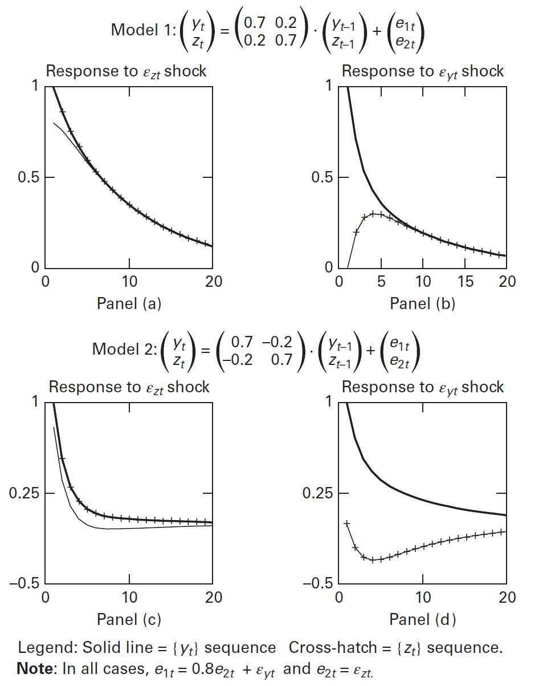

```{r, results='hide', message=FALSE, warning=FALSE, echo=FALSE}
library(tidyverse)
library(gridExtra) # Arrangning ggplots
library(readr)     # Loading data
library(readxl)    # Loading excel
library(zoo) # временные ряды
library(forecast)  
library(TSstudio) # симпатичные графики 
library(MTS) # график для кросс-корреляции
library(dLagM) # для ADL-моделей
library(ARDL)
library(urca)
library(vars)
library(haven)

setwd('D:/Users/Vladimir/Desktop/Github/usdrub/code/enders')
```

# Многомерные модели временных рядов.

Посмотрим на пример двух рядов, которые могут быть связаны между собой.

```{r}
t <- data.frame(read_excel('data/terrorism.xls'))
t <- subset(t, select =-c(ENTRY))
t['date'] <- seq(1970,by=0.25,length.out=nrow(t))
# zoo
t['date'] <- as.yearqtr(t$date)
t['date'] <- as.Date(t$date, format='%Y-%q')
glimpse(t)

# неплохой пакет для рисования временных рядов
# https://cran.r-project.org/web/packages/TSstudio/vignettes/Plotting_Time_Series.html
ts_plot(subset(t, select=c(date, Domestic, Transnational)),
               title = "Локальный и международный терроризм",
               Xtitle = "Время",
               Ytitle = "Терактов за квартал",
               line.mode =  "lines+markers",
               type = 'multiple')
```

## 1. Анализ интервенций.

Теперь проведем анализ интервенций. Для этого используем другой временной ряд, в котором, вероятно, произошел разовый скачок. Запишем модель:
$$
y_t = a_0 + a_1 y_{t-1} + c_0 z_{t} + \varepsilon_t,\ |a_1|<1
$$
где $z_t$ - просто переменная, которая принимает значение 0 до определенного периода и 1 после определенной даты, то есть $z$ - переменная сдвига уровня.

Соответственно, когда $z_t=0$, среднее значение временного ряда равно 
$\frac{a_0}{1-a_1}$, а потом - $\frac{a_0 + c_0}{1-a_1}$, долгосрочный эффект от дамми-переменной равен $\frac{c_0}{1-a_1}$, значимость дамми можно проверить с помощью обычного $t$-теста.

Очевидно, что для всех периодов после интервенции значение $z_t$ одинаково, поэтому 
$$
z_{t+1} = z_t \\
\frac{\partial y_{t+1}}{\partial z_t} = c_0 + c_0 a_1\\
\frac{\partial y_{t+j}}{\partial z_t} = c_0(1+ a_1 + ... + (a_1)^j)\\
$$
Где $t$ -  дата интервенции, и в долгосрочном периоде этот эффект сойдется к $\frac{c_0}{1-a_1}$. 

Виды интервенций:


Также важно учитывать, что если временной ряд имеет единичный корень, то интервенции будут иметь другой эффект, чем на стационарный ряд. Так, интервенция в виде пульса будет иметь постоянный эффект на процесс, а интервенция в виде скачка трансформирует единичный корень в единичный корень с дрифтом.

Теперь оценим конкретную модель с интервенциями. Для этого удалим кусок данных после интервенции, чтобы выборка была более сбалансированной, так как у нас мало наблюдений до интервенции и много после. Оценим модель ARIMA.

В данном случае код корректный, а результаты некорректные, потому что  автор не предоставил датасет.

```{r}
sub <-  t[t$date<='1988-10-01', ]
# создадим третий временной ряд
sub$Other <- sub$Transnational - sub$Domestic
# добавим дамми 
ind <- which(sub$date=='1973-01-01')
sub$jump <- 1
sub$jump[1:(ind-1)] <- 0
arima_jump_t <- auto.arima(sub$Domestic,xreg=sub$jump, ic='bic')
summary(arima_jump_t)

# оценим модель 
```

Автор также говорит нам, что хорошая модель с интервенцией должна:
* Иметь значимые коэффициенты. При выборе из нескольких моделей надо выбирать наиболее простую.
* Остатки должны быть белым шумом, без автокорреляции и гетероскедастичности.
* Модель должна быть "сильной" с точки зрения информационных критериев и точности по сравнению с альтернативными спецификациями.

## 2. ADLs и трансфертные функции.

Логичное обобщение модели с интервенцией - когда регрессор $z_t$ может быть непрерывным, и модель может быть записана как
$$
y_t = a_0 + A(L)y_{t-1}+C(L)z_t + B(L)\varepsilon_t
$$

Обязательное условие для $z_t$ - чтобы переменная была стационарной. Такая модель называется моделью с распределенными лагами, а полином $C(L)$ - трансферной функцией. Такеже важно, чтобы $z_t$ была экзогенной переменой и не зависела от $y_t$. $z_t$ также может быть опережающим индикатором, если модель имеет вид $y_t = a_0*0 + a_1*z_{t-1} + ...$.

Если мы можем наплевать на лаги MA, записав модель как 
$$
y_t = a_0 + A(L)y_{t-1} + C(L)z_t + \varepsilon_t
$$
То такая модель называется ADL (Autoregressive Distributed Lag). Наверно, ARIMAX в этом плане посильнее и поинтересней будет. Также важно, чтобы регрессор был некоррелирован с остатками.

Допустим, это так, и $z_t$ - процесс белого шума. Модель имеет вид 
$$
y_t = + a_1y_{t-1} + c_dz_t + \varepsilon_t
$$
Тогда можно оценить перекрестные корреляции между $y_t$ и $z_t$:
$$
\rho_{yz}(i) = \frac{cov(y_t, z_{t-i})}{\sigma_y \sigma_z}
$$
И нарисовать их. Эти перекрестные корреляции дадут нам ту же информацию, что и ACF в ARIMA:
$$
y_t = \frac{c_dz_d}{1-a_1L} + \frac{\varepsilon_t}{1-a_1L} = \\
c_d(z_{t-d} + a_1z_{t-d-1} + a_1^2z_{t-d-2} + ...) + \frac{\varepsilon_t}{1-a_1L} 
$$

Дальше можно перезаписать это как

И продолжить как

В итоге, помня, что $z_t$ - белый шум, мы получим

Или, в более компактной форме - 
$$
E y_t z_{t-i} = 0, i<d\\
 = c_da_1^{i-d} \sigma_z^2, i\geq d
$$

То есть до первого значимого коэффициента перекрестная коррелограмма нулевая, потом она начинает убывать с темпом, зависящим от $a_1$. Также понятно, что при разных знаков коэффициентов перекрестная коррелограмма будет иметь разный вид.

Можно переписать все это дело в более общем виде, когда $y_t$ зависит от нескольких лагов $z_t$, рассмотрим случай с двумя значимыми лагами:


Или, в более общем виде, 


То есть мы увидим пики во всех точках, где есть значимые значения лагов.
Посмотрим на примеры:


Например, на левом верхнем графике мы видим два пика, на 3 и 4 лаге, как и ожидалолсь.

Выводы по функции кросс-корреляции:
* Все выборочные корреляции будут равны нулю до первого ненулевого коэффициента при регрессоре.
* Пик в графике кросс-корреляции свидетельствует о ненулевом значимом коэффициенте при лаге $z_t$, то есть $z_{t-i}$ напрямую влияет на $y_t$.
* Все пики убывают пропорционально значениям авторегрессионных коэффицентов $y_t$, если этот коэффициент отрицательный, график будет осциллировать.

Теперь еще усложним ситуацию. Рассмотрим случай, когда $z_t$ - уже не процесс белого шума, а AR-процесс. То есть мы имеем дело с системой:
$$
\begin{cases}
y_t = a_0 + A(L)y_{t-1} + C(L)z_t + \varepsilon_t \\
z_t = D(L)z_{t-1} + \varepsilon_{zt}
\end{cases}
$$
Теперь мы также можем строить функции импульсного отклика для анализа влияния $\varepsilon_{zt}$ на $y_t$. Для этого можно переписать несколько уравнений в одно и брать от него производные:
$$
y_t = a_0 + A(L)y_{t-1}+ C(L)(1-D(L)Lz_{t})\varepsilon_{zt} + \varepsilon_t 
$$
Потом можно сделать прогноз $z_t$, поскольку для него есть отдельная модель, и на основании этого прогноза предсказать $y_t$.

Как оценить такую ADL-модель?
Например, можно построить отдельно модель для $z_t$, а потом заняться $y_t$. Или сразу оценить модель вида
$$
y_t = a_0 + \sum_{i=1}^p a_iy_{t-i} + \sum_{i=1}^n c_iz_{t-i} + \varepsilon_t
$$

Шаги:
* Выбрать максимально возможные $n$, $p$
* Оценить модель, и начать сокращать количество лагов, основываясь на результатах $t$-теста, $F$-теста, информационных критериях. Также важно проверить свойста остатков, как обычно.

Проблема способа - можно получить излишне параметризованную модель.
Другой способ - **фильтровать** $y_t$, умножив на $D(L)$. Кросс-корреляции $\hat\varepsilon_{zt}$ и $y_{filtered t}$ покажут структуру зависимостей в ADL. Покажем, почему это так:


Заметим, что кросс-корреляции $\hat\varepsilon_{zt}$ и $y_{filtered t}$ позволяют восстановить лаговый полином $C(L)$, который как раз нам и нужен.

Пример того, как это работает:


Для данного метода шаги по оценке будут следующими:
1. Построить AR-модель для $z_t$, сохранить оценки остатков $\hat\varepsilon_{zt}$.
2. Подобрать значения коэффициентов полинома, используя кросс-коррелограмму $y_{ft}$ и $\hat\varepsilon_{zt}$. Дальше надо посмотреть на значимость коэффициентов кросс-корреляции (в книжке описывается, как считается дисперсия).
3. Оценить полином $A(L)$. Для этого надо построить модель $y_t = C(L) + e_t$, для $e_t$ построить ACF, PACF, возможно, на этом этапе станет ясно, что нужно строить ARMA для $y_t$, а не AR.
4. Объединить результаты шагов 2 и 3, построить общую модель.

Некоторые лайфхаки:
* В итоговой модели, между $\varepsilon_t$, $\varepsilon_{zt}$ не должно быть значимой корреляции. В противном случае вполне возможно, что спецификация $C(L)$ выбрана неверно.
* Переменные должны быть стационарными, иначе надо брать разности. Интерпретация модели будет зависеть от того, для каких переменных бралась разность.
* Если регрессор - белый шум, то можно сразу строить кросс-коррелограмму между ним и $y_t$.

### Пример оценки ADL.

Рассмотрим пример ADL для оценки влияния терроризма в Италии на доходы туристической индустрии. Целевая переменная - очищенный от сезонности логарифм доходов туристической индустрии. Уравнение:
$$
y_t = a_0 + A(L)y_{t-1} + C(L)z_t + B(L)\varepsilon_t
$$
1. Подберем модель для $z_t$:

```{r}
t <- read_excel('data/italy.xls')
glimpse(t)
# 1. посмотрим на коррелограмму для регрессора
ggtsdisplay(t$Attkit)

```

Все лаги незначимы, можно считать, что регрессор - белый шум.

2. Посмотрим на кросс-корреляции между регрессорои и таргетом. Нам нужен левый нижний график, судя по нему, подойдут лаги 1, 2, 10.
```{r}
forecast::Acf(t[, c("Attkit", "Slitaly")])
# и вот тут они тоже считаются правильно
#	ccm(x, lags = 12, level = FALSE, output = T)
# и p-values верные
```
3. Раз $z_t$ - белый шум, мы можем сразу перейти к оценке регресии $y_t$ на $z_t$, а потом на остатках регрессии строить авторегресионную модель для таргета.

```{r}
lag <- 3
# embed - очень полезная функция, позволяет нам сгенерировать столько 
# лагов для регрессора, сколько нужно
X <- embed(t$Attkit,lag+1)
# выкинем первые 3 наблюдения из таргета
y <- t$Slitaly[-c(1:3)]
# построим несколько конкурирующих моделей, посмотрим на их
# информационные критерии, F-тесты и значимость коэффициентов
# три лага и z_t
summary(lm(y~X))
# три лага
summary(lm(y~X[,-4]))
# лаги 1 и 2, эта модель кажется неплохой
summary(lm(y~X[,-c(1,4)]))
# только лаг 1
summary(lm(y~X[,3]))
# только лаг 2
summary(lm(y~X[,2]))
```

4. Теперь получим остатки модели и по ним оценим порядок авторегресси для таргета. Константу выкинем, раз она незначима. По графику можно предположить, что подходят модели AR(2), ARIMA(2,0,1). Возьмем AR(2).

```{r}
lm_e <- summary(lm(y~0+X[,-c(1,4)]))
res <- lm_e$residuals
ggtsdisplay(res)
summary(auto.arima(res))
```
5. Оценим итоговую модель.

```{r}
# все же оценим модель, которую выбрал Enders
adl <- Arima(y, 
             order=c(4, 0, 0), 
             xreg = X[,-c(1,4)],
             # поставим нули там, где лаги не нужны
             fixed=c(NA, 0, 0, NA, NA, NA),
             include.mean = FALSE)
summary(adl)
checkresiduals(adl)
```

Есть другой подход, который был раскритикован выше - взять максимальное число лагов и посмотреть, какая из моделей лучше по ошибке прогноза и информационным критериям. В `R` ADL реализованы в трех пакетах: `dynlm` (базовая версия модели), `dLagM` и `ARDL` предлагают возможность поиска лучших значений модели по решетке лагов, более проработанной выглядит `dLagM`.

```{r}
t_ts <- ts(t[,c("Slitaly", "Attkit")], 
           start=c(1977, 1), 
           frequency=12)

formula <- Slitaly ~ Attkit

orders <- ardlBoundOrders(data = t_ts, 
                           formula = formula, 
                           ic=c("AIC", "BIC", "MASE", "GMRAE"),
                           max.p = 10, 
                           max.q = 10, 
                           FullSearch = TRUE)

# подобранный порядок для регрессора
orders$p
# подобранный оптимальный порядок авторегрессии
orders$q
# видимо, в табличке информационный критерий AIC
# то есть в функцию можно подать только один критерий за раз
orders$Stat.table 

# теперь продаем все то же самое с помощью библиотеки ARDL
ardl <- auto_ardl(Slitaly ~ Attkit, data = t, max_order = 10)
ardl$top_orders
```

Да, в таком "автоматическом" подходе есть серьезные проблемы. Главная - трудно обосновать, почему выбран именно такой порядок модели (одного информационного критерия для этого недостаточно), и разные пакеты по-разному выбирают лучшую модель по одному и тому же информационному критерию.

## 3. Векторные многомерные модели.

Проблемы ADL:

1. Трудно подобрать спецификацию модели, еще сложнее обосновать ее (особенно выбор количества лагов для регрессора и таргета).
2. Предпосылка об отсутствии обратной связи таргета и регрессора может быть нереалистичной, возможно, они оба влияют друг на друга.

Запишем VAR(1) в примитивной форме:
$$
\begin{cases}
y_t = b_{10} - b_{12}z_t + \gamma_{11}y_{t-1} + \gamma_{12}z_{t-1} + \varepsilon_{yt}  \\
z_t = b_{20} - b_{21}y_t + \gamma_{21}z_{t-1} + \gamma_{22}y_{t-1} + \varepsilon_{yt}  \\
\end{cases}
$$

Нумерация коэффициентов идет в соответствии с матрицами коэффициентов, которые мы в дальнейшем будем собирать.
 
Теперь запишем систему в структурной форме:
$$
\begin{pmatrix}
     1 & b_{12} \\ 
     b_{12} &  1\\
\end{pmatrix} \times
\begin{pmatrix}
     y_t \\ 
     z_t \\
\end{pmatrix} = 
\begin{pmatrix}
     b_{10} \\ 
     b_{20}\\
\end{pmatrix} +
\begin{pmatrix}
     \gamma_{11} & \gamma_{12} \\ 
     \gamma_{21} &  \gamma_{22} \\
\end{pmatrix} \times
\begin{pmatrix}
     y_{t-1} \\ 
     z_{t-1}\\
\end{pmatrix} 
$$
Или:

$$
Bx_t = \Gamma_0 + \Gamma_1x_{t-1}+\varepsilon_t
$$
Очевидно, что для константы в матрицу регрессоров просто добавлен единичный столбец. Чтобы все это работало в матричном виде, достаточно просто взять транспонированную матрицу регрессоров и умножить на матрицы коэффициентов.

Теперь, чтобы получить систему, которую можно оценить с помощью МНК, мы можем просто умножить на $B^{-1}$ все элементы уравнения и получить VAR в стандартной (или сокращенной) форме:
$$
B^{-1}Bx_t = B^{-1}\Gamma_0 + B^{-1}\Gamma_1x_{t-1}+B^{-1}\varepsilon_t \\
\Leftrightarrow x_t = A_0 + A_1x_{t-1} + e_t
$$

В отличие от структурной формы, здесь шоки $e_{ti}$ - это комбинация шоков отдельных переменных:

$$
\begin{cases}
    e_t = B^{-1}\varepsilon_t \\
    B = \begin{pmatrix}
             1 & b_{12}\\
             b_{21} & 1\\
         \end{pmatrix} \\
    B^{-1} = \frac{1}{1-b_{12}b_{21}}
    \begin{pmatrix}
             1 & -b_{12}\\
             -b_{21} & 1\\
         \end{pmatrix} \\
    \\
    \begin{cases}
        e_{1t} = (\varepsilon_{yt}-b_{12}\varepsilon_{zt})/(1-b_{12}b_{21}) \\
        e_{2t} = (\varepsilon_{zt}-b_{21}\varepsilon_{yt})/(1-b_{12}b_{21})
    \end{cases}
\end{cases}
$$

 Свойства новых ошибок:
 
$$
\begin{cases}
E[e_{it}]=0 \\
Var[e_{it}] = \frac{
                    {\displaystyle\sigma_1^2 + b_{..}^2\sigma_2^2}}
                    {\displaystyle{(1-b_{12}b_{21})^2}
                    } 
                    \\
cov(e_{1t}, e_{2t}) = \frac{
             {\displaystyle 1}}
             {\displaystyle {(1-b_{12}b_{21})^2}
             }
             E[(\varepsilon_{yt}-b_{12}\varepsilon_{zt})
(\varepsilon_{zt}-b_{12}\varepsilon_{yt})] = 
-\frac{ 
      {\displaystyle b_{21} \sigma^2_y + b_{12} \sigma^2_z}}
      {{\displaystyle...} 
      }
\end{cases}
$$
Или, в более общем виде:

$$
\Sigma = 
\begin{pmatrix}
    \sigma_1^2 & \sigma_{12} \\
    \sigma_{12} & \sigma_2^2 \\
\end{pmatrix}
$$
Как видно, дисперсия новых ошибок не зависит от времени (стационарность не нарушается). Автокорреляции новых ошибок равны нулю.

Важно, что $e_{ti}$ коррелированы между собой.

### Стабильность и стационарность системы

В модели авторегрессии первого порядка, через геометрическую прогрессию мы находим, что условие стабильности - $a_1$ должен быть меньше единицы, в VAR есть аналог такого условия (посчитаем, подставляя все более отдаленные лаги):

$$
x_t = A_0 + A_1(A_0 + A_1x_{t-2} + e_{t-2}) + e_t = \\
x_t = (I + A_1)(A_0) + A_1^2x_{t-2} + A_1e_{t-2} + e_t \\
\Leftrightarrow\ x_t = (I + A_1 + ... + A_1^n) A_0 + 
\sum_{i=0}^n A^i e_{t-i} + A_1^{n+1} x_{t-n-1}
$$

Для стабильности системы необходимо, чтобы $A_1^n \rightarrow 0$. При стабильности системы корни $(1-a_{11}L)(1-a_{22}L) - (a_{12}L\ a_{12}L)^2)$ должны лежать вне единичного круга. Если условие стабильности выполнено, можно записать решение системы в виде 

$$
\begin{cases}
    x_t = \mu + \sum_{i=0}^{\infty} A^i e_{t-i} \\[5pt]
    
    \mu = \begin{pmatrix}
                 \overline y_t \\ \overline z_t
          \end{pmatrix} \\[5pt]
          
    \overline y = [a_{10}(1-a_{22} + a_{12}a_{20})/\bigtriangleup] \\[5pt]
    \overline z = [a_{20}(1-a_{11} + a_{21}a_{10})/\bigtriangleup] \\[5pt]
    \bigtriangleup = (1-a_{11})(1-a_{22}) - a_{12} a_{12} \\[5pt]
\end{cases}
$$

По сути, в уравнении для среднего мы просто умножили $A_0$ на $(1-A_1)^{-1}$, воспользовавшись формулой геометрической прогрессии. Мы видим, что математическое ожидание $y_t$ просто $\mu$. Средние значения взялись у нас из первоначальной системы VAR(1), где было две переменных.

Теперь мы также можем найти дисперсии этих исходных переменных:

$$
E(x_t - \mu)^2 = E \bigg[\sum_{i=0}^{\infty} A_1^i e_{t-i} \bigg]^2 \\[5pt]
Ee^2_t = \begin{bmatrix} 
             e_{1t} \\ e_{2t}
         \end{bmatrix}
         [e_{1t} e_{2t}]
         \\[5pt]
E(x_t - \mu)^2 = (I + A_1^2 + A_1^4 + ...)\Sigma = [I - A_1^2]^{-1}\Sigma
$$

Можно подойти к демонстрации условий стабильности по-другому: 

<div style="width:500px; height:700px">

</div>

При первом переходе мы просто умножили на лаговый оператор $L$ обе стороны уравнения, описывающего динамику $z_t$. В итоге мы получили дроби, знаменатель которых не должен быть равен нулю.

### Динамика VAR-модели.

На рисунке представлены стационарные и нестационарные процессы. Для нестационарных процессов видно, что они не возвращаются к своему среднему значению. Конечно, тест на стабильность системы необходим.


### Оценка VAR и идентификация (обратный переход от сокращенной к структурной форме).

Box-Jenkins разработали методологию, целью которой было выявление наиболее лаконичной модели. Для целей наиболее точного краткосрочного прогноза из модели удалялись незначимые коэффициенты (странная аргументация, но ладно). 

Симс (1980) предложил несколько другой подход для подбора лагов. Рассмотрим обобщенную модель VAR:
$$
x_t = A_0 + A_1x_{t-1} + A_2x_{t-1} + ... + A_px_{t-p} + e_t
$$
Симс предложил выбирать длину лага $p$, исходя из тестов на длину лага (рассмотрены ниже), переменные для модели выбираются, исходя из экономической логики. 

Отдельная проблема - проклятие размерности. По уравнению видно, что VAR(p, n) содержит $n$ констант (по числу переменных) и $pn^2$ коэффициентов в матрицах параметров, **итого требуется оценить $n + pn^2$ параметров**, что при достаточно большом числе регрессоров приводит к излишней параметризации. С одной стороны, в такой ситуации исследователю хотелось бы уменьшить число лагов и переменных в модели, занулить отдельные коэффициенты в матрицах. С другой стороны, обнуление отдельных коэффициентов до оценивания может привести к искаженным результатам, а $t$-тесты для отбора значимых коэффициентов неприминимы, поскольку в модели легко может быть мультиколлинеарность (если регрессоры неплохо отобраны).

Также по уравенению в общем виде видно, что по отдельности можно оценить регрессии из него с помощью МНК - ошибки модели не связаны между собой во времени для одного из уравнений системы, хотя и ошибки разных уравнений системы коррелированы между собой, как было показано выше.

Для целей VAR-моделирования переменные должны быть стационарными, или надо моделировать коинтеграцию отдельно.

### Прогнозирование.

На первый взгляд, прогноз сделать просто:
$$
x_t = \hat A_0 + \hat A_1x_{t-1} + e_t \\
\hat x_{t+1} = E(x_{t+1}) = \hat A_0 + \hat A_1x_{t} \\
\hat x_{t+2} = E(x_{t+2}) = \hat A_0 + \hat A_1E[x_{t+1}] \\
$$

Проблема в том, что в такой модели слишокм много коэффициентов - из-за этого прогнозы могут стать бессмысленными. Как с этим бороться?

* Оценить **near-VAR**, используя SUR
* Использовать Байесовский подход для оценивания модели (Литтерман, 1980 предложил набор априорных распределений, которые до сих пор являются отправной точкой во многих работах).

Рассмотрим интересный пример прогнозирования с помощью VAR, предложенный в работе Eckstein, Tsiddon (2004). Они оценили VAR с 5 переменными:

* $T$ - терроризм
* $\bigtriangleup GDP$ - изменение ВВП
* $\bigtriangleup I$ - изменение инвестиций
* $\bigtriangleup EXP$ - изменение экспорта
* $\bigtriangleup NDC$ - изменение потребления потребительских краткосрочных товаров.

Модель оценивалась на квартальных данных с 1980 по 2003 годы, 95 наблюдений. Модель:


где $A_{ij}$ - лаговые полиномы, то есть для каждого из 4 регрессоров было использовано 4 квартальных лага, итого по 16 коэффициентов, связанных с регрессорами, и 4 константы (в сумме 70 параметров).

Чтобы оценить издержки израильской экономики от терроризма, авторы сделали прогноз на 12 месяцев вперед, предположив различные траектории для независимой переменной - терроризма, и посмотрели, как изменится ВВП в зависимости от траектории экзогенной переменной.

### Идентификация (восстановление влияния истинных случайных шоков на другие переменные системы для структурной VAR).

Мы не можем оценить VAR в структурной форме, так как переменные коррелируют с случайными ошибками других переменных. Вопрос в том, можем ли мы по оценкам из сокращенной формы VAR восстановить структурную VAR?

**Нет, если мы не наложим определенные ограничения на структурную форму.** Например, из оценки VAR(1) для двух переменных мы получим 6 коэффициентов, и ковариационную матрицу с 3 уникальными элементами. А структурная форма содержит 10 параметров (кроме коэффициентов для связи $y_t$ и $z_t$ в момент времени $t$, требуется также оценить стандартные отклонения ошибок переменных). Итого, нам нужно 10 параметров, а сокращенная форма дает только 9.

Один путь - **рекурсивная система**, предложенная Sims (1980). Идея проста: мы приравниваем к нулю один из коэффициентов (например, $b_{21} = 0$  для рассматриваемой VAR(1)), и тогда система идентифицируема путем рекурсивной оценки параметров:

$$
\begin{cases}
  \begin{cases}
      y_t = b_{10} - b_{12}z_t + \gamma_{11}y_{t-1} + \gamma_{12}z_{t-1} +           \varepsilon_{yt}  \\
      z_t = b_{20} - b_{21}y_t + \gamma_{21}z_{t-1} + \gamma_{22}y_{t-1} +           \varepsilon_{yt}  \\
  \end{cases} \\[7pt]
  \ x_t = A_0 + A_1x_{t-1} + e_t \\[7pt]
  \begin{cases}
          e_{1t} = (\varepsilon_{yt}-b_{12}\varepsilon_{zt})/(1-b_{12}b_{21})            \\
          e_{2t} = (\varepsilon_{zt}-b_{21}\varepsilon_{yt})/(1-b_{12}b_{21})
  \end{cases}
\end{cases} \\[10pt]
\Leftrightarrow \\
e_{1t} = \varepsilon_{yt}-b_{12}\varepsilon_{zt} \\
e_{2t} = \varepsilon_{zt} \\
cov(e_1, e_2) = -b_{12}\sigma^2_{z} \\
Var(e_{1}) = \sigma^2_{yt}+b_{12}\sigma^2_{zt} \\
Var(e_{1}) = \sigma^2_{zt} \\
$$

Также достаточно наглядным будет просто перезаписать VAR в структурной форме с учетом наложенного ограничения:
 
$$
\begin{bmatrix}
     1 & b_{12} \\ 
     0 &  1\\
\end{bmatrix} \times
\begin{bmatrix}
     y_t \\ 
     z_t \\
\end{bmatrix} = 
\begin{bmatrix}
     b_{10} \\ 
     b_{20}\\
\end{bmatrix} +
\begin{bmatrix}
     \gamma_{11} & \gamma_{12} \\ 
     \gamma_{21} &  \gamma_{22} \\
\end{bmatrix} \times
\begin{bmatrix}
     y_{t-1} \\ 
     z_{t-1}\\
\end{bmatrix} 
$$

Теперь умножим систему на $B^{-1}$ и получим (мне кажется, автор ошибся с $b_{12}$ - она должна была быть на другом месте в обратной матрице):
 
$$
\begin{bmatrix}
     y_t \\ 
     z_t \\
\end{bmatrix} = 
\begin{bmatrix}
     1 & -b_{12} \\ 
     0 &  1\\
\end{bmatrix} \times
\begin{bmatrix}
     b_{10} \\ 
     b_{20}\\
\end{bmatrix} +
\begin{bmatrix}
     1 & -b_{12} \\ 
     0 &  1\\
\end{bmatrix} \times
\begin{bmatrix}
     \gamma_{11} & \gamma_{12} \\ 
     \gamma_{21} &  \gamma_{22} \\
\end{bmatrix} \times
\begin{bmatrix}
     y_{t-1} \\ 
     z_{t-1}\\
\end{bmatrix} +
\begin{bmatrix}
     1 & -b_{12} \\ 
     0 &  1\\
\end{bmatrix} \times
\begin{bmatrix}
    \varepsilon_{yt}\\
    \varepsilon_{zt}\\
\end{bmatrix}
$$

Перемножив коэффициеты, получим

$$
\begin{bmatrix}
     y_t \\ 
     z_t \\
\end{bmatrix} = 
\begin{bmatrix}
     b_{10} - b_{12}b_{20} \\ 
     b_{20}\\
\end{bmatrix} +
\begin{bmatrix}
     \gamma_{11} - b_{12}\gamma_{21} & \gamma_{12} - b_{22}\gamma_{21} \\ 
     \gamma_{21} &  \gamma_{22} \\
\end{bmatrix} \times
\begin{bmatrix}
     y_{t-1} \\ 
     z_{t-1}\\
\end{bmatrix} +
\begin{bmatrix}
     \varepsilon_{yt} -b_{12}\varepsilon_{zt} \\ 
     \varepsilon_{zt}\\
\end{bmatrix} 
$$

Отсюда, используя оценки коэффициентов для системы в сокращенной форме

$$
\begin{cases}
y_t = a_{10} + a_{11}y_{t-1} + a_{12}z_{t-1} + e_{1t}  \\
z_t = a_{20} + a_{21}z_{t-1} + a_{22}y_{t-1} + e_{2t}  \\
\end{cases}
$$

Можно получить уравнения для оценки коэффициентов, скомбинировав две системы выше:
$$
\begin{cases}
    a_{10} = b_{10} - b_{12}b_{20} \\
    a_{20} = b_{20} \\
    a_{11} = \gamma_{11} - b_{12}\gamma_{21} \\
    a_{12} = \gamma_{12} - b_{22}\gamma_{21} \\
    a_{21} = \gamma_{21} \\
    a_{22} = \gamma_{22} \\
\end{cases}
$$
В общем, идея на самом деле несложная: у нас в сокращенной форме есть 

* $n+pn^2$ оценок коэффициентов 
* и $\frac{n}{2}(n+1)$ уникальных оценок ковариационной матрицы остатков. 

Итого $n+pn^2+\frac{n}{2}(n+1)$ коэффициентов.

А в структурной форме у нас 

* также $n+pn^2$ коэффициентов справа, 
* еще матрица $B$ с $n^2-n$ уникальными аргументами (будем считать, что диагональ матрицы единичная, как в примере) 
* и $n$ оценок для дисперсий остатков (остатки независимы между собой).

Итого $n+pn^2+n^2$ коэффициентов, нам не хватает $\frac{n}{2}(n-1)$ оценок, чтобы в системе было одинаковое количество неизвестных и уравнений. Значит, надо наложить ограничения на какие-то переменные. Чтобы получить нужное количество ограничений, надо занулить нижнюю или верхнюю диагональ одной из матриц коэффициентов.

Для оценки матрицы $B$ с помощью ковариационной матрицы из сокращенной формы используют разложение Холецкого. Его идея очень близка к тому, что нам требуется. Рассмотрим не доказательство, но интуицию разложения Холецкого.
Пусть у нас есть положительно определенная диагональная матрица 
$$
\begin{bmatrix}
    a & 0 & 0 \\
    b & c & 0 \\
    d & e & f \\
\end{bmatrix}
$$
Тогда произведение матрицы на саму себя транспонированную равно 
$$
\begin{bmatrix}
    a & 0 & 0 \\
    b & c & 0 \\
    d & e & f \\
\end{bmatrix} \times
\begin{bmatrix}
    a & b & d \\
    0 & c & e \\
    0 & 0 & f \\
\end{bmatrix} = 
\begin{bmatrix}
    a^2 & ab & ad \\
    ab & b^2 + c^2 & db + ce \\
    ad & db + ce & d^2 + e^2 + f^2 \\
\end{bmatrix} 
$$
Можно заметить, что новая матрица по-прежнему симметрична, и, скорее всего, положительно определена. Можно заметить, что симметричность неслучайна - она порождается тем фактом, что вне диаогонали есть одинаковые пары столбцов и строк, полученные благодаря форме матрицы и транспонированию.

Также понятно, что при поиске значений исходной треугольной матрицы нам надо потребовать от нее положительной определенности, поскольку при решении уравнений нам придется извлекать из получившейся матрицы корни.

Итого, у нас $n/2(n+1)$ неизвестных в исходной матрице и ровно столько же значений в итоговой, система будет иметь единственное решение.

### Функции импульсного отклика.

Точно так же, как у авторегрессионного процесса есть представление в виде скользящего среднего, у VAR есть представление в виде Vector Moving Average (VMA) - ранее мы его уже выводили:

$$
x_t = A_0 + A_1(A_0 + A_1x_{t-2} + e_{t-2}) + e_t = \\
x_t = (I + A_1)(A_0) + A_1^2x_{t-2} + A_1e_{t-2} + e_t \\
\Leftrightarrow\ x_t = (I + A_1 + ... + A_1^n) A_0 + 
\sum_{i=0}^n A^i e_{t-i} + A_1^{n+1} x_{t-n-1}
$$
Это существенная часть методологии Симса, поскольку она позволяет оценить влияние прошлых шоков на переменные системы.

Рассмотрим это на примере прежней системы из двух переменных в сокращенной форме.

$$
\begin{bmatrix}
     y_t \\ 
     z_t \\
\end{bmatrix} = 
\begin{bmatrix}
     a_{10} \\ 
     a_{20}\\
\end{bmatrix} +
\begin{bmatrix}
     a_{11} & a_{12} \\ 
     a_{21} &  a_{22} \\
\end{bmatrix} \times
\begin{bmatrix}
     y_{t-1} \\ 
     z_{t-1}\\
\end{bmatrix} +
\begin{bmatrix}
     e_{1t} \\ 
     e_{2t} \\
\end{bmatrix} 
$$

Используя уравнение для VMA, мы теперь можем переписать систему:

$$
\begin{bmatrix}
     y_t \\ 
     z_t \\
\end{bmatrix} = 
\begin{bmatrix}
     \overline y_t \\ 
     \overline z_t \\
\end{bmatrix} + \sum_{i=0}^{\infty}
\begin{bmatrix}
     a_{11} & a_{12} \\ 
     a_{21} &  a_{22} \\
\end{bmatrix}^{\displaystyle i} \times
\begin{bmatrix}
     e_{1t-i} \\ 
     e_{2t-i} \\
\end{bmatrix} 
$$
Важно помнить, что вектор интерсептов в начальной форме модели - это вовсе не средние значения переменных, средние значения перемнных мы видим именно теперь.

Теперь представим, что мы знаем матрицу $B$ (так как мы расссматриваем не оценивание модели, а теоретический процесс) и перепишем уравнение в терминах $\varepsilon_{zt}$ и $\varepsilon_{yt}$:

$$
[e_t] = B^{-1}[\varepsilon_t] \\[10pt]
\begin{bmatrix}
     e_{1t} \\ 
     e_{2t} \\
\end{bmatrix}  = 
\frac{1}{1-b_{12}b_{21}}
\begin{bmatrix}
    1 & -b_{12}\\
    -b_{21} & 1\\
\end{bmatrix} 
\begin{bmatrix}
     \varepsilon_{yt} \\ 
     \varepsilon_{zt} \\
\end{bmatrix}
$$

И теперь добавим это уравнение в то описание VMA, которое мы вывели выше:

$$
\begin{bmatrix}
     y_t \\ 
     z_t \\
\end{bmatrix} = 
\begin{bmatrix}
     \overline y_t \\ 
     \overline z_t \\
\end{bmatrix} + \sum_{i=0}^{\infty}
\begin{bmatrix}
     a_{11} & a_{12} \\ 
     a_{21} &  a_{22} \\
\end{bmatrix}^{\displaystyle i} \times
\frac{1}{1-b_{12}b_{21}}
\begin{bmatrix}
    1 & -b_{12}\\
    -b_{21} & 1\\
\end{bmatrix} 
\begin{bmatrix}
     \varepsilon_{yt-i} \\ 
     \varepsilon_{zt-i} \\
\end{bmatrix}
$$
Теперь несколько упростим это выражение, проведя замену:

$$
\displaystyle \phi_i = 
\frac{A^i_1}{1-b_{21}b_{12}}
\begin{bmatrix}
    1 & -b_{21}\\
    -b_{12} & 1\\
\end{bmatrix} 
$$

Обратим внимание, что в числителе именно матрица.
Теперь перепишем VMA:
$$
\begin{bmatrix}
     y_t \\ 
     z_t \\
\end{bmatrix} = 
\begin{bmatrix}
     \overline y_t \\ 
     \overline z_t \\
\end{bmatrix} + \sum_{i=0}^{\infty}
\begin{bmatrix}
     \phi_{11}(i) & \phi_{12}(i) \\ 
     \phi_{21}(i) &  \phi_{22}(i) \\
\end{bmatrix} \times
\begin{bmatrix}
     \varepsilon_{yt-i} \\ 
     \varepsilon_{zt-i} \\
\end{bmatrix}
$$
Причем, насколько я понимаю, $\phi_{jk}(i)$ - это скаляр в матрице размерности $2 \times 2$ (матрица $\phi_i$ для нужной степени $i$), чтобы можно было его нормально перемножить на вектор случайных шоков.

Можно также записать все это дело в более компактной, векторной форме:
$$
x_t = \mu + \sum_{i=0}^{\infty}\phi_i \varepsilon_{t-i}
$$
Коэффициенты $\phi_i$ помогают оценить влияние шоков на обе последовательности: $y_t$, $z_t$. Например, $\phi_jk(0)$ позволяют оценить влияение шока в период $t$ на переменные в период $t$. Так, например, $\phi_{12}(0)$ позволяет оценить эффект шока размером одну единицу измерения в $\varepsilon_{zt}$ на значение $y_t$.

Также, что гораздо  более интересно, можно оценить кумулятивный эффект $\varepsilon$ за несколько периодов на ту или иную переменную - так, эффект $\varepsilon_{zt}$ на $y_{t+n}$ может быть записан как 
$$
\sum_{i=0}^n \phi_{12}(i)
$$
При $n \Rightarrow \infty$ можно оценить полный эффект того или иного шока на переменную. Коэффициенты $\phi$ должны убывать к нулю по мере стремления $n \Rightarrow \infty$, если переменные стационарны. Иначе говоря, **случайные шоки не могут иметь постоянного эффекта на стационарный ряд**. 

То есть последовательности $\phi_i$ могут быть использованы для построения функций импульсного отклика. При этом стоит вспомнить, что, скорее всего, мы имеем дело с оценкой VAR в сокращенной форме, поэтому нам придется наложить ограничения на коэффициенты, чтобы получить функцию импульсного отклика. 


Рассмотрим далее нашу систему, с которой мы уже возились. Наложим ограничение $b_{21} = 0$. Тогда получается, что только текущие значения и шоки $z_t$ влияют на $y_t$, а вот обратное неверно. Говорят, что в таком случае $z_t$ casually prior для $y_t$. При этом шок $\varepsilon_[y_{t-1}]  $ может влиять на $z_t$, потому что лаг $y_t$ есть в уравнении для $z_t$. 

Как показано выше, наложив ограничения, мы можем решить систему уравнений, и получаем, что 
$$
\begin{cases}
    e_{1t} = \varepsilon_{yt} - b_{12} \varepsilon_{zt} \\
    e_{2t} = \varepsilon_{zt}
\end{cases}
$$
Говорят, что это **упорядочивание** уравнений (**ordering**).

Рассмотрим конкретный пример. Предположим, что система имеет вид
$$
\begin{bmatrix}
     y_t \\ 
     z_t \\
\end{bmatrix} = 
\begin{bmatrix}
     0 \\ 
     0\\
\end{bmatrix} +
\begin{bmatrix}
     0.7 & 0.2 \\ 
     0.2 &  0.7 \\
\end{bmatrix} \times
\begin{bmatrix}
     y_{t-1} \\ 
     z_{t-1}\\
\end{bmatrix} +
\begin{bmatrix}
     e_{1t} \\ 
     e_{2t} \\
\end{bmatrix} \\
\begin{cases}
    \sigma_1^2 = \sigma^2_2 \\
    cov(e_{1t}, e_{2t}) = 0.8 * \sigma_1 \sigma_2
\end{cases}
$$
Вспомним, что 
$$
\begin{cases}
  \begin{cases}
      y_t = b_{10} - b_{12}z_t + \gamma_{11}y_{t-1} + \gamma_{12}z_{t-1} +           \varepsilon_{yt}  \\
      z_t = b_{20} - b_{21}y_t + \gamma_{21}z_{t-1} + \gamma_{22}y_{t-1} +           \varepsilon_{yt}  \\
  \end{cases} \\[7pt]
  \ x_t = A_0 + A_1x_{t-1} + e_t \\[7pt]
  \begin{cases}
          e_{1t} = (\varepsilon_{yt}-b_{12}\varepsilon_{zt})/(1-b_{12}b_{21})            \\
          e_{2t} = (\varepsilon_{zt}-b_{21}\varepsilon_{yt})/(1-b_{12}b_{21})
  \end{cases}
\end{cases} \\[10pt]
\Leftrightarrow \\
e_{1t} = \varepsilon_{yt}-b_{12}\varepsilon_{zt} \\
e_{2t} = \varepsilon_{zt} \\
cov(e_1, e_2) = -b_{12}\sigma^2_{z} \\
Var(e_{1}) = \sigma^2_{yt}+b_{12}\sigma^2_{zt} \\
Var(e_{1}) = \sigma^2_{zt} \\
$$

Отсюда видно, что $b_{12} = corr(e_{1t}, e_{2t}) = 0.8$. То есть шок $\varepsilon_{zt}$ приводит к росту $y_t$ на 0.8 единиц. В следующем периоде, 
$$
z_{t+1} = 0.2y_t + 0.7z_t + \varepsilon_{zt+1} \\
z_{t+1} = 0.2*0.8 + 0.7 * 1 = 0.86 \\
y_{t+1}= 0.76
$$

В итоге, постепенно последовательности будут сходиться к своему долгосрочному среднему значению, что обеспечивается стабильностью системы (была проведена проверка характериситических корней). Иллюстрация к этому примеру приведена ниже:
<div style="width:500px; height:700px">

</div>

По графику также видно, что шок $y_t$ не имеет в период $t$ влияния на последовательность $z_t$. В следующем периоде, 
$$
y_{t+1} = 0.7y_t + 0.2z_t = 0.7 \\
z_{t+1} = 0.7z_t + 0.2y_t = 0.2
$$

Если сделать другое разложение по Холески, то в силу симметричности искомой матрицы $y_t$ будет не зависеть от шоков $z_t$ - то есть надо просто поменять местами названия для двух верхних графиков, и учесть, что теперь толстая линия обозначает последовательность $z_t$, а тонкая - $y_t$.

На практике, исследователь сам выбирает, какую декомпозицию сделать, исходя из теоретических препдосылок.

Также важно отметить, что порядок уравнений заисит от силы корреляции между $e_{1t}$ и $e_{2t}$. Обозначим его $\rho_{12} = \frac{\sigma_{12}}{\sigma_1 \sigma_2}$. Если корреляция нулевая, то порядок не важен ($e_{1t} = \varepsilon_{yt}, e_{2t}= \varepsilon_{zt}$). Значит, можно занулить матрицу коэффициентов $\Sigma$ (оставить только единичную диагональ).

Рассмотрим две ситуации:

1. $\mathbf{corr(e_{1t}, e_{2t})=0}$, $b_{12}=0$ или $b_{21}=0$, $\sigma_1^2= \sigma^2_2$ (предпосылка):

$$
\begin{cases}
          e_{1t} = (\varepsilon_{yt}-b_{12}\varepsilon_{zt})/(1-b_{12}b_{21})            \\
          e_{2t} = (\varepsilon_{zt}-b_{21}\varepsilon_{yt})/(1-b_{12}b_{21})
\end{cases} \\
b_{12} = 0 \Leftrightarrow 
\begin{cases}
          e_{1t} = \varepsilon_{yt} \\            
          e_{2t} = \varepsilon_{zt}-b_{21}\varepsilon_{yt} \\
          cov(e_{1t}, e_{2t}) = -b_{21} \sigma^2_1 = 0 \Rightarrow b_{21}=0 \\
          e_{1t} = \varepsilon_{yt} \\
          e_{2t} = \varepsilon_{zt}
\end{cases} \\[10pt]
b_{21} = 0 \Leftrightarrow 
\begin{cases}
          e_{1t} = \varepsilon_{yt}-b_{12}\varepsilon_{zt} \\            
          e_{2t} = \varepsilon_{zt}\\
          cov(e_{1t}, e_{2t}) = -b_{12} \sigma^2_2 = 0 \Rightarrow b_{12}=0 \\
          e_{1t} = \varepsilon_{yt} \\
          e_{2t} = \varepsilon_{zt}
\end{cases} 
$$
2. $\mathbf{corr(e_{1t}, e_{2t})=1}$, $b_{12}=0$ или $b_{21}=0$, $\sigma_1^2= \sigma^2_2$ (предпосылка): 
$$
\begin{cases}
          e_{1t} = (\varepsilon_{yt}-b_{12}\varepsilon_{zt})/(1-b_{12}b_{21})            \\
          e_{2t} = (\varepsilon_{zt}-b_{21}\varepsilon_{yt})/(1-b_{12}b_{21})
\end{cases} \\
b_{12} = 0 \Leftrightarrow 
\begin{cases}
          e_{1t} = \varepsilon_{yt} \\            
          e_{2t} = \varepsilon_{zt}-b_{21}\varepsilon_{yt} \\
          cov(e_{1t}, e_{2t}) = -b_{21} \sigma^2_1\\[7pt]
          corr(e_{1t}, e_{2t}) = \displaystyle \frac{-b_{21} \sigma^2_1}{\sigma_1^2} = -b_{21} = 1 \\
          e_{1t} = \varepsilon_{yt} \\
          e_{2t} = \varepsilon_{zt} + \varepsilon_{yt}
\end{cases} \\[10pt]
b_{21} = 0 \Leftrightarrow 
\begin{cases}
          e_{1t} = \varepsilon_{yt}-b_{12}\varepsilon_{zt} \\            
          e_{2t} = \varepsilon_{zt} \\
          cov(e_{1t}, e_{2t}) = -b_{12} \sigma^2_2\\[7pt]
          corr(e_{1t}, e_{2t}) = \displaystyle \frac{-b_{12} \sigma^2_2}{\sigma_2^2} = -b_{12} = 1 \\
          e_{1t} = \varepsilon_{yt}  + \varepsilon_{zt}\\
          e_{2t} = \varepsilon_{zt}
\end{cases}
$$
Видно, что во втором случае порядок важен, а в первом - нет. Все случаи, когда корреляция между переменными ненулевая, на самом деле можно описать в общем виде через случай (2). Из этого можно сделать следующие выводы:

1. Порядок уравнений важен при идентификации VAR в структурной форме, если предполагается ненулевая корреляция между переменными.
2. Исследователь заинтересован в том, чтобы протестировать значимость ковариаций (или корреляций) ковариационной матрицы, полученной в сокращенной форме. Правило большого пальца для подобных задач: поскольку в одномерной модели можно было бы протестировать гипотезу $\rho_i = 0$, предположив нормлаьное распределение со среднем в нуле и стандартным отклонением $T^{-1/2}$, то критическое значение по модулю было бы равно 0.2 для 100 наблюдений (умножили на квантиль, равный двум). Если корреляции значимы, стоит упорядочить переменные разумным образом и нарисовать функции импульсного отклика.
3. Если корреляции значимы, также стоит попробовать отразить зеркально ограничения на матрицу и попробовать нарисовать новые функции импульсного отклика. Если результат сильно отличается от полученного в пункте (2), стоит подумать, как наложить ограничения получше или что с этим делать.

#### Доверительные интервалы и функции импульсного отклика. 

Поскольку доверительные интервалы строятся на основе оценок коэффициентов, оценки импульсных откликов тажке содержат (вероятно) ошибки. Как построить ДИ для импульсных откликов?
 
 
Для простоты рассмотрим модель AR(1) :
$$
y_t = 0.6y_{t-1} + \varepsilon_t,\ t-stat(\hat a_1) = 4
$$
Так как наблюдаемое значение статистики 4, мы можем предположить, что с высокой вероятностью он значим. Функция импульсного отклика:
$$
\phi_i = 0.6^i
$$
Раз наблюдаемая статистика $4$, значит, стандартное отклонение $0.15$, доверительный интервал коэффициента с вероятностью 95% лежит в диапазоне $0.3-0.9$. Тогда для верхней границы функция импульсного отклика будет иметь вид $\phi_i = 0.3^i$, а для нижней - $\phi_i = 0.9^i$.

Но ситуация может значительно усложниться в системах более высокого порядка:

1. Коэффициенты могут оказаться коррелированы между собой
2. Возможно, распределение коэффициентов вовсе не нормальное.

Что делать, если в одномерной авторегрессии больше одного лага? Симуляция Монте-Карло!

1. Получим оценки коэффициентов, сохраним остатки, оцененные нами.
2. Бутстрэпом с возвращением насемплируем оценки остатков, используем их для инициализации искусственных временных рядов с помощью оценок коэффициентов, удалим первые наблюдения, чтобы нивелировать эффект стартовых наблюдений.
3. Теперь, на основании вновь сгенерированных рядов, сгененрируем несколько тысяч реализаций функций импульсного отклика. Теперь, когда у нас большой набор разных значений функций импульсного отклика, можно, например, выбрать 2.5% квантиль и 97.5% квантиль из этого набора и сконструировать доверительные интервалы.

Достоинство этого метода в том, что нет надобности делать какие-либо предположения об исходном распределении остатков.

Теперь рассмотрим применение этого подхода к многомерной системе VAR. Для примера возьмем следующую систему:
$$
y_t = a_{11}y_{t-1} + a_{21}z_{t-1} + \varepsilon_{1t} \\
z_t = a_{21}y_{t-1} + a_{22}z_{t-1} + \varepsilon_{2t}
$$

Поскольку мы рассматриваем VAR в сокращенной форме, то теперь остатки могут быть коррелированы между собой. Так что нам как-то нужно сэмплировать $e_{1t}$,$e_{2t}$ так, чтобы сохранить взаимосвязи между ними. Например, мы можем сэмплировать их каждый раз из одного общего периода. При использовании декомпозиции Холецкого мы так же можем напрямую сгенерировать коррелированные остатки из случайных величин, зная структуру взаимосвязи (мы ведь нашли решения уравнений для $e_{1t}$,$e_{2t}$). 

В качестве примера, рассмотрим иллюстрацию функций импульсного отклика для VAR(2), построенной автором учебника. Мы видим, что реакция национального терроризма на международный всегда незначима.

<div style="width:500px; height:700px">


### Декомпозиция дисперсии (FEVD).

Другой полезный способ изучения взаимосвязей между переменными в системе - разложение дисперсии ошибки прогноза. 

Допустим, мы знаем оценки коэффициентов в виде матриц $A_0$, $A_1$ и хотим получить прогнозы $x_{t+i}$ на основе исторических наблюдений $x_t$:
$$
Ex_{t+1} = A_0 + A_1x_t \\
x_{t+1} - Ex_{t+1} = e_{t+1}\\
Ex_{t+2} = A_0 + A_1(A_0 + A_1 x_{t+1}) \\
x_{t+2} - Ex_{t+2} = e_{t+2} + A_1e_{t+1} \\
x_{t+n} - Ex_{t+n} = e_{t+n} + A_1e_{t+n-1} + ... + A_1^{n-1}e_{t+1}
$$
Если записать ошибку прогноза в терминах VMA, получим:
$$
x_{t+n} - Ex_{t+n} = \sum_{i=0}^{n-1}\phi_i e_{t+n-i}
$$
Рассмотрим только последовательность $y_t$. Для нее получаем:
$$
y_{t+n} - Ex_{t+n} =  \\
\phi_{11}(0)\varepsilon_{yt+n} +  \phi_{11}(1)\varepsilon_{yt+n-1} + ... + \phi_{11}(n-1)\varepsilon_{yt+n-1} +\\
+ \phi_{12}(0)\varepsilon_{zt+n}+ \phi_{12}(1)\varepsilon_{zt+n} + ... +
\phi_{12}(n-1)\varepsilon_{zt+n-1}
$$
Обозначим дисперсию ошибки прогноза на $n$ периодов вперед за $\sigma_y^2(n)$:
$$
\sigma_y^2(n) = \sigma^2_y [\phi_{11}(0)^2 +  \phi_{11}(1)^2 + ... + \phi_{11}(n-1)^2] +\\
\sigma^2_z [\phi_{12}(0)^2 +\phi_{12}(1)^2 + ... + \phi_{12}(n-1)^2]\\
$$
Соответственно, чем больше горзионт прогноза, тем сильнее возрастает дисперсия ошибки. И что самое интересное, мы теперь можем разложить дисперсию ошибки прогноза на дисперсии, связанные с отдельными шоками. 

Так, вклад ошибок $\varepsilon_{yt}$, $\varepsilon_{zt}$ в $\sigma_y^2(n)$ составляет:
$$
\frac{\sigma^2_y [\phi_{11}(0)^2 +  \phi_{11}(1)^2 + ... + \phi_{11}(n-1)^2]}{\sigma_y^2(n)} \\
\frac{\sigma^2_z [\phi_{12}(0)^2 +  \phi_{12}(1)^2 + ... + \phi_{12}(n-1)^2]}{\sigma_y^2(n)} \\
$$

**FEVD** позволяет нам оценить, какой вклад внесли шоки каждой из переменных в изменения ряда. Если на всех горизонтах шоки одной переменной практически не объясняют разброс ошибки другой переменной, можно считать, что целевая переменная экзогенна по отношению к той, с которой исследуется связь.

Если одна переменная полностью объясняет разброс ошибок второй, то вторая переменная эндогенна.

Если разброс ошибки переменной в краткосрочном периоде объясняется самой переменной, а в долгосрочном периоде другой переменной, то мы можем предположить, что моментальной взаимосвязи в духе коинтеграции между переменными нет, а вот лаги регрессора значимы и влияют на целевую переменную.

Опять же, как и в случае с функциями импульсного отклика, нам требуется идентификация VAR. Очевидно, что ограничения будут влиять на полученный в FEVD результат. FEVD также может быть использована для проверки наложенных ограничений "задним числом" - можно увидеть, действительно ли отобранные переменные оказывают моментальное влияние на другие переменные системы. 

Вместе анализ функций импульсного отклика и FEVD называется **innovation accounting**. Если между инновациями слабая корреляция, идентификация не будет серьезной проблемой (раз моментальной связи нет). В такой ситуации и изменения в ограничениях не должны сильно повлиять на полученные результаты.

С другой стороны, одновременные изменения в переменных системы могут быть сильно коррелированы между собой, и здесь встает вопрос как правомерности ограничений, наложенных в духе разложения Холецкого, так и вопрос поиска верных и альтернативных способов идентификации VAR. Другие подходы к идентификации будут рассмотрены ниже, после изучения тестирования гипотез и построения первой самостоятельной векторной авторегрессии на данных авторов.

### Тестирование гипотез.

В принципе, ничто не мешает запихнуть в VAR сколь угодно много лагов. Но тогда проклятие размерности неизбежно, поэтому строгий отбор переменных для включения в модель совершенно необходим. 

VAR с n уравнениями может быть записана как

$$
\begin{bmatrix}
    x_{1t} \\
    x_{2t} \\
    ... \\
    x_{nt} \\
\end{bmatrix} = 
\begin{bmatrix}
    A_{10} \\
    A_{20} \\
    ... \\
    A_{n0} \\
\end{bmatrix} +
\begin{bmatrix}
    A_{11}(L) & A_{12}(L) & ... & A_{1n}(L)\\
    A_{21}(L) & A_{22}(L) & ... & A_{2n}(L)\\
    ... & ... & ... & ... \\
    A_{n1}(L) & A_{n2}(L) & ... & A_{nn}(L)\\
\end{bmatrix} \times
\begin{bmatrix}
    x_{1t-1} \\
    x_{2t-1} \\
    ... \\
    x_{nt-1} \\
\end{bmatrix} + 
\begin{bmatrix}
    e_{1t} \\
    e_{2t} \\
    ... \\
    e_{nt} \\
\end{bmatrix}
$$

 Я так понимаю, что автор смешал здесь все в кучу: регрессоры - это векторы, столбец интерсептов содержит скаляры, матрица коэффициентов - матрицы.
 
Итак, нас все же интересует, как определить длину лага для регрессоров при оценивании VAR. Нам придется включить одинаковое число лагов в каждое уравнение системы, поскольку это гарантирует хорошие свойства МНК-оценок.

Если взять слишком мало лагов, мы не выявим закономерности взаимосвязей между данными, а в остатках будет автокорреляция. Если выберем слишком большой лаг, получим проклятие размерности и неустойчивые оценки. 

Поэтому обычно начинают с максимально возможно длинного лага на основе теоретических предпосылок. После этого с помощью F-теста нельзя тестировать гипотезу, что один или несколько лагов можно выкинуть - ведь мы хотим ограничить не одно конкретное уравнение, а всю модель, а уравнения оцениваются МНК по отдельности. Поэтому мы будем использовать **Likelihood ratio test**. 

Получим оценки для двух конкурирующих моделей и вытащим ковариационные матрицы $\Sigma_i$. Например, у нас квартальные данные, и мы сравниваем модель с 8 лагами против модели с 12. Получается, что мы наложили $4n^2$ ограничений, то есть занулили четыре матрицы, по одной для каждого лага. Тестовая статистика выглядит как 
$$
T\bigg[ ln|\Sigma_8| - ln |\Sigma_{12}|\bigg]
$$
Симс (1980) предложил скорректированную версию статистики:
$$
(T-c)\bigg[ ln|\Sigma_8| - ln |\Sigma_{12}|\bigg]
$$
Где $T$ - число наблюдений, $c$ - число параметров, оцениваемых в каждом уравнении неограниченной системы, а вместо модуля ковариационной матрицы, как могло показаться по уравнениям, надо брать ее определитель. 

В нашем примере $c= 1 + 12n$, так как в каждом уравнении 12 лагов для каждой переменной и константа.

Статистика имеет $\chi^2$-распределение с числом степеней свободы, равным числу ограничений в системе (в нашем случае, $4n^2$). 

Какая логика показателя? Чем больше связаны между собой переменные, тем меньше определитель. Значит, если они не отличаются между собой, мы оставляем меньшее число лагов; большое наблюдаемое значение статистики может свидедельствовать в пользу того, что не надо сокращать число лагов. Обратная ситуация говорит о том, что нам можно попробовать и дальше сокращать число лагов, если это кажется разумным.

Такой тест может быть использован в принципе для проверки любых гипотез в системе нескольких уравнений. Например, можно проверить, стоит ли включать дамми-переменные для сезонности в VAR, тогда, если данные квартальные, у нас будет $3n$ ограничений и степеней свободы в тестовой статистике.

**Проблема в том, что LR-тест основан на асимптотике и может плохо работать на малых выборках. Поэтому разумно использовать также информационные критерии (AIC, SBC), тем более что они не требуют обязательно наличия двух моделей.** Информационные критерии также считаются по определителю ковариационной матрицы остатков из модели.

И AIC, и SBC также штрафуют за излишнее число параметров (а вообще надо смотреть спецификацию конкретного инфокритерия, который реализован в статистическом пакете):
$$
AIC = T\ ln |\Sigma| + 2N
SBC = T\ ln |\Sigma| + N ln(T)
$$
где N - число параметров во всех уравнениях. Правда, зачастую инфокритерии считаются вот так:

$$
AIC = \frac{-2 ln(L)}{T} + 2N/T \\
SBC = \frac{-2 ln(L)}{T} + N\ ln(N)/T
$$
Где $L$ - значение логарифмической функции правдоподобия. Но, естественно, для этого нужно получить оценку модели методом максимального правдоподобия или хотя бы подставить коэффициенты в функцию правдоподобия и посчитать ее значения в точке, для который известны оценки коэффициентов системы.

### Причинность по Грэйнджеру

Один из тестов на причинность проверяет, значимы ли со статистической точки зрения лаги одной переменной в уравнении для другой переменной. В системе с двумя уравнениями и $p$ лагами, $y_t$ не причинен по Грэйнджеру для $z_t$ тогда и только тогда, когда все коэффициенты лагового полинома $A_{21}(L)$ равны нулю. То есть, если $y_t$ никак не помогает предсказывать $z_t$.

**Если все переменные в VAR стационарны**, прямой способ протестировать на причинность по Грэйнджеру - использовать стандартный $F$-тест, чтобы проверить ограничение
$$
a_{21}(1) = a_{21}(2) = a_{21}(3) = ... = a_{21}(p) = 0
$$
Также тест Грэйнджера может быть обобщен для случая с несколькими переменными.

**Тест Грэйнджера - это не то же самое, что и тест на экзогенность переменной**. Потому что тест Грэйнджера не рассматривает ситуацию, когда одна переменная влияет на другую моментально (то есть когда $z_t$ влияет на $y_t$в период $t$).

**Тест на блочную экзогенность** как раз применяют, когда рассматривают вопрос о включении в VAR дополнительной переменной. По аналогии с этим, существует блочный тест на причинность Грэйнджера, который позволяет проверить, влияют ли лаги рассматриваемой переменной на значения хотя бы одной переменной в системе. 
Например, есть система из двух переменных, $y_t$, $z_t$, рассматривается вопрос о причинности по Грэйнджеру для этих переменных со стороны $w_t$. Проводится тест отношения правдоподобия, ограничение - что все коэффициенты, связывающие $y_t$, $z_t$ с лагами $w_t$, равны нулю. В итоге получаем тестовую статистику, где $u$ - как обычно, обозначение неограниченной модели:
$$
(T-c)\bigg[ ln|\Sigma_r| - ln |\Sigma_{u}|\bigg]
$$
Число степеней свободы статистики равно $2p$ (так как $p$ лагов переменной $w$ исключили из каждого уравнения). $c=3p+1$, так как мы выкинули лаги $w$ из трех уравнений и удалили константу (при переходе от неограниченной модели из трех уравнений к ограниченной модели с двумя).

#### Пример: причинность по Грэйнджеру и изменения в предложении денег.

Гипотеза 1970-х: изменения денежной массы позволяют предсказывать цены и реальные доходы. Friedman, Kuttner (1992) рассмотрели модель VAR 
$$
\bigtriangleup y_t = \alpha + \sum_{i=1}^4 \beta_i \bigtriangleup m_{t-i} + 
\sum_{i=1}^4 \gamma_i \bigtriangleup g_{t-i} + 
\sum_{i=1}^4 \delta_i \bigtriangleup y_{t-i} 
$$
Где $y$ - логарифмическое изменение номинального ВВП, $m$ - логарифм изменения предложения денег, $g$ - логарифм изменения госзакупок.

Вопрос был поставлен так: с учетом имеющихся в модели лагов $y_t$, $g_t$, позволяет ли знание о лагах денежного предложения лучше предсказывать будущие значения номинального ВВП? 

Авторы использовали различные агрегаты денежной массы (M1, M2) и оценивали модель на разлчиных горизонтах. Они получили, что в 1960-1979 F-статистика для нулевой гипотезы об отсутствии влияния денежной массы на ВВП (причинность по Грэйнджеру) составила 3.6, так что можно отвергнуть гипотезу на 1% уровне значимости. Однако, для 1970-1994 статистика составила только 0.82, что не позволяет отвергнуть нулевую гипотезу. 

Также авторы посмотрели на вопрос в разрезе FEVD. Денежная масса для первой подвыборки объясняла 27% колебаний ВВП, но только 10% для второй подвыборки.

### Тесты с нестационарными переменными.

Если переменная стационарна, то значимость коэффициента может быть проверена с помощью обыкновенного $t$-теста. Для больших выборок можно использовать нормальную аппроксимацию $t$-теста. Рассмотрим пример уравнения, взятого из VAR с двумя переменными:
$$
y_t = a_{11}y_{t-1} + a_{12}y_{t-2} + b_{11}z_{t-1} + b_{12}z_{t-2} + 
\varepsilon_t
$$
Сначала рассмотрим случай, когда $y_t$ $I(1)$ и $z_t$ $I(0)$. Так как коэффициенты при $z_t$ - коэффициенты при стационарной переменной, то мы можем использовать $t$-тест для тестирования их значимости по отдельности или $F$-тест для тестирования их совместной значимости. То есть есть причинность по Грэйнджеру мы можем проверить с помощью обыкновенного $F$-теста.

Также можно использовать $t$-тест для проверки значимости коэффициентов при $y_t$, хотя переменная и не является стационарной. Но нельзя проверить значимость одновременно обоих коэффициентов при $y_t$ с помощью $F$-теста. Продемонстрируем это, вычтя и добавиви к правой части уравнения одно и то же слагаемое:
$$
y_t = a_{11}y_{t-1} + \mathbf{a_{12}y_{t-1}} - \mathbf{a_{12}(y_{t-1}} - y_{t-2}) + b_{11}z_{t-1} + b_{12}z_{t-2} + 
\varepsilon_t
$$
Заменив $a_{11} + a_{22}=\gamma$, получим:

$$
y_t = \gamma y_{t-1} - a_{12}\bigtriangleup y_{t-1} + b_{11}z_{t-1} + b_{12}z_{t-2} + 
\varepsilon_t
$$

$\bigtriangleup y_{t-1}$ - стационарная переменная, поэтому значимость $a_{12}$ можно проверить с помощью $t$-теста. Теперь вычтем и добавим $a_{11}y_{t-2}$ из правой части исходного уравнения:

$$
y_t = a_{11}\bigtriangleup y_{t-1} - \gamma y_{t-2} + b_{11}z_{t-1} + b_{12}z_{t-2} + \varepsilon_t
$$
Так мы показали, что можно по отдельности тестировать гипотезы для разных лагов нестационарной переменной, но нельзя тестировать гипотезы для $\gamma = a_{11} + a_{12}$, поскольку этот коэффициент распределен явно не нормально, и нельзя его как-то перезаписать так, чтобы он был при стационарной переменной.

Теперь рассмотрим ситуацию, когда оба ряда $I(1)$. Можно лего показать, что $a_{12}$, $b_{12}$ могут быть записаны при стационарных переменных. Для этого вычтем и добавим $a_{12}y_{t-1}$, $b_{12} z_{t-1}$ к правой стороне исходного уравнения и получим 
$$
y_t = (a_{11}+a_{12}) y_{t-1} - a_{12} (y_{t-1}-y_{t-2} ) + 
(b_{11}+b_{12}) z_{t-1} - b_{12} (z_{t-1}-z_{t-2} ) +
\varepsilon_t \\
\Leftrightarrow y_t = \gamma_1 y_{t-1} - a_{12}\bigtriangleup y_{t-2} + 
\gamma_2 z_{t-1} - b_{12} \bigtriangleup z_{t-1} + \varepsilon_t

$$

Так что можно провести $F$-тест для проверки гипотезы $a_{12}=b_{12}=0$. Тем не менее, нельзя провести тест для проверки, является ли $z$ причинной по Грэйнджеру для $y$. Для этого нужно твердо знать, что $\gamma=0$ - только в таком случае тест будет релевантен. Итог таков:

<div style="width:500px; height:700px">

</div>

#### Пример простой VAR: национальный и международный терроризм.

Рассмотрим данные по международному и национальному терроризму. Модель имеет вид:

$$
\begin{cases}
    dom_t = a_{10} + A_{11}(L)dom_{t-1} + A_{12}(L)trans_{t-1} + e_{1t} \\
    trans_t = a_{20} + A_{21}(L)dom_{t-1} + A_{22}(L)trans_{t-1} + e_{1t}
\end{cases}
$$

1. Проверим переменные на стационарность. Проведем тесты ADF, ERS, лаги подберем с помощью информационного критерия.

```{r}
t <- data.frame(read_excel('data/terrorism.xls'))
glimpse(t)

dom <- ts(t$Domestic, start = c(1970, 1), end=c(2010, 4), frequency=4)
trans <- ts(t$Transnational, start = c(1970, 1), end=c(2010, 4), frequency=4)
# отбросим наблюдения, которые не нравятся автору
dom <- window(dom, start=c(1979, 2))
trans <- window(trans, start=c(1979, 2))

plot(cbind(dom, trans), 
     main = "Динамика рядов", 
     xlab="Время, квартал")

ggtsdisplay(dom, main = "Национальный терроризм")
ggtsdisplay(trans, main = "Международный терроризм")

# почему drift, а не none? вроде в тексте tau \mu
dom_adf <- ur.df(dom, type='drift', lag=2)
trans_adf <- ur.df(trans, type='drift', lag=1)
summary(dom_adf)
summary(trans_adf)

dom_ers <- ur.ers(dom, model='constant', lag=2)
trans_ers <- ur.ers(trans, model='constant', lag=1)
summary(dom_ers)
summary(trans_ers)
```


На основании тестов, стоит скорее остановитья на  предположении, что ряды все же стационарны.

2. Выбор лага для модели. `type="const` означает, что в модель включаются константы, `type="trend"` - добавляется линия тренда, `type="both"` - включено и то, и другое.

```{r}
d <- cbind(dom, trans)
VARselect(d, type = 'const', lag.max = 12)
```

Информационные критерии дают выбор между 2 и 3 лагом, для того, чтобы выбрать наиболее полную модель, остановися на лаге 3. Оценивание будет происходить с помощью МНК.

3. Оценим модель.

```{r}
fitted <- VAR(d, p = 3, type = "const", season = NULL, exog = NULL)
summary(fitted)
```

Выводы:

1. Корни характеристического многочлена меньше единицы, значит, система стабильна.
2. Международный и локальный терроризм слабо влияют друг на друга, судя по коэффициентам, причем с лагом в полгода.
3. Сама модель значима, судя по $F$-тесту. 
4. Навскидку можно предположить, что корреляции между переменными на грани значимости и скорее незначимы.

4. Проверим остатки.

```{r}
# https://kevinkotze.github.io/ts-7-tut/
# проверим на наличие автокорреляции в остатках
ac <- serial.test(fitted, lags.pt = 12, type = "PT.asymptotic")
ac
# нарисуем распределение остатков из модели
plot(ac, names = "dom")
plot(ac, names = "trans")

# проверим на гетероскедастичность
arch <- arch.test(fitted, lags.multi = 12, multivariate.only = TRUE)
arch

# и на нормальность с помощью теста Харке-бера
norm <- normality.test(fitted, multivariate.only = TRUE)
norm

# а также CUSUM-тест на стабильность коэффициентов
cusum <- stability(fitted, type = "OLS-CUSUM")
plot(cusum)
```

* p-value больше уровня значимости для Portmaneau-теста означает, что в остатках нет автокорреляции.
* то же самое касается и теста на гетероскедастичность в остатках.
* распределение остатков, конечно, не нормальное.
* CUSUM-тест показывает, что структурных сдвигов не было - линии не выходят за границы доверительных интервалов.

5. Протестируем на причинность по Грэйнджеру.

```{r}
gr_dom <- causality(fitted, cause = "dom")
gr_dom
gr_trans <- causality(fitted, cause = "trans")
gr_trans
```

Гипотеза о том, что локальный терроризм не влияет на международный по Грэйнджеру, отвергается на любом разумном уровне значимости. Правда, гипотеза об отсутствии моментального влияния отвергается на уровне 2.5%.

А вот для международного терроризма наоборот: он явно не причинен по Грэйнджеру для локального.

6. Функции импульсного отклика и FEVD. 

Для начала перепишем оба уравнения через VMA:
$$
\begin{cases}
    dom_t = c_0 + \sum_{j=1}^{\infty} (c_{1j} e_{1t-j} + c_{2j} e_{2t-j}) + e_{1t} \\
    trans_t = d_0 + \sum_{j=1}^{\infty} (d_{1j} e_{1t-j} + d_{2j} e_{2t-j}) + e_{2t} \\
\end{cases}
$$
Чтобы получить FEVD, воспользуемся декомпозицией Холецкого. При этом порядок не важен, потому что корреляция между переменными близка к незначительной.

```{r}
# получим число лагов
nlags = ncol(d)
# зададим матрицу коэффициентов, на которую наложим ограничения
Amat <- diag(nlags)
# NA заполняются те элементы, которые мы хотим оценить
diag(Amat) <- NA
Amat[1, 2] <- NA
Amat

# если проблемы с оцениванием, надо попробовать разные estmethod
svar <- SVAR(fitted, Amat = Amat, estmethod = "direct",
             max.iter = 10000, hessian = TRUE)
svar
```


Теперь нарисуем сами IRF:
```{r}
domtrans <- plot(irf(svar, response = "dom", impulse = "trans", 
    n.ahead = 12, ortho = TRUE, boot = TRUE))
transtrans <- plot(irf(svar, response = "trans", impulse = "trans", 
    n.ahead = 12, ortho = TRUE, boot = TRUE))
domdom <- plot(irf(svar, response = "dom", impulse = "dom", 
    n.ahead = 12, ortho = TRUE, boot = TRUE))
transdom <- plot(irf(svar, response = "trans", impulse = "dom", 
    n.ahead = 12, ortho = TRUE, boot = TRUE))

par(mfrow = c(2, 2), mar = c(2.2, 2.2, 1, 1), cex = 0.6)
domdom
domtrans
transtrans
transdom
par(mfrow = c(1, 1))
```

Функции импульсного отклика показывают, что, в-общем то, значимы только  отклики переменных на свои же шоки. Слабо значим положительный отклик международного терроризма на локальный.

Теперь нарисуем FEVD.

```{r}
svar_fevd <- fevd(svar, n.ahead = 12)
plot(svar_fevd)
svar_fevd
```

FEVD подтверждает выводы, сделанные по графикам функций импульсного отклика.

### Структурные декомпозиции.

Иногда необходимо идентифицировать VAR в сокращенной форме, и декомпозиция Холекцого не устраивает. Что делать?

Цель структурной VAR - придать налагаемым ограничениям экономический смысл (хотя на мой взгляд, и ограничения по методу Холецкого могут быть более чем осмысленными). С Холецким есть еще одна проблема - если все переменные в системе между собой сильно коррелированы, достаточно сложно определить элементы, на которые будут наложены ограничения, и если действовать перебором, то придется оценить большое число моделей. Например, для модели с 4 переменными придется перебрать 24 (!) спецификации.

Симс, Бернанке (1986) предложили моделировать инновации, основываясь на экономическом анализе. Для примера рассмотрим систему вида

$$
\begin{bmatrix}
    1 & b_{12} & b_{13} & ... & b_{1n} \\
    b_{21} & 1 & b_{23} & ... & b_{2n} \\
    . & . & . & ... & . \\
    b_{n1} & b_{n2} & b_{n3} & ... & b_{nn} 
\end{bmatrix} 
\begin{bmatrix}
   x_{1t} \\
   x_{2t} \\
   ... \\
   x_{nt} 
\end{bmatrix} = 
\begin{bmatrix}
   b_{10} \\
   b_{20} \\
   ... \\
   b_{n0} 
\end{bmatrix} +
\begin{bmatrix}
    \gamma_{11} & \gamma_{12} & \gamma_{13} & ... & \gamma_{1n} \\
    \gamma_{21} & \gamma_{22} & \gamma_{23} & ... & \gamma_{2n} \\
    . & . & . & ... & . \\
    \gamma_{n1} & \gamma_{n2} & \gamma_{n3} & ... & \gamma_{nn} 
\end{bmatrix} 
\begin{bmatrix}
   x_{1t-1} \\
   x_{2t-1} \\
   ... \\
   x_{nt-1} 
\end{bmatrix} +
\begin{bmatrix}
   \varepsilon_{1t} \\
   \varepsilon_{2t} \\
   ... \\
   \varepsilon_{nt} 
\end{bmatrix}   
$$

Ее также можно записать как 
$$
Bx_t = \Gamma_0 + \Gamma_1x_{t-1} + \varepsilon_t
$$
И привести к сокращенному виду

$$
x_t = B^{-1}\Gamma_0 + B^{-1}\Gamma_1x_{t-1} + B^{-1}\varepsilon_t
$$

Ну и дальше автор просто излагает, что нужно $(n^2-n)/2$ ограничений, чтобы система стала идентифицируемой, **и мы можем накладывать их в любом порядке**, а не только треугольником, как у Холецкого.

**Другие варианты ограничений на коэффициенты (кроме Холецкого)**:

1. **Приравнять коэффициент к конкретному числу**, или нулю, или единице, или минус единице.
2. **Ограничение на дисперсию** (в R, кажется, это делается через `Bmat` в пакете `vars`). Rigonon, Sack (2004) подробно рассматривают это в своей работе.
3. **Симметричное ограничение** (Enders, Souki, 2008) - предположить, что один коэффициент равен другому (или, думаю, можно линейно выразить один через другой).
4. **Sign restrictions** (Mountford, Uhlig, 2008).


### Сверх-идентифицируемые системы.

Если мы наложили больше $(n^2-n)/2$ ограничений, система считается сверхидентифицированной. В этом случае надо сделать следующее, чтобы идентифицировать систему:

1. Сначала оценим неограниченную VAR (в сокращенной форме), поскольку ограничения на $B$, дисперсию шоков никак не влияют на эту оценку.
2. Получим ковариационную матрицу $\Sigma$ для неограниченной оценки.
3. Ограничения на $B$ или дисперсии повлияют на оценку $\Sigma$, надо выбрать ограничение и максимизировать логарифмическую функцию правдоподобия по свободным параметрам $B$, ковариационную матрицу. Так мы получим ограниченную ковариационную матрицу, назовем ее $\Sigma_R$. $|\Sigma_R|-|\Sigma|\sim \chi_2$, число степеней свободы равно числу сверхидентифицирующих ограничений. Как проходит оценивание?
$$
\Sigma_{\varepsilon} = \frac{1}{T} \sum_{t=1}{T} \varepsilon_t \varepsilon_t^{T} \\
\varepsilon_t = B e_t \\
\Leftrightarrow \Sigma_{\varepsilon} = B \Sigma B^T \\
- \frac{T}{2}ln| B^{-1} \Sigma (B^T)^{-1}| - 
\frac{1}{2}\sum_{t=1}^T (\hat e^T_t B^T \Sigma_{\varepsilon}^{-1} B \hat e_t)
\Rightarrow max
$$
Где $\hat e_t$ - остатки, полученные из МНК сокращенной формы, $\Sigma_{\varepsilon}$ - ковариационная матрица для структурной формы.
4. Число сверхидентифицирующих ограничений - разность числа ограничений в модели и $(n^2-n)/2$. Если ограничение не имеет смысла, $|\Sigma_R|-|\Sigma|$ равно нулю. Также возможно сравнить с помощью теста две системы со сверхидентифицируемыми ограничениями (см. учебник).

Также в сверхидентифицированной системе можно считать $t$-тесты для отдельных коэффициентов, хотя и возможны неточные оценки стандартных ошибок.

#### Пример с ценами на пшеницу.

Модель:

$$
\begin{bmatrix}
   pe_{t} \\
   ex_{t} \\
   r_t \\
   pg_{t} 
\end{bmatrix} = 
\begin{bmatrix}
   a_{10} \\
   a_{20} \\
   a_{30} \\
   a_{40} 
\end{bmatrix} +
\begin{bmatrix}
    A_{11}(L) & A_{12}(L) & A_{13}(L) & A_{14}(L) \\
    A_{21}(L) & A_{22}(L) & A_{23}(L) & A_{24}(L) \\
    A_{31}(L) & A_{32}(L) & A_{33}(L) & A_{34}(L) \\
    A_{41}(L) & A_{42}(L) & A_{43}(L) & A_{44}(L) \\
\end{bmatrix}    
\begin{bmatrix}
   pe_{t-1} \\
   ex_{t-1} \\
   r_{t-1} \\
   pg_{t-1} 
\end{bmatrix}  +
\begin{bmatrix}
   e_{1t} \\
   e_{2t} \\
   e_{3t} \\
   e_{4t} 
\end{bmatrix}   
$$

Где: 

* $pe$ - логарифм цен на энергию от Мирового банка
* $ex$ - логарифм средневзвешенного курса доллара
* $r$ - скорректированная на инфляцию ставка по 3-месячным T-bills
* $pg$ - логарифм цены зерна

Построим модель в сокращенной форме.
```{r}
p <- read_excel('data/enders_holt.xls')

# превратим все это в объект формата ts
p <- ts(subset(p, select = -c(ENTRY)), 
         start=c(1974, 1), frequency = 12)
head(p, 5)  
plot(p)

# предположим, что ряды стационарные
VARselect(p, lag.max=12, type='const')
# инфокритерии дают 2 лаг, но мы, как и автор, будем работать с 7
VAR_grain <- VAR(p, p=7, type='const')
# мы дальше будем работать со структурной формой
# поэтому нас интересует матрица корреляций сокращенной формы
summary(VAR_grain)$corres
# похоже, вполне можно предположить, что шоки независимы
# сначала проверим по остаткам, что сокращенная модель нормальная

ac <- serial.test(VAR_grain, lags.pt = 12, type = "PT.asymptotic")
ac
# проверим на гетероскедастичность
arch <- arch.test(VAR_grain, lags.multi = 12, multivariate.only = TRUE)
arch
# и на нормальность с помощью теста Харке-бера
norm <- normality.test(VAR_grain, multivariate.only = TRUE)
norm
# а также CUSUM-тест на стабильность коэффициентов
cusum <- stability(VAR_grain, type = "OLS-CUSUM")
plot(cusum)
# модель не идеальная - на 5% уровне не можем отвергнуть гипотезу об 
# а/к в остатках, также есть г/ск в остатках, зато нет структурных сдвигов
```

Точная идентификация требует наложения 6 ограничений, а мы наложим больше, предположив, что в системе одна по-настоящему эндогенная переменная - это цены на зерно:

$$
\begin{bmatrix}
   e_{1t} \\
   e_{2t} \\
   e_{3t} \\
   e_{4t} 
\end{bmatrix} =
\begin{bmatrix}
    g_{11} & 0 & 0 & 0 \\
    0 & g_{22} & 0 & 0 \\
    0 & 0 & g_{33} & 0 \\
    g_{41} & g_{42} & g_{43} & g_{44} \\
\end{bmatrix}   
\begin{bmatrix}
   \varepsilon_{1t} \\
   \varepsilon_{2t} \\
   \varepsilon_{3t} \\
   \varepsilon_{4t} 
\end{bmatrix}  
$$

```{r}
n <- ncol(p)
amat <- diag(n)
# нам интересны коэффициенты для уравнения цены пшеницы
amat[4, 1] <- NA
amat[4, 2] <- NA
amat[4, 3] <- NA
SVAR_grain <- SVAR(VAR_grain, 
                   estmethod = 'direct', 
                   Amat=amat,
                   max.iter = 100000,
                   hessian=TRUE)
summary(SVAR_grain)
```


Поскольку корреляция между остатками $ex$ и $r$ была высокая, добавим также $g_{23}$:

$$
\begin{bmatrix}
   e_{1t} \\
   e_{2t} \\
   e_{3t} \\
   e_{4t} 
\end{bmatrix} =
\begin{bmatrix}
    g_{11} & 0 & 0 & 0 \\
    0 & g_{22} &  g_{23} & 0 \\
    0 & 0 & g_{33} & 0 \\
    g_{41} & g_{42} & g_{43} & g_{44} \\
\end{bmatrix}   
\begin{bmatrix}
   \varepsilon_{1t} \\
   \varepsilon_{2t} \\
   \varepsilon_{3t} \\
   \varepsilon_{4t} 
\end{bmatrix}  
$$

```{r}
amat[2, 3] <- NA
SVAR_2 <- SVAR(VAR_grain, 
                   estmethod = 'direct', 
                   Amat=amat,
                   max.iter = 100000,
                   hessian=TRUE)
summary(SVAR_2)
```

Вопрос. Как сделать тест хи-квадрат для сравнения двух сверхидентифицированных систем в R? Вроде это несложно, для этого только требуется вытащить ковариационные матрицы для модели в сокращенной и структурной формах. Первое не составило труда, а вот вытащить новую оценку ковариационной матрицы с учетом ограничений из `SVAR`я так и не смог, возможно, стоит покопаться побольше в содержимом объекта класса.

А вот авторы смогли вытащить ков. матрицы и провести тест. У них получилось, что нулевая гипотеза о бессмысленности ограничений не отвергается. Значит, цена на зерно зависит ото всех остальных переменных в системе.

**Важный комментарий.**
Идентификация VAR может быть проведена с помощью 3 спецификаций:

1. $A$-модель (матрица $A$ описывает моментальную связь переменных между собой)
2. $B$-модель (матрица $B$ описывает моментальную связь переменных с **остатками** других переменных)
3. $AB$-модель (тут я пока сам не до конца разобрался).

#### Пример модели (Sims, 1986).

В модели были использованы квартальные данные для 6 переменных:

* $y$ - реальный ВВП.
* $i$ - реальные инвестиции в основной капитал.
* $p$ - дефлятор ВВП.
* $m$ - предложение денег (денежная масса).
* $u$ - безработица.
* $r$ - доходность казначейских облигаций США.

Была оценена неограниченная модель с константой и 4 лагами, проведена декомпозиция по Холески. Но поскольку для реальных переменных отклик на изменение денежной массы был незначим ни с теоретической, ни с эконометрической точки зрения (коэффициенты, функции импульсного отклика, тест на причинность по Грэйнджеру), то Симс решил перейти к ограниченной сверхидентифицированной модели:

$$
\begin{bmatrix}
    1 & b_{11} & 0 & 0 & 0 & 0 \\
    b_{21} & 1 & b_{23} & b_{24} & 0 & 0 \\
    b_{31} & 0 & 1 & 0 & 0 & b_{36} \\
    b_{41} & 0 & b_{43} & 1 & 0 & b_{46} \\
    b_{51} & 0 & b_{53} & b_{54} & 1 & b_{56} \\
    0 & 0 & 0 & 0 & 0 & 1 \\
\end{bmatrix}
\begin{bmatrix}
    r_t \\    
    m_t \\
    y_t \\
    p_t \\
    u_t \\
    i_t \\
\end{bmatrix} = 
\begin{bmatrix}
  \varepsilon_{rt} \\    
  \varepsilon_{mt} \\
  \varepsilon_{yt} \\
  \varepsilon_{pt} \\
  \varepsilon_{ut} \\
  \varepsilon_{it} \\
\end{bmatrix}
$$
Мы получаем 17 ограничений, а необходимо только 15. Теперь система выйдет осмысленной с точки зрения результатов.


### Декомпозиция Бланшара-Куа.

Blanchard, Quah (1989) прелдожили альтернативный способ иденитификации структурной VAR. Их целью было разложить реальный ВВП на временную и постоянную компоненты. Они предложили модель, в рамках которой ВВП зависел от шоков спроса и предложения. По теории непонятно какой, шоки со стороны спроса не имели долгосрочного эффекта на ВВП. Шоки со стороны предложения, связанные с эффективностью производства, имеют в рамках модели долгосрочный эффект на ВВП. С помощью VAR(1) с двумя переменными, Бланшар и Куа показали, как делать декомпозицию ВВП и восстановить два чистых шока.

Пусть мы рассматриваем $I(1)$ переменную $y_t$ и хотим разложить ее на перманентную и временную составляющую. Пусть также у нас есть переменная $z_t$, которая стационарна и находится под влиянием точно таких же двух шоков. Без учета константы, модель $BMA$ (Bivariate Moving Average) имеет следующий вид:

$$
\bigtriangleup y_t = \sum_{k=0}^{\infty} c_{11} (k) \varepsilon_{1t-k} + 
  \sum_{k=0}^{\infty} c_{12} (k) \varepsilon_{2t-k} \\

z_t = \sum_{k=0}^{\infty} c_{21} (k) \varepsilon_{1t-k} + 
  \sum_{k=0}^{\infty} c_{22} (k) \varepsilon_{2t-k}
$$

Или, в более компактной форме, 

$$
\begin{bmatrix}
    \bigtriangleup y_t \\
    z_t \\
\end{bmatrix} = 
\begin{bmatrix}
    C_{11}(L) & C_{11}(L) \\
    C_{12}(L) & C_{22}(L) \\
\end{bmatrix}
\begin{bmatrix}
    \varepsilon_{1t} \\
    \varepsilon_{2t} \\
\end{bmatrix}
$$

Для простоты будем считать, что шоки нормализованы, и $var(\varepsilon_{1t}) = var(\varepsilon_{2t})=1$. Если мы обозначим за ковариацонную матрицу инноваций $\Sigma$, то можно записать
$$
\Sigma_{\varepsilon} = 
\begin{bmatrix}
    var(\varepsilon_{1t}) & cov(\varepsilon_{1}, \varepsilon_{2}) \\
    cov(\varepsilon_{1}, \varepsilon_{2}) & var(\varepsilon_{2t})\\
\end{bmatrix} = 
\begin{bmatrix}
    1 & 0 \\
    0 & 1 \\
\end{bmatrix}
$$

Чтобы использовать технику Бланшара и Куа, хотя бы одна из переменных должна быть нестационарной, потому что у стационарной нет постоянной компоненты. Тем не менее, для использования их подхода надо привести обе переменные к стационарному виду. Если вторая переменная нестационарна, ее также надо привести к стационарному виду.

Если рассматривать этот подход с идейной точки зрения, то $\varepsilon_{1t}, \varepsilon_{2t}$ не связаны напрямую с последовательностями $y_t$, $z_t$ - скорее, это некие экзогенные переменные, которые формируют обе последовательности.

Предположим, что шоки спроса не имеют долгосрочного эффекта на ВВП. Тогда 
$$
\sum_{k=0}^{\infty} c_{11} (k) \varepsilon_{1t-k} = 0 \\
\Leftrightarrow \sum_{k=0}^{\infty} c_{11} (k) = 0
$$
Второе равенство мы получили, так как первое равенство должно быть верным для любой последовательности шоков $\varepsilon_{1t}$.

При оценивании в сокращенной форме мы получим модель вида 

$$
\begin{bmatrix}
    \bigtriangleup y_t \\
    z_t \\
\end{bmatrix} = 
\begin{bmatrix}
    C_{11}(L) & C_{12}(L) \\
    C_{12}(L) & C_{22}(L) \\
\end{bmatrix} \
\times
\begin{bmatrix}
    \bigtriangleup y_t \\
    z_t \\
\end{bmatrix}
+
\begin{bmatrix}
    e_{1t} \\
    e_{2t} \\
\end{bmatrix}
$$

Идея в том, что оцененные остатки $e_{it}$ - это комбинация шоков $\varepsilon_{1t}, \varepsilon_{2t}$. Например, для прогноза $y_t$ на один период вперед
$$
e_{1t} = \bigtriangleup y_t - E_{t-1} \bigtriangleup y_{t-1} \\
\begin{cases}
e_{1t} = c_{11} (0) \varepsilon_{1t} + c_{12} (0) \varepsilon_{2t}\ (BMA) \\
e_{1t} = c_{11} (0) \varepsilon_{1t} + c_{12} (0) \varepsilon_{2t}\ (BMA)
\end{cases} \\[10pt]
\Leftrightarrow \\[10pt]
\begin{bmatrix}
    e_{1t} \\
    e_{2t} \\
\end{bmatrix} = 
\begin{bmatrix}
    c_{11}(0) & c_{12}(0) \\
    c_{12}(0) & c_{22}(0) \\
\end{bmatrix}
\begin{bmatrix}
    \varepsilon_{1t} \\
    \varepsilon_{2t} \\
\end{bmatrix}
$$

Вопрос о том, как восстановить истинные шоки, по-прежнему остается открытым. Бланшар и Куа говорят, что полученные уравнения для равенства кумулятивного эффекта нулю и наложенные раннее ограничения могут быть переформулированы как 4 ограничения, достаточные для идентификации системы:

1. Рассчитаем дисперсию ошибки сокращенной системы
$$
e_{1t} = c_{11} (0) \varepsilon_{1t} + c_{12} (0) \varepsilon_{2t} \\
E\varepsilon_{1t} \varepsilon_{2t} = 0 \\
var(\varepsilon_{1t})=var(\varepsilon_{2t}) = 1 \\
\Leftrightarrow\ var(e_{1t}) = c_{11} (0)^2 + c_{12} (0)^2
$$
2. То же самое для другой переменной
$$
e_{2t} = c_{21} (0) \varepsilon_{1t} + c_{22} (0) \varepsilon_{2t} \\
E\varepsilon_{1t} \varepsilon_{2t} = 0 \\
var(\varepsilon_{1t})=var(\varepsilon_{2t}) = 1 \\
\Leftrightarrow\ var(e_{1t}) = c_{21} (0)^2 + c_{22} (0)^2
$$

3.
$$
e_{1t}e_{2t} = [c_{11} (0) \varepsilon_{1t} + c_{12} (0) \varepsilon_{2t}]
[c_{21} (0) \varepsilon_{1t} + c_{22} (0) \varepsilon_{2t}] \\
Ee_{1t}e_{2t} = c_{11} (0) c_{12} (0) + c_{21} (0) c_{22} (0) \\
$$
С учетом двух предыдущих шагов, у нас 4 неизвестных и 3 уравнения.
4. Осталось как-то учесть, что сумма эффектов всех шоков $\varepsilon_{1t}$ на переменную $y_t$  в долгосрочном периоде равна нулю.
$$
x_t = A(L)Lx_t + e_t \\
[1-A(L)L]x_t = e_t \\
x_t = [1-A(L)L]^{-1}e_t \\
D = |1-A(L)L| \\
\Leftrightarrow  \\
\begin{bmatrix}
    \bigtriangleup y_t \\
    z_t \\
\end{bmatrix} = 
\frac{1}{D}
\begin{bmatrix}
    1-A_{11}(L)L & A_{12}(L)L \\
    A_{12}(L)L & 1-A_{22}(L)L \\
\end{bmatrix} \
\begin{bmatrix}
    e_{1t} \\
    e_{2t} \\
\end{bmatrix} = \\[10pt]
\frac{1}{D}
\begin{bmatrix}
    1-\sum_{k=0}^{\infty} a_{22}(k) L^{k+1}
      & \sum_{k=0}^{\infty} a_{12}(k) L^{k+1} \\
    \sum_{k=0}^{\infty} a_{12}(k) L^{k+1} 
      & 1-\sum_{k=0}^{\infty} a_{11}(k) L^{k+1} \\
\end{bmatrix} \
\begin{bmatrix}
    e_{1t} \\
    e_{2t} \\
\end{bmatrix} \\[10pt]
\Leftrightarrow \\[10pt]
\bigtriangleup y_t = \frac{1}{D} 
   \Bigg\{ 
      \bigg [1-\sum_{k=0}^{\infty} a_{22}(k) L^{k+1} \bigg] e_{1t} +
      \sum_{k=0}^{\infty} a_{12}(k) L^{k+1} e_{2t}
   \Bigg\} \\
\Leftrightarrow \\[7pt]   
\bigg[ 1-\sum_{k=0}^{\infty} a_{22}(k) L^{k+1} \bigg] с_{11}(0) \varepsilon_{1t} +
     \sum_{k=0}^{\infty} a_{12}(k) L^{k+1} с_{21}(0) \varepsilon_{1t} = 0
$$
Последнее уравнение мы получили, подставив ранее выведенные уравнения для $e_{1t}, e_{2t}$ и учтя, что $\varepsilon_{1t}$ не имеет долгосрочного эффекта на $y_t$. Это и есть четвертое ограничение.

То есть, последнее уравнение показывает нам, что $\varepsilon_{1t}$ не имеет долгосрочного эффекта ни на $y_t$, ни на $z_t$. Если выкинуть $\varepsilon_{1t}$ из последнего уравения, получим четвертое ограничение:

$$
\bigg[ 1-\sum_{k=0}^{\infty} a_{22}(k) L^{k+1} \bigg] с_{11}(0) +
     \sum_{k=0}^{\infty} a_{12}(k) L^{k+1} с_{21}(0) = 0
$$

Теперь у нас 4 неизвестных и 4 уравнения. Кратко еще раз опишем общую схему процедуры:

1. Надо протестировать оба ряда на тренды и единичные корни. Если хотя бы у одной переменной нет единичного корня, то продолжать бессмысленно. В противном случае приведем обе последовательности к стационарному виду. Выполним необходимые процедуры для подбора длины лага, протестируем оценки сокращенной модели на автокорреляцию, гетероскедатсичность и стабильность (при этом остатки разных уравнений сокращенной системы, естественно, могут быть коррелированы между собой, ведь они линейная комбинация истинных шоков).

2. Используя оценки остатков сокращенной системы $e_{it}$, оценим их ковариационную матрицу. Также посчитаем суммы $1-\sum_{k=0}^p a_{22}(k)$ и $\sum_{k=0}^p a_{12}(k)$, где $p$ - глубина лага в VAR-модели. С помощью этих оценок решим уравнения для четырех коэффициентов идентифицируемой модели и идентифицируем истинные шоки:

$$
var(e_1) = c_{11}(0)^2 + c_{12}(0)^2 \\
var(e_2) = c_{21}(0)^2 + c_{22}(0)^2 \\
cov(e_1, e_2) = c_{11}(0) c_{21}(0) + c_{12}(0)c_{22}(0) \\
c_{11}(0)\big[ 1 - \sum_{k=0}^{p} a_{22}(k)\big] + 
c_{21}(0) \sum_{k=0}^{p} a_{12}(k) = 0 \\
\Leftrightarrow \\
\begin{cases}
    e_{1t-i} = c_{11}(0)\varepsilon_{1t-i} + c_{12}(0)\varepsilon_{2t-i}\\
    e_{2t-i} = c_{21}(0)\varepsilon_{1t-i} + c_{22}(0)\varepsilon_{2t-i}\\
\end{cases}
$$

3. Как и в традиционной модели, мы теперь можем построить IRF и FEVD. Только трактовка шоков и импульсных откликов теперь немного другая (см. пример). Также теперь мы можем получить для ряда декомпозицию, по которой восстановим влияние перманентной компоненты на динамику ряда.


### Результаты Бланшара и Куа.

В своей работе они использовали первую разность логарифма реального ВВП и уровня безработицы. Они заметили, что у беработицы есть выраженный тренд, а рост реального ВВП замедлился в 1970-е. Они оценили модель с 8 лагами, наложив ограничение, что шоки со стороны спроса не имеют эффект на реальный ВВП. 

```{r}
bq <- read_dta('data/BQdata.dta')
glimpse(bq)

# преобразуем данные
u <- ts(bq$unrate, start=c(1947, 1), frequency = 12)
g <- ts(bq$lgnp, start=c(1947, 1), frequency = 12)
bq_ts <- cbind(u, g)
# удалим пропуски 
bq_ts <- na.omit(bq_ts)

# нарисуем данные
plot(bq_ts)

# оценим VAR в сокращенной форме с 8 лагами
bq_r <- VAR(bq_ts, p = 8, type = "none")
summary(bq_r)

# теперь применим долгосрочные ограничения Бланшара-Куа 
# с помощью встроенной команды
VAR_bq <- BQ(bq_r)
summary(VAR_bq)

# вытащим функции импульсного отклика
irf_u <- irf(VAR_bq, impulse = "u", boot = FALSE, n.ahead = 40)
irf_g <- irf(VAR_bq, impulse = "g", boot = FALSE, n.ahead = 40) 
# создадим набор данных с импульсными функциями шока предложения
supply <- cbind(cumsum(irf_g$irf$g[, 1]), irf_g$irf$g[, 2])
# теперь точно так же получим шок спроса
# следуя работе Бланшара и Куа, будем рассматривать негативный шок спроса
demand <- cbind(-1 * cumsum(irf_u$irf$u[, 1]), -1 * irf_u$irf$u[, 2])

# и построим графики: для реакции на шок спроса
plot.ts(demand[, 1], col = "black", lwd = 2, ylab = "", 
    xlab = "", main = "Demand Shock", xlim = c(0, 40), ylim = c(-5, 
        1.))
lines(demand[, 2], col = "blue", lwd = 2)
abline(h = 0)
legend(x = "topright", c("Output response", "Unemployment response"), 
    col = c("black", "blue"), lwd = 2, bty = "n")

# и на шок предложения
plot.ts(supply[, 1], col = "black", lwd = 2, ylab = "", 
    xlab = "", main = "Supply Shock", xlim = c(0, 40), ylim = c(-5, 
        1))
lines(supply[, 2], col = "blue", lwd = 2)
abline(h = 0)
legend(x = "topright", c("Output response", "Unemployment response"), 
    col = c("black", "blue"), lwd = 2, bty = "n")
```

У меня косячные данные, но на нормальных данных выходит, что влияние шоков спроса временное, а шоков предложения - постоянное (последние не убывают на графике импульсного отклика).

### Декомпозиция реальных и номинальных обемнных курсов: пример.

Реальный обменный курс канадского доллара может быть описан как 
$$
r_t = e_t + p^*_t - p_t
$$
Где $p^*_t$ - логарифм ИПЦ США, $p_t$ - логарифм цен в Канаде, $e_t$ - номинальный обменный курс канадского доллара к американскому.

Чтобы объяснить, почему уравнение, записанное в соответствии с паритетом покупательной способности, не выполняется, авторы предположили наличие двух шоков: реального и номинального. Теория говорит нам, что реальные шоки вызывают перманентные изменения курса, а номинальные - только временные. 

```{r}
# загрузим данные и посмотрим на них
fx <- read_xls('data/EXRATES.xls')
glimpse(fx)

# преобразуем во временные ряды
fx_ts <- ts(data=NA, 
            start=c(1973, 1), 
            end=c(2013, 1), 
            freq=4)

for (column in colnames(fx)){
  fx_ts = cbind(fx_ts,
                ts(fx[column],
                   start=c(1973, 1),
                   freq=4))
}

fx_ts <- fx_ts[ , c(3:ncol(fx_ts))]
colnames(fx_ts) <- colnames(fx)[c(2:length(colnames(fx)))]

e <- log(fx_ts[ ,"Ex_Canada"])
r <- e-log(fx_ts[ ,"CPI_Canada"])+log(fx_ts[ ,"CPI_US"])
de <- na.omit(diff(e))
dr <- na.omit(diff(r))

plot(cbind(e, r), 
     main='Динамика номинального и реального курса')

# проверим на единичные корни
e_adf <- ur.df(e, type='none')
summary(e_adf)

r_adf <- ur.df(r, type='none')
summary(r_adf)

X1 = embed(de,2)
X2 = embed(e,2)
fitted <- lm(X1[,1]~X2[-1,2]+X1[,-1]) 
summary(fitted)

df1 = ur.df(dloge_ca,type="drift")
df1@testreg

df = data.frame(r_uk=logr_ca,e_uk=loge_ca)
VAR.PPP = VAR(df,p=3)
summary(VAR.PPP)
fevd(VAR.PPP)

k = ncol(df)
amat = diag(k)
diag(amat) = NA
amat[2,1] = NA
amat
SVAR.PPP = SVAR(VAR.PPP, estmethod = "scoring", Amat = amat, Bmat = NULL,
                max.iter = 100, maxls = 1000, conv.crit = 1.0e-8)
fevd(SVAR.PPP)

plot(irf(SVAR.PPP,boot=FALSE),col=1,las=1,xaxs="i",xlab="",ylab="")

BQ.PPP = BQ(VAR.PPP)
fevd(BQ.PPP)
plot(irf(BQ.PPP,boot=FALSE),col=1,las=1,xaxs="i",xlab="",ylab="")

```


