---
output:
  html_document:
    df_print: paged
---
```{r, results='hide', message=FALSE, warning=FALSE, echo=FALSE}
library(tidyverse)
library(gridExtra) # Arrangning ggplots
library(readr)     # Loading data
library(readxl)    # Loading excel
library(zoo) # временные ряды
library(forecast)  
library(urca)
library(vars)
library(haven)

setwd('D:/Users/Vladimir/Desktop/Github/usdrub/code/enders')
```

## Этот конспект посвящен главе про коинтеграцию и модели коррекции ошибки.

По сути, коинтеграционные модели - это VARы с нестационарными переменными. В одномерных моделях можно было избавиться от нестационарности с помощью дифференцирования и различных других преобразований. Если существует линейная связь между нестационарными переменными (**коинеграция**), то можно смоделировать ряды в многомерной модели, не прибегая к дифференцированию. Кроме того, наличие такой связи позволяет одновременно моделировать краткосрочные и долгосрочные связи между переменными.

## 1. Линейные комбинации интегрированных переменных

Рассмотрим простую модель спроса на деньги. Теория говорит нам, что людям важны реальные размеры денег на руках, поэтому имзенения спроса на деньги должно быть пропорционально изменению цен. Рост реального спроса на деньги должен объясняться в первую очередь транзакционным спросом. Поскольку альтернативные издержки владения деньгами - процентная ставка, спрос на денежную массу должен быть отрицательно связан с процентыми ставками. Получаем модель:

$$
m_t = \beta_0 + \beta_1 p_t + \beta_2 y_t + \beta_3 r_t + e_t
$$
Где $e_t$ - стационарный случайный шок, и все переменные, кроме процентной ставки, в логарифмах.

Предположение, что рынок находится в равновесии, позволяет строить модель. Предположительно, $\beta_1=1$, $beta_2 >0$ и $\beta_3 <0$, и конечно, нам было бы интересно протестировать эти ограничения параметров. Если $e_t$ имеет стохастический трен, то шоки перманентны и модель бесполезна, поэтому ключевое требование к эконометрической модели - чтобы ряд $e_t$ был стационарным.

Все переменные в нашем анализе нестационарны, скорее всего $I(1)$. То есть каждая из этих переменных может колебаться и никогда не возвращаться к неким средним значениям. Но наша модель предполагает стационарную линейную комбинацию этих нестационарных переменных. Мы можем выразить ошибку из уравнения:

$$
e_t = m_t - \beta_0 - \beta_1 p_t - \beta_2 y_t - \beta_3 r_t
$$

Концепция коинтеграции была предложена Engle, Granger (1987). Они рассмотрели набор переменных, которые в долгосрочном периоде находятся в равновесии:

$$
\beta_1 x_{1t} + \beta_2 x_{2t} + ... +  \beta_n x_{nt} = 0
$$

Переобозначим вектор параметров $(\beta_1, \beta_2, ...)$ как $\beta$, а матрицу из векторов переменных $(x_{1t}, x_{2t}, x_{3t})$ как $x_t$. Тогда в долгосрочном равновесии  

$$
\beta x_t = 0
$$

А отклонение от долгосрочного равновесия - ошибка -

$$
\beta x_t = e_t
$$

Если равновесие и правда существует, то ошибка должна быть стационарной. По определению Engle, Granger, вектор $x_t=(x_{1t}, x_{2t}, x_{3t})$ коинтегрирован порядка $d, b$ ($x_t \sim CI(d, b)$), если

1. Все компоненты вектора интегрированы порядка $d$
2. Существует такой вектор $\beta=(\beta_1, \beta_2, ...)$, что линейная комбинация $\beta x_t = \beta_1 x_{1t} + \beta_2 x_{2t} + ... +  \beta_n x_{nt}$ интегрирована порядка $d-b$, где $b>0$. $\beta$ называется **коинтеграционным вектором**.

Тогда уравнение для спроса на деньги, которое мы задали выше, задает коинтеграцию порядка (1, 1) для входящих в него переменных, если все переменные интегрированы порядка 1. Коинтеграционный вектор имеет вид $(1, -\beta_0, -\beta_1, -\beta_2, -\beta_3)$, отклонение от долгосрочного равновесия должно быть стационарным. 

Важно отметить четыре особенности, связанные с определением коинтеграционного отношения, данным выше:

1. Коинтеграция, как правило, подразумевает *линейную* комбинацию нестационарных переменных. Тем не менее, в теории, эта связь может быть и нелинейной, и в эконометрике уже есть процедуры, которые позволяют протестировать ряды на наличие нелинейной коинтеграционной связи. Кроме того, коинтеграционный вектор может быть не уникальным: если $\beta=(\beta_1, \beta_2, ...)$ - коинтеграционный вектор, то для любого ненулевого $\lambda$ вектор $\lambda\beta=(\lambda\beta_1, \lambda\beta_2, ...)$ тоже коинтеграционный вектор. Обычно, чтобы избежать путаницы, коинтеграционный вектор нормализуют по одной из переменных, принимая значение нормализуемой переменной за единицу: например, если мы нормализуем по $x_{1t}$, то тогда $\lambda = 1/\beta_1$.
2. Согласно оригинальному определению Энгла и Гренджера, коинтеграция существует для переменных, интегрированных одинакового порядка. Тем не менее, можно найти коинтеграционные соотношения между **группами** переменных, интегрированными разного порядка. Например, у нас в наборе данных есть $x_{1t}$ и $x_{2t}$, которые $I(2)$, а также несколько переменных, которые $I(1)$. Тогда, например, между $x_{3t}$ и $x_{2t}$ не может быть коинтеграционного соотношения, но если переменные $x_{1t}$ и $x_{2t}$ $CI(2,1)$ между собой, то может существовать линейная комбинация $\beta_1x_{1t} + \beta_2 x_{2t}$ $I(1)$. И тогда уже возможно, что эта *комбинация* коинтегрирована с остальными переменными. Lee, Granger (1990) используют термин **multicointegration**, чтобы описать этот вариант связи между переменными.
3. Возможно существование нескольких независимых коинтеграционных векторов между переменными. Число независимых коинтеграционных векторов называется **коинтеграционным рангом** многомерной переменной $x_t$ (набора векторов разных переменных). Представим, что денежная масса падает, когда номинальный ВВП растет, и растет, когда номинальный ВВП падает. Если работать с переменными в логарифмах, то номинальный ВВП можно выразить как сумму реального ВВП и уровня цен. Тогда можно описать зависимость так:

$$
m_t = \gamma_0 - \gamma_1(y_t + p_t) + e_{1t} =  \\
 = \gamma_0 - \gamma_1y_t - \gamma_1 p_t + e_{1t}
$$

Так как ранее мы выводили другое соотношение для спроса на деньги, то теперь у нас два уравнения со схожими регрессорами, которые описывают денежную массу:

$$
\begin{cases}
    m_t = \beta_0 + \beta_1 p_t + \beta_2 y_t + \beta_3 r_t + e_t\\
    m_t = \gamma_0 - \gamma_1y_t - \gamma_1 p_t + e_{1t}
\end{cases}
$$

Отсюда мы получаем сразу два коинтеграционных вектора - теперь $\beta$ является матрицей:

$$
\beta = 
\begin{bmatrix}
    1 & - \beta_0 & -\beta_1 & - \beta_2 & - \beta_3 \\
    1 & - \gamma_0 & -\gamma_1 & - \gamma_3 & 0
\end{bmatrix}
$$

Обе линейные комбинации, с точки зрения теоретических моделей, должны быть стационарными. Коинтеграционный ранк равен двум. Как будет показано далее, для многомерной переменной $x_t$ с $n$ нестационарными компонентами возможно существование $n-1$ коинтеграционных отношений. То есть, если в уравнении две нестационарных переменных, то коинтеграционный вектор может быть только один (спасибо за неочевидные инсайты).

4. Зачастую, в работах рассматриваются на системах, где у каждой переменной есть единичный корень - так авторам проще. То есть под коинтеграцией обычно подразумевается отношение $CI(1, 1)$.

Рассмотрим коинтеграционные соотношения на двух примерах. В первом двойном примере ряды генерируются как случайное блуждание плюс шум, где к скрытой переменной - случайному блужданию - прибавляются разные стационарные последовательности случайных шоков. На первой иллюстрации сами по себе процессы не стремятся к какому-либо долгосрочному среднему значению, но у них общий стохастический тренд, и случайная ошибка их линейной комбинации стационарна. На третьем и четвертом графике первой иллюстрации три переменные, на первый взгляд, не имеют совместной динамики, но на самом деле также существует коинтеграционное соотношение между ними. Если бы мы нарисовали совместную точечную диаграмму рассеивания для двух рядов из двух первых графиков, то мы увидели бы выраженную линейную взаимосвязь.

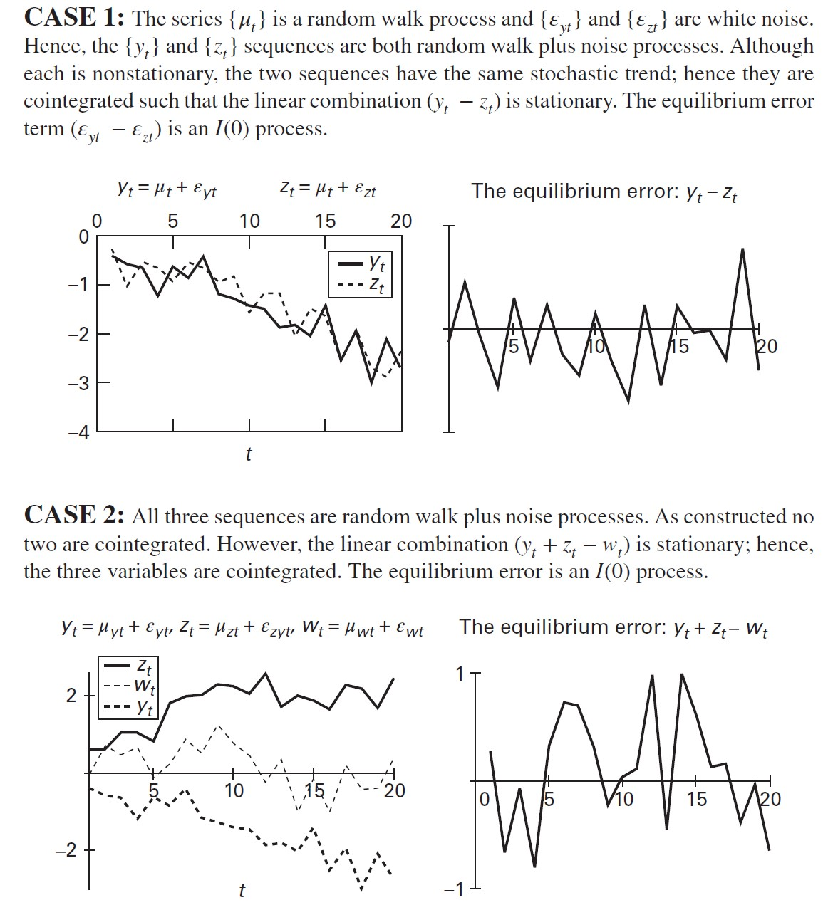


Также рассмотрим пример с тремя интегрированными и не коинтегрированными рядами. Ошибка их линейной комбинации нестационарна (хотя на глаз сказать трудно, нужен тест), и по диаграмме рассеивания также видно отсутствие выраженной линейной связи.

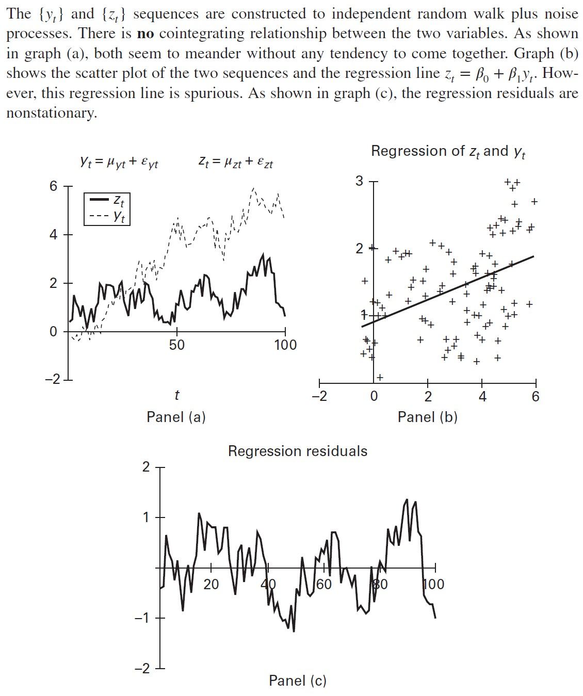


## 2. Коинтеграция и общие тренды.

Наблюдение Stock, Watson (1988), что коинтегрированные переменные по сути обладают общим стохастическим трендом, предлагат удобную парадигму для анализа коинтеграционных соотношений. Для простоты будем по-прежнему рассматривать ситуацию, где $x_t$ состоит только из двух векторов $(y_{t}, z_{t})^T$. Предположим следующую структуру связи, игнорируя сезонные и циклические компоненты:

$$
\begin{cases}
    y_t = \mu_{yt} + e_{yt} \\
    z_t = \mu_{zt}+ e_{zt}
\end{cases}
$$

Где $\mu_{it}$ - стохастический тренд, $e_t$ - случайная ошибка. Если $y_t, z_t$ $C(1, 1)$, то должен существовать вектор $\beta = (\beta_1, \beta_2)$ такой, что линейная комбинация $\beta_1 y_t + \beta_2 z_t$ стационарна. Рассмотрим сумму 

$$
\beta_1 y_t + \beta_2 z_t = \beta_1(\mu_{yt} + e_{yt}) 
+ \beta_2(\mu_{zt} + e_{zt}) = \\
(\beta_1 \mu_{yt} + \beta_2 \mu_{zt}) + (\beta_1 e_{yt}  + \beta_2 e_{zt})
$$

Чтобы совместный процесс был стационарным, необходимо, чтобы $\beta_1 \mu_{yt} + \beta_2 \mu_{zt}$ был стационарной комбинацией. Соответственно, необходимое и достаточное условие для того, чтобы $x_t$ $C(1, 1)$:

$$
\beta_1 \mu_{yt} + \beta_2 \mu_{zt} = 0 \Leftrightarrow \mu_{yt} =- \frac{\beta_2 \mu_{zt}} {\beta_1 }
$$

То есть, получается, что *стохастический тренд должен совпадать с точностью до константы*.

В качестве примера рассмотрим иллюстрацию выше с тремя коинтегрированными переменными. Вспомним, что связь стохастических трендов выражалась следующим образом:

$$
\mu_{wt} = \mu_{yt}+\mu_{zt}
$$

То есть, коинтеграционный вектор для $x_t$ имеет вид $(1, 1, -1)$, и тогда комбинация $y_t + z_t - w_t$ стационарна. Рассмотрим процесс в более общем виде:

$$
y_t + z_t - w_t = (\mu_{yt} + \varepsilon_{yt}) + (\mu_{zt} + \varepsilon_{zt}) - (\mu_{wt} + \varepsilon_{wt}) = \\
\varepsilon_{yt} + \varepsilon_{zt} - \varepsilon_{wt}
$$

Вот мы и получили вывод стационарности процесса.

Подводя итог, можно сказать, что коинтеграция существует тогда, когда стохастический тренд одной переменной выражается как линейная комбинация тренда (трендов) другой переменной (переменных).

В общем виде, 

$$
x_t = \mu_t + e_t
$$

Где $x_t$ - многомерный вектор, матрица из нескольких переменных, $\mu_t$ - многомерный вектор стохастических трендов переменных, $e_t$ - многомерный вектор стационарных частей отдельных переменных. Тогда, если существует коинтеграционный вектор $\beta$, такой что 

$$
\beta \mu_t = 0 \\
\beta x_t = \beta \mu_t + \beta e_t \\
\Leftrightarrow \beta x_t = \beta e_t
$$

Вот мы и получили, что линейная комбинация $\beta x_t$ стационарна.

## 3. Коинтеграция и коррекция ошибок.

Принципиальная идея коинтеграции в том, что траектория коинтегрированных переменных зависит от их отклонения от общего стохастического тренда. По идее, так как каждая переменная состоит из стационарной и нестационарной компонент, то отклонение от общего стохастического тренда, вызванное стационарной компонентой, должно быть временным. 

Рассмотрим пример с краткосрочными и долгосрочными ставками. Теория предполагает, что они коинтегрированы. Краткосрочный разрыв в их равновесии может быть компенсирован тремя путями:

1. Изменится краткосрочная ставка
2. Изменится долгосрочная ставка
3. Изменятся обе ставки

Допустим, обе ставки $I(1)$. Тогда модель коррекции ошибок выглядит так:

$$
\begin{cases}
\bigtriangleup r_{St} = \alpha_S (r_{Lt-1} - \beta r_{St-1}) + \varepsilon_{St} \\
\bigtriangleup r_{Lt} = -\alpha_L (r_{Lt-1} - \beta r_{St-1}) + \varepsilon_{Lt} \\
\alpha_S, \alpha_L >0
\end{cases}
$$

Из системы видно, что краткосрочная ставка реагирует на случайные шоки и на разрыв в равновесии в прошлый период между краткосрочной и долгосрочной ставкой. Если отклонение от равновесия положительное, то краткосрочная ставка вырастет, а долгосрочная упадет (второе уравнение).

По предположению о нестационарности, $\bigtriangleup r_{St}$ стацонарна, поэтому левая часть уравнений системы $I(0)$ (для долгосрочной ставки логика аналогичная). Правая часть тоже стационарная, если переменные интегрированы с коинтеграционным вектором $(1, -\beta)$.

Также в модель можно докинуть лагов самих переменных, если надо:

$$
\begin{cases}
\bigtriangleup r_{St} = \alpha_S (r_{Lt-1} - \beta r_{St-1}) + \sum a_{11} (i) \bigtriangleup r_{St-i} + \sum a_{12} (i) \bigtriangleup r_{Lt-i} + \varepsilon_{St} \\
\bigtriangleup r_{Lt} = -\alpha_L (r_{Lt-1} - \beta r_{St-1}) + \sum a_{21} (i) \bigtriangleup r_{Lt-i} + \sum a_{22} (i) \bigtriangleup r_{Lt-i} + \varepsilon_{Lt} \\
\end{cases}
$$

То есть, модель коррекции ошибками - это просто $VAR$, в которую докинули переменные, отвечающие за возвращение коинтегрированных рядов к долгосрочному равновесию. Коэффициенты $\alpha_S, \alpha_L$ отвечают за **скорость подстройки**. 

Теперь сформулируем выводы в более общем виде. В случае $n$ переменных, $n \times 1$ многомерный вектор $x_t = (x_{1t}, x_{2t}, ... x_{nt})$, которые $I(1)$, имеет представление в виде модели коррекции ошибками, если может быть выражен как 

$$
\bigtriangleup x_t = \pi_0 + \pi x_{t-1} + \pi_1 \bigtriangleup x_{t-1} + \pi_2 \bigtriangleup x_{t-2} + ... + \pi_p \bigtriangleup x_{t-p } + \varepsilon_t
$$
Где $\pi_i$ - матрицы коэффициентов. Если система представима в виде модели коррекции ошибками, существует такая комбинация $I(1)$ переменных системы, которая стационарна. Перепишем уравнение:

$$
\pi x_{t-1} = \bigtriangleup x_t - \pi_0 - \sum \pi_i \bigtriangleup x_{t-i} - \varepsilon_t
$$

Откуда следует, что поскольку правая часть стационарна, то и левая должна быть стационарной, а в предположении о существовании коинтеграции каждая строка $\pi$ - это коинтеграционный вектор для $x_t$.

Пара замечаний.

1. Если все элементы $\pi$ равны нулю, то модель - обычная VAR.
2. Если хотя бы один из элементов матрицы $\pi$ $\pi_{jk}$ ненулевой, то $\bigtriangleup x_t$ реагирует на отклонения от равновесия в предыдущем периоде. А значит, *оценивать VAR в первых разностях некорректно*, ведь тогда мы не учтем линейную взаимосвязь нестационарных переменных.

Хороший способ разобрать связь между коинтеграцией и моделью коррекции ошибок - это изучить особенности обычной VAR-модели:

$$
y_t = a_{11} y_{t-1} + a_{12} z_{t-1} + \varepsilon_{yt} \\
z_t = a_{21} y_{t-1} + a_{22} z_{t-1} + \varepsilon_{zt} \\
$$

Используя оператор лага, мы можем переписать модель как 

$$
(1 - a_{11}L) y_t - a_{12} L z_t = \varepsilon_{yt} \\
- a_{21}L y_t + (1 - a_{22} L z_t) = \varepsilon_{zt} \\
$$

В матричной форме:

$$
\begin{bmatrix}
    (1 - a_{11}L) & - a_{12} \\
    - a_{21}L  & (1 - a_{22}L) \\
\end{bmatrix} 
\begin{bmatrix}
    y_t \\
    z_t
\end{bmatrix} = 
\begin{bmatrix}
    \varepsilon_{yt} \\
    \varepsilon_{zt}
\end{bmatrix}
$$

Используя правило Крамера для нахождения обратной матрицы, мы можем выразить $y_t$, $z_t$ как 

$$
\begin{cases}
    y_t = \displaystyle \frac{(1 - a_{22}L) \varepsilon_{yt} + a_{12} L \varepsilon_{zt}}{(1-a_{11}L)(1-a_{22}L -  a_{12}a_{21}L^2)} \\[10pt]
    z_t = \displaystyle \frac{ a_{21} \varepsilon_{yt} + (1 - a_{11}L) \varepsilon_{zt}}{(1-a_{11}L)(1-a_{22}L -  a_{12}a_{21}L^2)}
\end{cases}
$$

Обозначим характеристические корни многочленов из знаменателей как $\lambda = 1/L$ и запишем характеристическое уравнение как 

$$
\lambda^2 - (a_{11} + a_{22})\lambda + (a_{11} a_{22} - a_{12} a_{21}) = 0
$$

Так как характеристическое уравнение общее для обоих рядов, перейдем к выводам:

1. Если оба корня характеристического многочлена $(\lambda_1, \lambda_2)$ лежат внутри единичного круга (то есть корни $L$ больше единицы), то имеется стабильное решение для последовательностей $y_t$, $z_t$. Если число наблюдений достаточно большое, то условие стабильности гарантирует, что переменные стационарные, а значит, они не могут быть интегрированы порядка 
2. Если один из корней лежит вне единичного круга, то решения не сходятся, и не одна из переменных не может быть стационарной даже в разностях, а значит, не может быть коинтегрирована с другой. Если оба характеристических корня единичные, то последовательности стационарны во вторых разностях $(I(2))$, а значит, они не могут быть интегрированы порядка 1.
3. Если $a_{12} = a_{21} = 0$, решение тривиальное. Чтобы $y_t$ и $z_t$ были процессами с единичными корнями, необходимо, чтобы $a_{11}=a_{22}=1$. Тогда $\lambda_1 = \lambda_2=1$, а значит, обе последовательности двигаются без какой-либо долгосрочной связи, и между ними не может быть коинтеграции.
4. Чтобы $y_t$, $z_t$ были $CI(1, 1)$, необходимо, чтобы один корень был единичным, а другой меньшим, чем единица, по модулю. Тогда у обеих переменных будет стохастический тренд, и первая разность обеих переменных будет стационарной. Например, если $\lambda_1=1$, мы получаем 

$$
y_t = \frac{(1-a_{22}L) \varepsilon_{yt} + a_{12}L \varepsilon_{zt}}{(1-L)(1-\lambda_2 L)}
$$

Умножим на $(1-L)$:

$$
(1-L)y_t = \bigtriangleup y_t = \frac{(1-a_{22}L) \varepsilon_{yt} + a_{12}L \varepsilon_{zt}}{1-\lambda_2 L}
$$

Этот процесс стационарен, если $|\lambda_2| < 1$. Поэтому, чтобы убедиться, что переменные $CI(1, 1)$, мы должны потребовать, чтобы один характеристический корень был равен единице, а второй был меньше единицы в абсолютном значении. Требование для большего из корней равняться единице через обычную формулу для корней квадратного уравнения можно записать так:

$$
0.5(a_{11}+a_{22}) + 0.5\sqrt{ (a^2_{11} + a^2_{22}) - 2 a_{11}a_{122} + 4 a_{12}a_{21}} = 1
$$
После некоторых упрощений, формула будет иметь вид

$$
a_{11} = \frac{(1-a_{22}) - a_{12}a_{21}}{1-a_{22}}
$$

Теперь вернемся ко второму характеристическому корню. Так как $a_{12} \neq 0$ и/или $a_{21} \neq 0$, условие $|\lambda_2| < 1$ требует

$$
\begin{cases}
    a_{22} > 1 \\
    a_{12} a_{21} + a_{22}^2 < 1
\end{cases}
$$

Все эти ограничения нужно наложить на систему двух переменных, описанную выше, чтобы переменные были $CI(1,1)$. Чтобы посмотреть, как эти ограничения повлиют на систему, перепишем ее как

$$
\begin{bmatrix}
    \bigtriangleup y_t \\
    \bigtriangleup z_t
\end{bmatrix} = 
\begin{bmatrix}
    a_{11}-1 & a_{12} \\
    a_{21}  & a_{22} - 1 \\
\end{bmatrix} 
\begin{bmatrix}
    y_t \\
    z_t
\end{bmatrix} + 
\begin{bmatrix}
    \varepsilon_{yt} \\
    \varepsilon_{zt}
\end{bmatrix}
$$

Наложив ограничение $a_{11} -1 = -a_{12}a_{21}/(1 - a_{22}$, мы можем переписать систему в виде

$$
\bigtriangleup y_t = - \frac{a_{12} a_{21} y_{t-1}}{1 - a_{22}} + a_{12} z_{t-1} + \varepsilon_{yt} \\
\bigtriangleup z_t = a_{12} y_{t-1} - (1 - a_{22}) z_{t-1} + \varepsilon_{zt}
$$

Вот мы и получили модель коррекции ошибок. Если $a_{12} \neq 0$ и $a_{21} \neq 0$, мы можем нормализовать коинтеграционный вектор по одной из переменных. Например, по $y_t$:

$$
\begin{cases}
\bigtriangleup y_t = \alpha_{y} (y_{t-1}-\beta z_{t-1}) + \varepsilon_{yt} \\
\bigtriangleup z_t = \alpha_{z} (y_{t-1}-\beta z_{t-1}) + \varepsilon_{zt} \\[7pt]
\alpha_y = - a_{12} a_{21} / (1- a_{22}) \\
\alpha_z = a_{21} \\
\beta = (1 - a_{22}) / a_{21}
\end{cases}
$$

Хотя оба коэффициента $a_{12}, a_{21}$не могут одновременно равняться нулю, интересный случай возникает, когда один из них равен нулю. Например, если $a_{12}=0$, $\alpha_y=0$. Тогда $y_t$ реагирует только на собственные шоки и не подстраивается в зависимости от отклонений от долгосрочного равновесия, то есть ее можно назвать **слабо экзогенной**. 

Подытожим.

1. Ограничения, которые налагаются на значения коэффициентов системы, гарантируют существование модели коррекции ошибками. В нашем случае, обе переменные нестационарны, но они коинтегрированы с коинтеграционным вектором $(1, -(1 - a_{22})/a_{21})$. **Теорема Грейнджера** говорит, что для любого набора $I(1)$ переменных существование коинтеграции между переменными и существование модели коррекции ошибками равнозначно.
2. Коинтеграция налагает ограничения на коэффициенты VAR - можно рассматривать модель коррекции ошибок как VAR с ограничениями. Также из уравнения общего вида для коинтегрированной системы можно понять, что условие $\pi \neq 0$ можно трансформировать в проверку ранга матрицы $\pi$. Например, в нашем примере, если больший из корней равен единице, то определитель равен нулю, а ранг матрицы равен единице. Если бы ранг был равен нулю, то тогда $a_{11}=a_{22}=1, a_{12}=a_{21}=0$. VAR имела бы тогда вид $\bigtriangleup y_t = \varepsilon_{yt}, \bigtriangleup z_t = \varepsilon_{zt}$. То есть оба временных ряда - это просто процессы с единичным корнем и безо всякой коинтеграции. Если же ранг матрицы полный, то обе последовательности стационарны.
3. Как правило, обе переменные в коинтегрированной системе будут реагировать на отклонения от равновесия. Тем не менее, можно рассмотреть и такую систему, где одна из переменных будет слабо экзогенной.

Также *можно переопределить понятие причинности по Грэйнджеру для коинтегрированной системы.* Теперь $y_t$ не причинен по Грэйнджеру для $z_t$, если лаги $\bigtriangleup y_{t-i}$ бесполезны при прогнозировании $\bigtriangleup z_t$, и если $z_t$ не реагирует на отклонения от равновесия (то есть если эта переменная слабо экзогенна). 

### Обобщение на случай n переменных.

Все выводы из двумерного случая сохраняются, но появляетя интересная возможность существования множественных коинтеграционных векторов. Рассмотрим модель векторной авторегрессии с $n$ переменными в общем виде:

$$
x_t = A_1 x_{t-1} + \varepsilon_t \\
x_t - x_{t-1} = \bigtriangleup x_{t} = (A_1 - I) x_{t-1} + \varepsilon_t = \\
= -(I - A_1) x_{t-1} + \varepsilon_t = \pi x_{t-1} + \varepsilon_t
$$

Где размерность $A$ - $n \times n$, а $\pi = -(I - A_1)$. То есть у нас в модели пока только один лаг. Если конитеграции нет, $rank(\pi) = 0$ и $\bigtriangleup x_t = \varepsilon_t$, то есть каждый регрессор - процесс с единичным корнем, и его разность стационарна.

Рассмотрим противоположный случай: если $\pi$ полного ранга, то получаем $n$ коинтеграционных векторов:

$$
\begin{cases}
\pi_{11} x_{1t} + \pi_{12} x_{2t} + ... + \pi_{1n} x_{nt} = 0 \\
\pi_{21} x_{1t} + \pi_{22} x_{2t} + ... + \pi_{2n} x_{nt} = 0 \\
... \\
\pi_{n1} x_{1t} + \pi_{n2} x_{2t} + ... + \pi_{3n} x_{nt} = 0 \\
\end{cases}
$$

Каждое из этих уравнений - независимое ограничение на долгосрочное решение для системы. В таком случае, каждая из переменных должна быть стационарной, поэтому коинтеграции быть не может. Почему? Посмотрим, например, на систему из двух переменных:

$$
\begin{cases}
    \alpha_1 x_t + \alpha_2 y_t = 0 \\
    \alpha_3 x_t + \alpha_4 y_t = 0
\end{cases}
$$

В этом случае мы явным образом можем выразить каждую переменную через другую. И получается, что если все коэффициенты ненулевые, то значит, нулю равны обе переменных. Аналогично можно мыслить и со стационарными процессами: если каждое уравнение системы стационарно, и каждая переменная системы выражается как линейная комбинация всех остальных переменных, то выходит, что все переменные должны быть стационарны. Но тогда мы должны быть уверены, что вся система стационарна.

В промежуточных случаях, когда $0<rank(\pi)=r<n$, имеется $r$ коинтеграционных векторов. Например, если коинтеграционный вектор один, то можно записать коинтеграционное уравнение и нормализовать его по первой переменной:

$$
\bigtriangleup x_{1t} = \pi_{11} x_{1t-1} + \pi_{12} x_{2t-1} + ... + \pi_{1n} x_{nt-1} + \varepsilon_t \\
\alpha_1 = \pi_{11} \ and \ \ \beta_{1j} = \pi_{1j}/\pi_{11} \\
\Leftrightarrow \ \bigtriangleup x_{1t} = \alpha_1 (x_{1t-1} + \beta_{12} x_{2t-1} + ... + \beta_{1n} x_{nt-1}) + \varepsilon_t \\
$$

Отсюда следует, что есть три способа тестировать на коинтеграцию. 

* Метод Энгла и Грэйнджера подразумевает проверку, стационарны ли остатки равновесной модели. 
* Johansen (1988) проверяет ранг $\pi$, 
* а метод модели коррекции ошибок изучает скорость коэффициентов подстройки.


## 4. Тестирование на коинтеграцию: методология Энгла-Грэйнджера

1. **Шаг 1.**
Тестирование переменных на порядок их интеграции. Если переменные $I(1)$ или $I(2)$, имеет смысл двигаться дальше.
2. **Шаг 2**. 
Оценивание долгосрочных "равновесных" взаимосвязей. Если результаты шага 1 свидетельствуют, что все переменные (например, их две) $I(1)$, то можно оценить модель долгосрочного равновесия в форме $y_t = \beta_0 + \beta_1 x_t + \varepsilon_t$. Если переменные коинтегрированы, МНК даст состоятельные оценки, а остатки из регрессии (обозначим их за $\hat e_t$) будут стационарны. Проверим остатки с помощью теста Дикого Фуллера, оценив модель вида $\bigtriangleup \hat e_t = a_1 \hat e_{t-1} + \varepsilon_t$. Константу можно и не включать, так как она уже есть в регрессии. Если гипотеза $a_1=0$ не отвергается, в остатках единичный корень и коинтеграции нет. При этом возникает проблема: так как МНК минимизирует квадрат ошибки, то оценка ошибок может быть смещенной в сторону стационарного процесса, поэтому есть отдельные критические значения именно для такой процедуры. Если в остатках есть автокорреляция, надо добавить лаги разностей остатков и снова протестировать $a_1 = 0$, чтобы все было сделано максимально аккуратно.
3. **Шаг 3.**
Оценить модель коррекции ошибок. Если переменные коинтегрированы, ошибки из регрессии на предыдущем шаге могут бысть использованы для оценивания модели коррекции ошибок. Рассмотрим снова пример системы с двумя переменными:

$$
\begin{cases}
    \bigtriangleup y_t = \alpha_1 + \alpha_y [y_{t-1} - \beta_1 z_{t-1}] + \displaystyle \sum_{i=1} a_{11}(i) \bigtriangleup y_{t -i} + \displaystyle \sum_{i=1} a_{12}(i) \bigtriangleup z_{t -i} + \varepsilon_{yt}\\[10pt]
    \bigtriangleup z_t = \alpha_1 + \alpha_z [y_{t-1} - \beta_1 z_{t-1}] + \displaystyle \sum_{i=1} a_{21}(i) \bigtriangleup y_{t -i} + \displaystyle \sum_{i=1} a_{22}(i) \bigtriangleup z_{t -i} + \varepsilon_{zt}
\end{cases}
$$

Где $(1, -\beta_1)$ - собственно, коинтеграционный вектор. Подставляя оценки ошибок из предыдущего шага, получаем

$$
\begin{cases}
    \bigtriangleup y_t = \alpha_1 + \alpha_y \hat e_{t-1} + \displaystyle \sum_{i=1} a_{11}(i) \bigtriangleup y_{t -i} + \displaystyle \sum_{i=1} a_{12}(i) \bigtriangleup z_{t -i} + \varepsilon_{yt}\\[10pt]
    \bigtriangleup z_t = \alpha_1 + \alpha_z \hat e_{t-1} + \displaystyle \sum_{i=1} a_{21}(i) \bigtriangleup y_{t -i} + \displaystyle \sum_{i=1} a_{22}(i) \bigtriangleup z_{t -i} + \varepsilon_{zt}
\end{cases}
$$

Если коэффициенты при оценках ошибок будут незначимы, то мы получим обыкновенную VAR в первых разностях. Так как все элементы уравнений стационарны, то мы можем оценивать ее так же, как VAR, и применять к ней все те же статистические тесты, что и к VAR.

4. **Шаг 4.**
Проверка спецификации модели - есть несколько вариантов:

1. Проверить остатки итоговой модели на белошумность. Если осталась автокорреляция, можно докинуть лагов. Если есть желание, можно с помощью SUR докинуть одним переменным больше лагов, чем другим.
2. Анализ *коэффициентов скорости подстройки*. Они напрямую связаны с характеристическими корнями системы дифференциальных уравнений. Сходимость требует, чтобы для нашего примера с двумя переменными $\alpha_y <0, \alpha_z > 0$. Вот кстати не понял, откуда это условие взялось - да все просто, из обычной логики: если все коэффициенты подстройки будут положительны, то в ответ на отклонение от долгосрочного равновесия каждая из коинтегрированных переменных  будет расти, и система никогда не прийдет к равновесию. Если один из коэффициентов нулевой, мы можем сказать, что одна из переменных слабо экзогенна. Для существования коинтеграции требуется, чтобы хотя бы один из коэффициентов скорости подстройки был ненулевым.
3. Построить функции импульсного  отклика и декомпозицию дисперсии ошибки, но для этого придется провести какую-нибудь процедуру идентификации - например, по Холески. Так как коинтегрированная комбинация нестационарных процессов стационарна, функции импульсного отклика должны убывать и сходиться к нулю.


Важно отметить, что классический $t$-тест неприменим для тестирования значимости коэффициентов коинтеграционного вектора, так как асимптотически эти коэффициенты не имеют $t$-распределение. Допустим, мы оценили модель в форме $y_t = \beta_0 + \beta_1 z_t + e_t$. Даже если переменные коинтегрированы, в остатках может быть автокорреляция. Более того, так как обе переменные определяются в системе совместно, может возникнуть проблема - $z_t$ нельзя считать независимой переменной. Есть только один вариант, при котором применение $t$-статистик оправдано. Допустим, между переменными существует коинтеграционное соотношение, такое что
$$
y_t = \beta_0 + \beta_1 z_t + \varepsilon_{1t} \\
\bigtriangleup z_t = \varepsilon_{2t} \\
E \varepsilon_{1t} \varepsilon_{2t} = 0
$$

В общем, чтобы тестировать значимость коэффициентов во всех остальных случаях, Phillips, Hansen (1990) придумали соответствующую процедуру.

## 2. Пример для методологии Энгла-Грэйнджера

Модели, заданные при симуляции рядов, в таблице ниже. Коинтеграционный вектор $(1, 1, -1)$.

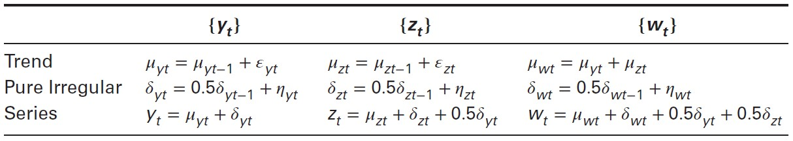

```{r}
# прочитаем данные
s <- read_excel('data/coint6.xls')
glimpse(s)

# нарисуем
plot(1:nrow(s), s$y, type='l', col='gray', 
     main='Динамика 3 рядов', xlab='Время', ylab='Значение ряда',
     ylim = c(-10, 1))
lines(1:nrow(s), s$y, type='p', 
     cex=0.5, pch=24, bg='gray', col='darkgrey')
lines(1:nrow(s), s$z, type='l', col='steelblue')
lines(1:nrow(s), s$z, type='p', 
     cex=0.5, pch=0, bg='steelblue', col='steelblue')
lines(1:nrow(s), s$w, type='l', col='orange')
lines(1:nrow(s), s$w, type='p', 
     cex=0.5, pch=1, bg='orange', col='orange')
legend("bottomleft", 
       legend=c("y", "z", "w"),
       col=c("gray", "steelblue", "orange"), 
       lty=1, cex=0.8)
```

То есть у третьей переменной, $w$ - стохастический тренд, который равен сумме стохастических трендов двух других переменных. Кроме того, нерегулярные компоненты двух других переменных также влияют на $w$.

Допустим, мы знаем модель, по которой генерировались ряды. Вопрос в том, сможет ли методология Энглай-Грэйнджера выявить верную спецификацию. 

```{r}
#|----------------------------------------------------
#|  шаг 1: протестируем ряды на уровень интеграции  --
#|----------------------------------------------------
adf1 = ur.df(s$y,lag=0)
summary(adf1)
adf1 = ur.df(s$y,lag=4)
summary(adf1)
adf2 = ur.df(s$z,lag=0)
adf2@testreg
adf2 = ur.df(s$z,lag=4)
adf2@testreg
adf3 = ur.df(s$w,lag=0)
adf3@testreg
adf3 = ur.df(s$w,lag=4)
adf3@testreg
# все ряды нестационарны порядка 1

#|--------------------------------------------------------------
#|  шаг 2: оценка линейных регрессий и стационарность ошибок  --
#|--------------------------------------------------------------

eq_1 <- lm(y~z+w, data=s)
eq_2 <- lm(z~y+w, data=s)
eq_3 <- lm(w~y+z, data=s)
# сохраним остатки
res_1 <- eq_1$residuals
res_2 <- eq_2$residuals
res_3 <- eq_3$residuals
# посмотрим на оценки коэффициентов
summary(eq_1)
summary(eq_2)
summary(eq_3)
# протестируем остатки
summary(ur.df(res_1, type='none', lags=0))
summary(ur.df(res_2, type='none', lags=0))
summary(ur.df(res_3, type='none', lags=0))
# с другим лагом (если бы данные были квартальные)
summary(ur.df(res_1, type='none', lags=4))
summary(ur.df(res_2, type='none', lags=4))
summary(ur.df(res_3, type='none', lags=4))
# остатки стационарны - данные CI(1, 1)

#|-------------------------------------------
#|  шаг 3: оценка модели коррекции ошибок  --
#|-------------------------------------------

data_ecm <- cbind(diff(s$y), diff(s$z), diff(s$w), res_3[-length(res_3)])
colnames(data_ecm) <- c('dy', 'dz', 'dw', 'error')
ECM <- VAR(data_ecm[ ,c('dy', 'dz', 'dw')], 
           p=1, type = 'const', 
           exogen = data_ecm[ ,c('error')], )
summary(ECM)
```

Как правильно смотреть на результаты? Надо посмотреть на оценки третьего уравнения для $\bigtriangleup w_t$ и вспомнить, что ошибка $e_{wt}$ - это на самом деле коинтеграционная модель $e_{wt-1} = w_{t-1} + 0.08 - 0.99 y_{t-1} - 0.95 z_{t-1} $. При оценивании на реальных данных в модели сохранялась бы некоторая неопределенность - для построения VAR мы могли бы совершенно обоснованно использовать остатки $e_{yt}$ или $e_{zt}$ вместо $e_{wt}$. 

Заметим, что коэффициент скорости подстройки значим только в первом из трех уравнений.

Также отметим, что все в порядке со  знаками коэффициентов скорости подстройки - один из них отрицательный, а значит, система может прийти к долгосрочному равновесию. 

На всякий случай также рассмотрим ситуацию, когда не все переменные в наборе данных коинтегрированы. Например, $x_{1t}, x_{2t}, x_{3t}$ $I(1)$, и коинтеграция вида $x_{1t} - \beta_2 x_{2t}$ есть только для двух переменных. Тогда в регрессиях коэффициенты при $x_{3t}$ должны быть нулевые, а регрессия $x_{3t}$ на остальные переменные не должна выявить коинтеграционное соотношение, так как слева будет нестационарная переменная, а справа стационарная комбинация нестационарных переменных и стационарная компонента временного ряда в виде случайной ошибки и, возможно, лагов.

Опять же, надо быть аккуратным при проверке значимости коэффициентов в уравнениях долгосрочного равновесия, поскольку их асимптотическое распределение - не Стьюдент.

Также, естественно, строить проверить спецификацию модели, протестировав свойства ее остатков, и подобрать оптимальный лаг с помощью, например, информационных критериев.

### Процедура Энгла-Грэйнджера с $I(2)$ переменными.

Множественная коинтеграция - ситуация, когда существует стационарная линейная комбинация $I(1)$ и $I(2)$ переменных. Например, $x_t$, $y_t$ $I(2)$, $z_t$ $I(1)$. Возможно, что существует $I(1)$ комбинация $x_t$, $y_t$ и $I(0)$  комбинация сочетания этих двух переменных с $z_t$. Тогда возможны следующие модели:

$$
x_t = \beta_2 y_t + \alpha_1 z_t \\
x_t = \beta_2 y_t + \gamma_1 \bigtriangleup y_t + \alpha_1 z_t
$$

Второе уравнение подразумевает, что есть $I(1)$ линейная комбинация $x_t - \beta_2 y_t$, которая коинтегрирована с оставшимися $I(1)$ переменными: $\bigtriangleup y_t, z_t$. Поэтому логично разделить оценивание на два шага:

1. сначала оцениваем коинтеграцию между $I(2)$ переменными.
2. потом коинтеграцию их линейной комбинации с оставшимися $I(1)$ переменными.

Если на первом шаге мы ошиблись в спецификации, второй шаг смысл иметь не будет. Поэтому Engsted (1997) предложил сразу за один шаг оценивать максимально полную модель вида 

$$
\begin{cases}
x_{1t} = a_0 + a_1 t + a_2 t^2 + \beta_2 x_{2t} + \beta_3 x_{3t} + \gamma_1 \bigtriangleup x_{2t} + \gamma_2 \bigtriangleup x_{3t} + \alpha_1 z_t + e_t \\
x_{1t}, x_{2t} \sim I(2) \\
x_{3t} \sim I(1)
\end{cases}
$$

Если остатки модели стационарны, имеет место множественная коинтеграция. Критические значения статистик зависят от исла регрессоров и спецификации детерминистических регрессоров.

Пример. Рассмотрим модель, оцененную Haldrup (1994) для спроса на деньги. Наблюдения квартальные:

$$
\begin{cases}
m_t = a_0 + 0.68 p_t + 1.57y_t - 2.67r_t - 2.55\bigtriangleup p_t \\
m_t = a_0 + a_1 t 0.89 p_t + 2.39 y_t - 2.69r_t - 3.25\bigtriangleup p_t \\
m_t, p_t \sim I(2) \\
r_t, y_t \sim I(1) \\
\end{cases}
$$

Тесты показали, что гипотеза о равенстве нулю коэффициента в тесте на стационарность остатков не отвергается на уровне 5%, то есть остатки нестационарны, и, скорее всего, множественной коинтеграции нет.

## 6. Коинтеграция и паритет покупательной способности: пример.

Согласно паритету покупательной способности, в логарифмах обменный курс валюты должен равняться разнице уровня цен. Автор составил коинтеграционную модель:

$$
\begin{cases}
    e_t + p^*_t = \beta_0 + \beta_1 p_t + \mu_t \\
    \mu_t \sim I(0) \\
    \beta_1 = 1
\end{cases}
$$

$\mu$ - просто некоторая стационарная компонента, в которую, например, можно запихнуть лаги разностей нестационарных переменных. Все нужные ряды интегрированы порядка 1. 

Результаты оценивания регрессий для коинтеграционного соотношения:
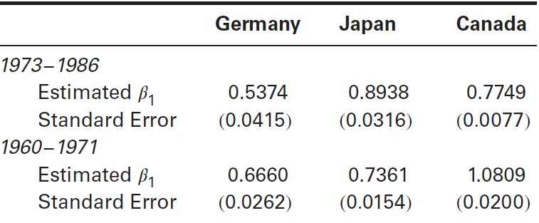


При этом нельзя с уверенностью утверждать, что коэффициент в коинтеграционном векторе равен  единице или неотличим от единицы, так как, еще раз, распределение статистики - не по Стьюденту.

Потом автор проверил остатки каждой из линейных регрессий на единичный корень, табличка показывает результаты для самого важного коэффициента из регрессии Дикого Фуллера:

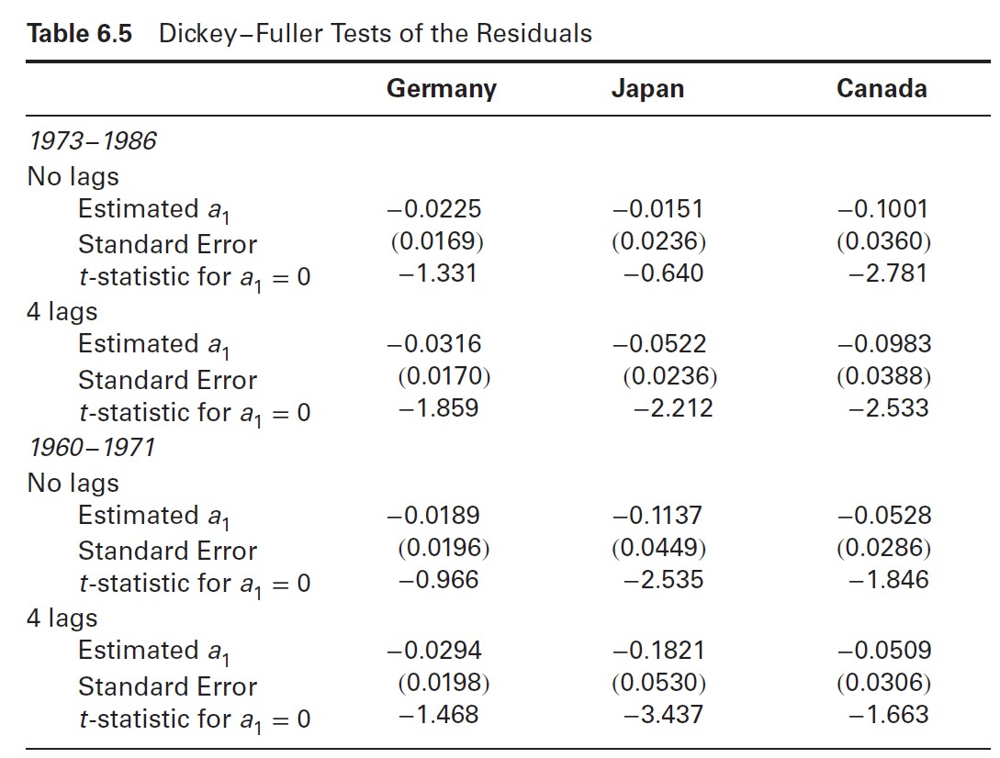

Для всех стран и лагов отвергается гипотеза о стационарности остатков, единственное исключение - Япония (критическое значение статистики на уровне 5% составляет -3.398 дл 100 наблюдений).

В качестве третьего шага автор оценил модели коррекции ошибок для Японии и Штатов:

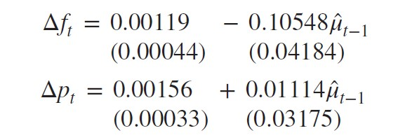


Где $f_t = e_t + p^*_t$, $\hat \mu_{t-1}$ - оценки ошибок из моделей долгосрочного равновесия. 

Подведем итог. У процедуры Энгла-Грейнджера есть несколько недостатков:

1. В случае двух переменных, автор модели должен выбрать, какую переменную ставить влево, а какую вправо - между прочим, от этого зависит оценка коинтеграционного вектора. Также тест на стационарность ошибок этих двух конкурирующих спецификаций эквивалентен только в асимптотике - иными словами, мы можем прийти к разным выводам о наличии коинтеграции в модели с двумя переменными, в зависимости от того, какую переменную мы оставим в левой части уравнения, а какую - в правой. Проблема только нарастает, если переменных больше, чем 2.
2. Процедура Энгла-Грэйнджера основана на двухшаговой оценке - такой подход увеличивает вероятность выбрать неверную спецификацию модели.

## 7. Методология Йохансена: характеристические корни, ранг и коинтеграция

Johansen (1988), Stock & Watson (1988) с помощью оценок ММП избежали двухшагового оценивания и получили возможность тестировать на наличие множественных коинтеграционных векторов, а также накладывать различные ограничения на коинтеграционные вектора и коэффициенты скорости подстройки системы.

По сути, процедура Йохансена - это многомерное обобщение теста Дики-Фуллера. Вспомним уравнение для теста:

$$
y_t = a_1 y_{t-1} + \varepsilon_t \\
\Leftrightarrow \ \bigtriangleup y_t = (a_1 - 1) y_{t-1} + \varepsilon_t
$$

Если $(a_1 - 1)=0$, в ряде есть единичный корень, в противном случае последовательность стационарна. Теперь обобщим это на случай $n$ переменных:

$$
x_t = A_1 x_{t-1} + \varepsilon_t \\
\bigtriangleup x_t = A_1 x_{t-1} - x_{t-1} + \varepsilon_t = \\
= (A_1 - I) x_{t-1} + \varepsilon_t = \pi x_{t-1} + \varepsilon_t
$$

Ранг $\pi$ равен числу коинтеграционных векторов. Если ранг равен нулю, то все ряды в модели - единичные корни, независимые между собой с точки зрения коинтеграции. Если характеристические корни больше единицы и ранг полный, все переменные стационарны.

Перепишем немного предыдущее уравнение, включив в него drift, который представляет собой по сути линейный временной тренд для рядов в уровнях, поскольку мы добавляем константу в модель для разностей рядов:

$$
\bigtriangleup x_t = A_0 + \pi x_{t-1} + \varepsilon_t
$$

То есть, математическое ожидание в долгосрочном периоде $t$ для рядов системы просто $A_0 \times t$.

Для примера, рассмотрим коинтегрированную систему

$$
\begin{bmatrix}
    \bigtriangleup y_t \\
    \bigtriangleup z_t \\
\end{bmatrix} = 
\begin{bmatrix}
    -0.2 & 0.2 \\
    0.2 & -0.2 \\
\end{bmatrix} 
\begin{bmatrix}
     y_{t-1} \\
     z_{t-1} \\
\end{bmatrix} +
\begin{bmatrix}
     \varepsilon_{yt} \\
     \varepsilon_{zt} \\
\end{bmatrix} 
$$

Где коинтеграционное отношение имеет вид

$$
-0.2 y_{t-1} + 0.2 z_{t-1} = 0 \Leftrightarrow y_t = z_t
$$

Теперь попробуем сгенерировать случайным образом наблюдения для этой системы, а также добавим в систему различные константы и посмотрим, как в таком случае будет выглядеть динамика рядов:

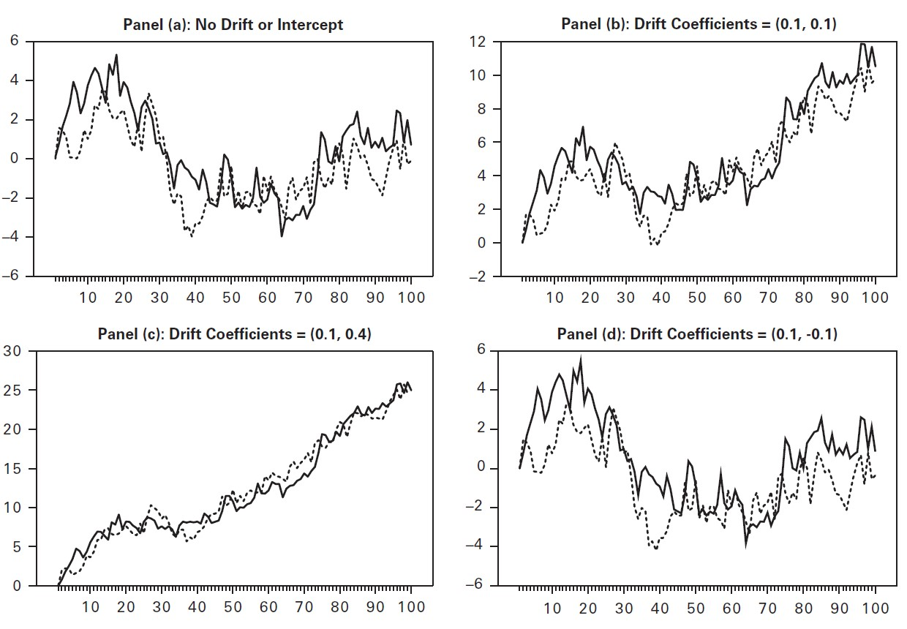

Важно отметить, что при наличии дрифта сонаправленное движение последовательностей - вовсе не результат того, что значения дрифта на правом верхнем графике одинаковые. Если еще раз вернуться к записи для многомерной системы в общем виде:

$$
\bigtriangleup x_t = A_0 + \pi x_{t-1} + \varepsilon_t
$$

Станет ясно, что стационарность обеих частей уравнения требует, чтобы дрифт вошел в коинтеграционное уравнение в виде линейного тренда. Возникает логичный вопрос, а как же включить в коинеграционное уравнение именно константу?

Один способ - это наложить ограничения на значения матрицы $A_0$. Например, если ранг матрицы $\pi$ равен единице, то строки матрицы будут различатся только на скалярный множитель, и мы можем переписать систему как 

$$
\bigtriangleup x_{1t} = \pi_{11} x_{1t-1} + \pi_{12} x_{1t-2} + ... + \pi_{1n} x_{nt-1}  + a_{10} + \varepsilon_{1t} \\
\bigtriangleup x_{2t} = s_2(\pi_{11} x_{1t-1} + \pi_{12} x_{1t-2} + ... + \pi_{1n} x_{nt-1})  + a_{20} + \varepsilon_{2t} \\
... \\
\bigtriangleup x_{nt} = s_n(\pi_{11} x_{1t-1} + \pi_{12} x_{1t-2} + ... + \pi_{1n} x_{nt-1})  + a_{n0} + \varepsilon_{nt} \\
$$

Наложим ограничение $a_{i0} = s_i a_{10}$ и перепишем систему:

$$
\bigtriangleup x_{1t} = \pi_{11} x_{1t-1} + \pi_{12} x_{1t-2} + ... + \pi_{1n} x_{nt-1}  + a_{10} + \varepsilon_{1t} \\
\bigtriangleup x_{2t} = s_2(\pi_{11} x_{1t-1} + \pi_{12} x_{1t-2} + ... + \pi_{1n} x_{nt-1}  + a_{10}) + \varepsilon_{2t} \\
... \\
\bigtriangleup x_{nt} = s_n(\pi_{11} x_{1t-1} + \pi_{12} x_{1t-2} + ... + \pi_{1n} x_{nt-1}  + a_{n0}) + \varepsilon_{nt} \\
$$

Или, в более компактной форме, 

$$
\bigtriangleup x_t = \pi^* x^*_{t-1} + \varepsilon_t
$$

Где 

$$
\begin{cases}
    x_t = (x_{1t}, x_{2t}, ..., x_{nt})^T \\[7pt]
    x^*_t = (x_{1t-1}, x_{2t-1}, ..., x_{nt-1}, 1)^T \\[9pt]
    \pi^* = 
    \begin{bmatrix}
        \pi_{11} & \pi_{12} & ... & \pi_{1n} & a_{10} \\
        \pi_{21} & \pi_{22} & ... & \pi_{2n} & a_{20} \\
        . & . & ... & . & . \\\
        \pi_{n1} & \pi_{n2} & ... & \pi_{nn} & a_{n0} 
    \end{bmatrix}
\end{cases}
$$

Любопытно, что таким образом мы не получили линейный тренд в данных - ведь константа входит в коинтеграционное уравнение, которое стационарно (убедимся, записав первое из уравнений системы):

$$
\bigtriangleup x_{1t} = \pi_{11} x_{1t-1 } + \pi_{12} x_{1t-1} + ... + \pi_{1n} x_{nt-1 } + a_{10} = 0
$$

Можно также, при желании, засунуть и линейный тренд в уравнения одновременно с константой:

$$
\bigtriangleup x_{1t} = (\pi_{11} x_{1t-1} + \pi_{12} x_{1t-2} + ... + \pi_{1n} x_{nt-1}  + b_{10})  + b_{11} + \varepsilon_{1t} \\
. \\
. \\
. \\
\bigtriangleup x_{nt} = s_2(\pi_{11} x_{1t-1} + \pi_{12} x_{1t-2} + ... + \pi_{1n} x_{nt-1}  + b_{10}) + b_{n1} + \varepsilon_{2t} \\
$$

То есть, получается, что у коинтегрированных переменных будет общий стохастический тренд и общий детерминистический. 

Также можно заметить, что эта модель получилась просто-напросто разложением константы в предыдущей модели на две части: $s_i b_{10} + b_{i1} = a_{10}$. Из этого следует, что нам требуется некоторая стратегия, чтобы отдельно оценить обе константы. В EViews такое оценивание реализовано. В то же время, такая спецификация модели может быть полезна, в случае, если предполагается, что переменные обладают не только стохастическим, но и детерминистическим трендом. Тем не менее, разумно включать детерминистический тренд, только если есть серезная уверенность в его существовании - в силу трудностей с его аккуратным оцениванием.

Как и с ADF-тестом, можно добавить лаги в модель:

$$
x_t = A_1 x_{t-1} + A_2 x_{t-2} + ... + A_p x_{t-p} + \varepsilon_t
$$

Вычтем и добавим $A_p x_{t-p+1}$ справа:

$$
x_t = A_1 x_{t-1} + A_2 x_{t-2} + ... + A_{p-2} x_{t-p+2} + (A_{p-1} + A_p) x_{t-p+1} - A_p \bigtriangleup x_{t-p+1} + \varepsilon_t
$$

Теперь вычтем и добавим $(A_{p-1} + A_p) x_{t-p+2}$ справа:

$$
x_t = A_1 x_{t-1} + A_2 x_{t-2} + ... - (A_{p-1} + A_p) \bigtriangleup x_{t-p+2} - A_p \bigtriangleup x_{t-p+1} + \varepsilon_t
$$

Так можно продолжать долго, в итоге получим

$$
\begin{cases}
    \bigtriangleup x_t = \pi x_{t-1} + \displaystyle \sum_{i=1}^{p-1} \pi_i \bigtriangleup x_{t-i} + \varepsilon_t \\[7pt]
    \pi = - \bigg ( I - \displaystyle \sum_{i=1}^{p} A_i \bigg) \\[7pt]
    \pi_i = - \displaystyle \sum_{j=i+1}^{p} A_j
\end{cases}
$$

То есть, при добавлении новых лагов получается двойная сумма коэффициентов в $\pi$, и из нее вычленяют именно саму $\sum_i A_i$. Почему $(I-\sum_{i=1}^p A_i)$? Потому что это и есть запись коинтеграционной матрицы, когда мы все коинтегрированные переменные перенесли влево и теперь у нас весь коинтеграционный вектор находится слева.

Опять же, нам важен только ранг $\pi$. Число независимых коинтеграционных векторов равно рангу матрицы, а он, в свою очередь, равен числу ненулевых характеристических корней матрицы. Допустим, мы получили $n$ характеристических корней $\lambda_1 > \lambda_2 > ... > \lambda_n$. Соответственно, для каждого из корней выражение $ln(1-\lambda_i)=0$ будет выполняться при равенстве корня нулю (вычитание из единицы взялось для удобства расчетов). Если характеристические корни матрицы ненулевые и меньше единицы, то логарифмы для ненулевых корней будут отрицательны. 

Было придумано две тестовые статистики:

$$
\lambda_{trace} (r) = -T \displaystyle \sum_{i=r+1}^n ln(1- \hat \lambda_i) \\
\lambda_{max} (r, r=1) = -T \ ln(1-\hat \lambda_{r+1})
$$

Первая статистика проверяет нулевую гипотезу о том, что число различных коинтеграционных векторов меньше или равно $r$. $\lambda_{trace} = 0 \Leftrightarrow all \ \lambda_i = 0$. Чем больше отличаются корни от нуля, тем более отрицательную сумму мы получим в качестве наблюдаемого значения. 

Вторая статистика проверяет нулеввую гипотезу о равенстве числа коинтеграционных векторов $r$ против альтернативной гипотезы о равенстве числа этих векторов $r+1$. Критические значения для статистик получены с помощью метода Монте-Карло. Их распределения зависят от двух параметров:

1. Числа нестационарных компонент в нулевой гипотезе ($n-r$).
2. Детерминистических элементов, включенных в модель (нет никаких констант и трендов / константа в коинтеграционном уравнении / тренд в общем уравнении ряда / и то и другое).

Как работает логика теста?

Если $\lambda_i < 1$, то чем больше абсолютное значение $\lambda_i$, тем больше по модулю отрицательное значение $ln(1-\lambda_i)$, и тем выше вероятность сущестования коинтеграционного соотношения.

Далее мы сортируем характеристические корни оцененной матрицы по убыванию значения и начинаем двигаться от меньших корней к большим, так как меньшие корни дают меньшую вероятность значимой коинтеграции. 

* **Использование **$\bf{\lambda_{trace}}$. Если мы хотим проверить нулевую гипотезу о существовании коинтеграции в приниципе $H_0: r=0$, мы смотрим на $max(\lambda_{trace}) = \sum_i \lambda_{max \ i}$ и сравниваем со статистикой из таблицы. Если сумма недостаточно велика, то мы отвергаем гипотезу о коинтеграции. Если мы хотим, например, проверить $r \leq 1$ против альтернативной гипотезы $r \ \epsilon [2, 4]$ (например, в системе 4 переменных), то мы суммируем $\lambda_{max}$ с 2 по 4й. Если получившееся значение недостаточно велико, мы не отвергаем нулевую гипотезу.
* **Использование **$\bf{\lambda_{max}}$. Эта статистика позволяет работать с альтернативной гипотезой о конкретном числе коинтеграционных ограничений. Например, чтобы проверить гипотезу о $r=0$ против $r=1$, мы берем $\lambda_{max}$ для самого большого корня  и сравниваем со статистикой. Аналогично, чтобы проверить гипотезу $r=1$ против $r=2$, мы берем $\lambda_{max}$ для второго по значению корня и сравниваем со статистикой.
* Результаты двух тестов могут конфликтовать, обычно ориентируются на $\lambda_{max}$, когда речь идет об определении количества коинтеграционных соотношений. 

Пример того, как могут выглядеть статистики для теста на реальных данных:

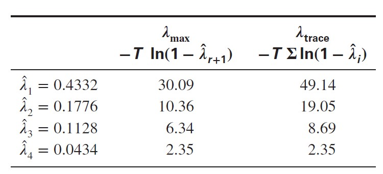

То есть, чтобы проверить гипотезу об отсутствии коинтеграции с помощью $\lambda_{trace}$, нам нужно наблюдаемое значение 49, которое равно сумме всех $\lambda_{max}$. Чтобы проверить гипотезу о единственном коинтеграционном соотношении против двух векторов, нам надо взять 10.36, чтобы проверить гипотезу об отсутствии коинтеграции против гипотезы об одном векторе, нам надо взять 30.09.


## 8. Тестирование гипотез

Как и в тесте Дикого Фуллера, здесь важно правильно выбрать спецификацию детерминистического регрессора, потому что от нее зависит выбор критических значений, насэмплированных с помощью Монте-Карло. Без детерминистических регрессоров критические значения статистик меньше. 

Интересная возможность процедуры Йохансена - можно тестировать ограничения на коинтеграционный вектор. Ключевая идея для этих тестов - *если существует $r$ коинтеграционных векторов в данной системе, то есть только $r$ линейных комбинаций, которые стационарны*. Все остальные комбинации нестационарны. Поэтому, если мы вновь оценим $\pi$, наложив на нее ограничения, то увидим, что число коинтеграционных векторов не уменьшилось, если ограничения незначимы.

Например, мы хотим протестировать гипотезу о константе в коинтеграционном векторе против гипотезы о неограниченном дрифте (прокси на детерминистический тренд переменной, как уже обсуждалось ранее). Оценим обе модели, получим характеристические корни. Для модели с трендом будем называть их $\hat \lambda_i$, для модели с интерсептом - $\hat \lambda^*_i$. Допустим, неограниченная модель имеет $r$ характеристических корней. Тогда асимптотически 
$$
-T \displaystyle \sum_{i=r+1}^n \big[ ln (1- \hat \lambda^*_i) - ln (1- \hat \lambda_i)\big] \sim \chi^2_{n-r}
$$
Если ограничение бессмысленно, то разности и их сумма должны быть близки к нулю, тогда мы включаем интерсепт в модель. Но включение интерсепта в модель увеличивает вероятность, что мы сможем найти новый коинтеграционный вектор, который не нашли раньше, потому что он включает в себя интерсепт. А значит, большие значения статистики говорят в пользу отказа от интерсепта и дальнейшей работы с линейным трендом, так как включение интерсепта в коинтеграционное уравнение искуственно "раздувает" количество коинтеграционных векторов системы.

Чтобы тестировать другие ограничения на коинтеграционный вектор, Йохансен вводит две матрицы, $\alpha$ и $\beta$, каждая размерности $n \times r$, где $r$ - ранг матрицы $\pi$. Эти матрицы таковы, что выполняется 

$$
\pi = \alpha \beta^T
$$

$\alpha$ - матрица весов, с которыми каждый коинтеграционный вектор попадает в уравнения системы, $\beta$ - матрица самих коинтеграционных векторов. Эти две матрицы невозможно оценить с помощью МНК. Но с помощью ММП можно оценить модель коррекции ошибок

$$
\bigtriangleup x_t = \pi x_{t-1} + \displaystyle \sum_{i=1}^{p-1} \pi_i
$$

Из нее получить ранг $\pi$, использовать $r$ самых значимых коинтеграционных векторов, чтобы сформировать $\beta$, и найти $\alpha$ из уравнения $\pi = \alpha \beta^T$.

Рассмотрим оценивание $\alpha$ и $\beta$ на примере системы с одним коинтеграционным вектором. Раз ранг равен единице, все ряды $\pi$ линейно пропорциональны друг другу. Поэтому система имеет вид

$$
\bigtriangleup x_{1t} = \pi_{11} x_{1t-1} + \pi_{12} x_{1t-2} + ... + \pi_{1n} x_{nt-1} + \varepsilon_{1t} \\
\bigtriangleup x_{2t} = s_2(\pi_{11} x_{1t-1} + \pi_{12} x_{1t-2} + ... + \pi_{1n} x_{nt-1}) + \varepsilon_{2t} \\
... \\
\bigtriangleup x_{nt} = s_n(\pi_{11} x_{1t-1} + \pi_{12} x_{1t-2} + ... + \pi_{1n} x_{nt-1}) + \varepsilon_{nt} \\
$$

Для простоты мы не стали включать лаги разностей переменных в уравнения системы. Теперь определим $\alpha_i = s_i \pi_{11}$ и $\beta_i = \pi_{1i}/\pi_{11}$, после чего в общем виде перепишем одно из уравнений системы как 

$$
\bigtriangleup x_{1t} = \alpha_i ( x_{1t-1} + \beta_2 x_{1t-2} + ... + \beta_n x_{nt-1}) + \varepsilon_{1t} 
$$

Или, в матричной форме, добавив лаги разностей переменных, получим

$$
\bigtriangleup x_t = \displaystyle \sum_{i=1}^{p-1} \pi_i \bigtriangleup x_{t-i} + \alpha \beta^T x_{t-1} + \varepsilon_t
$$

Где единственный коинтеграционный вектор - $\beta=(1, \beta_2, ..., \beta_n)$, а $\alpha = (\alpha_1, \alpha_2, ...)$ - коэффициенты скорости подстройки.

Теперь в векторном виде рассмотрим разложение $\pi$ на $\alpha$ и $\beta$. Идея заключается в том, что если у нас несколько коинтеграционных векторов, то в уравнение для каждой переменной системы будут входить несколько отклонений от долгосрочного равновесия со своими коэффициентами скорости подстройки. Посмотрим на примере системы с тремя переменными. Начнем с 1 коинтеграционного вектора:

$$
\pi x_t = 
\begin{bmatrix}
    \pi_{11} & \pi_{12} & \pi_{13} \\
    \pi_{21} & \pi_{22} & \pi_{23} \\
    \pi_{31} & \pi_{32} & \pi_{33} 
\end{bmatrix} 
\begin{bmatrix}
    x_t \\
    y_t \\
    z_t 
\end{bmatrix} = 
\begin{bmatrix}
    \alpha_{11} \\
    \alpha_{21} \\
    \alpha_{31} 
\end{bmatrix} 
\begin{bmatrix}
    1 & -\beta_{11} & -\beta_{12}
\end{bmatrix}
\begin{bmatrix}
    x_t \\
    y_t \\
    z_t 
\end{bmatrix} 
$$

Отсюда видно, что в итоге строки матрицы $\pi$ - это просто коинтеграционный вектор $\beta$, каждый раз умноженный на новую $\alpha_{1i}$.

Теперь рассмотрим ситуацию, когда в той же системе два коинтеграционных вектора:

$$
\pi x_t = 
\begin{bmatrix}
    \pi_{11} & \pi_{12} & \pi_{13} \\
    \pi_{21} & \pi_{22} & \pi_{23} \\
    \pi_{31} & \pi_{32} & \pi_{33} 
\end{bmatrix} 
\begin{bmatrix}
    x_t \\
    y_t \\
    z_t 
\end{bmatrix} = 
\begin{bmatrix}
    \alpha_{11} & \alpha_{12}\\
    \alpha_{21} & \alpha_{22}\\
    \alpha_{31} & \alpha_{32}
\end{bmatrix} 
\begin{bmatrix}
    1 & -\beta_{11} & -\beta_{12} \\
    1 & -\beta_{21} & -\beta_{22}
\end{bmatrix}
\begin{bmatrix}
    x_t \\
    y_t \\
    z_t 
\end{bmatrix} 
$$

Теперь видно, что каждый ряд $\pi$ - это линейная комбинация двух отклонений от долгосрочного равновесия, полученных с помощью двух уникальных коинтеграционных векторов.

Как только мы получили $\alpha$ и $\beta$, дальше мы можем проводить различные тесты, сравнивая для нулевой и альтернативной гипотезы количество коинтеграционных векторов. Пусть $\hat \lambda_i, \hat \lambda_2, ...$ и $\hat \lambda^*_i, \hat \lambda^*_2, ...$ представляют собой упорядоченные характеристические корни неограниченной и ограниченной моделей. Тогда, чтобы протестировать ограничения на $\beta$, запишем тестовую статистику 

$$
T\displaystyle \sum_{i=1}^r \big[ln(1- \hat \lambda^*_i) - ln(1- \hat \lambda_i)\big] \sim \chi^2_{k}
$$

Где $k$ - число ограничений, наложенных на матрицу $\beta$, распределение для статистики асимптотическое. Малые значения $\hat \lambda^*_i$ относительно $\hat \lambda_i$ говорят о уменьшении числа коинтеграционных векторов. Тогда ограничение, проверяемое в нулевой гипотезе, значимо, если наблюдаемое значение статистики превосходит критическое. Кажется, автор тут напутал немного: я посмотрел оригинальную работу Йохансена, там наоборот: нулевая гипотеза - что наложенное на систему ограничение валидно, асимптотическое распределение при верной нулевой гипотезе $\chi^2$. Соответственно, при большом $p-value$ нулевая гипотеза не отвергается.

Пример. 

Оценили коинтеграционную модель, в ней два коинтеграционных вектора и 4 переменных, все переменные входят в коинтеграционный вектор. Сформируем гипотезу о равенстве коэффициентов с противоположным знаком при двух первых переменных в обоих коинтеграционных векторах: $H_3: \beta_{1i} = -\beta_{2i}$. Тогда транспонируем матрицу коинтеграционных векторов $\beta$ и запишем ограничение (матрица $H$) на нее:

$$
\begin{bmatrix}
    \beta^r_{11} & \beta^r_{12} \\
    \beta^r_{21} & \beta^r_{22} \\
    \beta^r_{31} & \beta^r_{32} \\
    \beta^r_{41} & \beta^r_{42} \\
\end{bmatrix} = 
H \times \beta = 
\begin{bmatrix}
   -1 & 0 & 0 \\
    1 & 0 & 0 \\
    0 & 1 & 0 \\
    0 & 0 & 1 \\
\end{bmatrix} \times
\begin{bmatrix}
    \beta^u_{11} & \beta^u_{12} \\
    \beta^u_{21} & \beta^u_{22} \\
    \beta^u_{31} & \beta^u_{32} \\
\end{bmatrix} = 
\begin{bmatrix}
    -\beta^u_{11} & -\beta^u_{12} \\
    \beta^u_{1} & \beta^u_{12} \\
    \beta^u_{21} & \beta^u_{22} \\
    \beta^u_{31} & \beta^u_{32} \\
\end{bmatrix}
$$

Сразу видно, что в ограниченной матрице после перемножения $H$ и $\beta$ появились нужные линейные ограничения. Мы также видим, что для неограниченной матрицы коэффициентов пропал один ряд: мы же посчитали, что коэффициенты для второй переменной равны нулю, поскольку эти коэффициенты равны коэффициенту первой переменной с обратным знаком. Поэтому мы позволили себе выкинуть один ряд из матрицы неограниченных коэффициентов.

На мой взгляд, это странно, потому что мы могли бы записать матрицу ограничений и для полной неограниченной матрицы безо всяких удалений строк, ну да ладно, возможно, это как-то связано с выводом распределения для теста.

Также приведем полезную картинку для размерностей неограниченной матрицы и матрицы ограничений, взятых по [отличной ссылке](https://www.r-bloggers.com/2021/12/some-interesting-issues-in-vecm-using-r/):

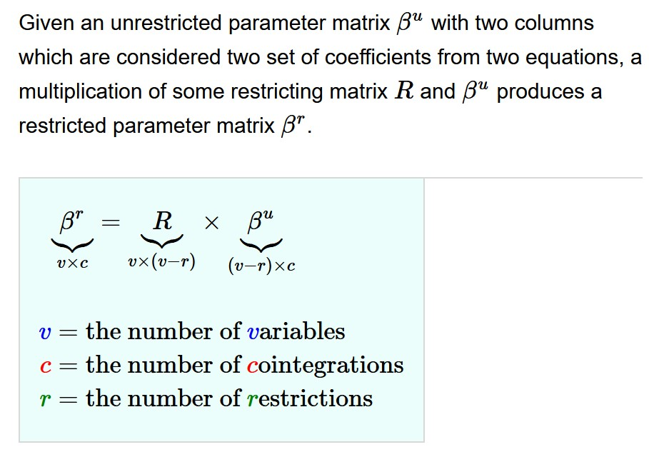

Пример из учебника.
Оценили уравнение 

$$
x_t = 1.03 y_t - 5.21 z_t + 4.22 w_t + 6.06
$$

Потом на коэффициент при $y_t$ наложили ограничение, что он равен единице, и заново оценили модель, получили новые характеристические корни и для них посчитали статистику:

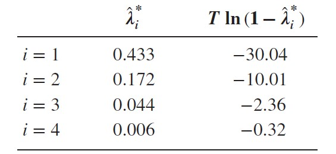

Учитывая, что число ограничений $r=1$ и неограниченная статистика была равна $30.09$, получаем $-30.04 + 30.09 = 0.05$. Распределение - $\chi^2_1$, так как ограничение всего одно. $P-value$ наблюдаемой статистики значимо, нулевая гипотеза о валидности ограничения не отвергается.

Схожим образом можно тестировать ограничения на $\alpha$ - надо наложить на нее ограничения и сравнить $r$ самых значимых характеристических корней для неограниченной и ограниченной моделей. 

Например, мы работаем с моделью, в которой два коинтеграционных вектора и 4 переменных. Мы хотим проверить гипотезу, что коэффициенты скорости подстройки при первых двух переменных равны нулю. Пример [по ссылке](https://www.r-bloggers.com/2021/12/some-interesting-issues-in-vecm-using-r/)

Другая полезная ссылка - [разбор от Kevin Kotze](https://kevinkotze.github.io/ts-10-tut/) на Github.

### Выбор длины лага и тесты на причинность.

Вернемся к рассмотрению системы переменных в виде 

$$
\bigtriangleup x_t = \pi x_{t-1} + \displaystyle \sum_{i=1}^{p-1} \pi \bigtriangleup x_{t-i} + \varepsilon_t
$$

Коэффициенты при лагах разностей можно тестировать, основываясь на предпосылке о нормальном распределении. Гипотезы о длине лага можно тестировать с помощью $\chi^2$ распределения. [Полезная ссылка ](https://statproofbook.github.io/).

Пусть $\Sigma_u$ - ковариационная матрица для неограниченной, а  $\Sigma_r$ - ограниченной системы. Тогда, если $c$ - максимальное число регрессоров, которое содержится в самом длинном уравнении, а $k$ - число ограничений в системе:

$$
(T-c)(log|\Sigma_r| - log|\Sigma_u|) \sim \chi^2_{k}
$$

Также можно использовать традиционные информационные критерии для отбора длины лага. Для выбора длины лага в одном уравнении подходит F-тест.

К сожалению, в коинегрированной системе нельзя проводить тесты на причинность, поскольку они предполагают стандартный F-тест. Рассмотрим пример, когда $rank(\pi)=0$ и система сводится к обычной $VAR$:

$$
\bigtriangleup x_t = \sum_{i=1}^{p-1} \pi_i \bigtriangleup x_{t-i} + \varepsilon_t
$$
В такой спецификации тест на причинность отработает нормально. Но если будет коинтеграция, то в тест попадут коинтеграционные коэффициенты, которые являются множителями нестационарных переменных, поэтому нельзя использовать F-статистику.

## Брать разность или не брать разность.

Если мы хотим построить $VAR$ и включим в модель только разности, хотя между переменными на самом деле существует коинтеграция, то наши оценки коэффициентов будут смещенными. А что будет, если оценить $VAR$ в уровнях для нестационарных переменных, предположив их коинтеграцию, которой на самом деле нет?

1. Тесты будут бесполезны, поскольку лишний лаг
2. Тесты Грэйнджера будут бесполезны, поскольку F-распределение бесполезно
3. Функции импульсного отклика будут бессмысленны - они покажут перманентный эффект шока на ряды, когда в действительности эффект шока должен был бы убывать со временем.

## Тестирование на множественные коинтеграционные векторы.

Непросто интерпретировать коинтеграционные векторы, когда ранг $\pi$ больше единицы. При существовании нескольких коинт. векторов их линейная комбинация - тоже коинт. вектор. Выход один - разумно задавать спецификацию модели, грамотно наложив ограничения на систему.

Если в системе с $n$ переменными есть $r$ коинтеграционных векторов, то для каждой комбинации из $n-r+1$ векторов существует коинтеграционный вектор. Например, для системы из 3 переменных с 2 коинтеграционными векторами существует коинтеграционное соотношение для каждой пары векторов. 

Разберем пример с 4 переменными и 2 коинтеграционными векторами.

$$
\begin{bmatrix}
    1 & -\beta_{12} & -\beta_{13} & -\beta_{14} \\
    1 & -\beta_{22} & -\beta_{23} & -\beta_{24}
\end{bmatrix}
\begin{bmatrix}
    x_{1t} \\
    x_{2t} \\
    x_{3t} \\
    x_{4t} 
\end{bmatrix} = 
\begin{bmatrix}
    0 \\
    0
\end{bmatrix}
$$

Далее будем рассматривать саму матрицу коинтеграционных векторов. Вычтем ряд 1 из ряда 2:

$$
\begin{bmatrix}
    1 & -\beta_{12} & -\beta_{13} & -\beta_{14} \\
    0 & -\beta_{22} + \beta_{12} & -\beta_{23} + \beta_{13}& -\beta_{24}+ \beta_{14}
\end{bmatrix}
$$

Теперь пронормируем второй ряд по $(\beta_{12} - \beta_{22})$:

$$
\begin{bmatrix}
    1 & -\beta_{12} & -\beta_{13} & -\beta_{14} \\
    0 & 1 & -\beta^*_{23} & -\beta^*_{24}
\end{bmatrix}
$$

Теперь мы видим, что $x_{2t}, x_{3t}, x_{4t}$ коинтегрированы между собой. Умножим ряд 2 на $\beta_{12}$ и добавим к первому ряду, получим:

$$
\begin{bmatrix}
    1 & 0 & -\beta^*_{13} & -\beta^*_{14} \\
    0 & 1 & -\beta^*_{23} & -\beta^*_{24}
\end{bmatrix}
$$
Так как в вектор с регрессорами мы можем упаковывать сами регрессоры в любом порядке, то получается, что мы можем собрать коинтегрированную комбинацию из любых трех векторов в системе. При этом мы не накладывали никакие ограничения на существующие стартовые коинтеграционные вектора - просто собрали новые из линейных комбинаций старых. В итоге, для матрицы коинтеграционных соотношений $r \times n$, где $r$ - число коинтеграционных векторов, $n$ - число переменных, можно собрать коинтеграионный вектор из любых $n-r+1$ переменных системы. Это ведет к ряду важных выводов.

**Исключение переменной из уравнения**. При рассмотрении одного элемента из одного отдельного коинтеграционного уравнения при наличии множественных коинтеграционных векторов в системе, мы уже не сможем проверить гипотезу о равенстве конкретного коэффициента нулю. Придется удалить $r$ элементов, и тогда по $\chi^2$ статистике с одним элементом свободы (так как у нас всего одно ограничение) мы сможем протестировать валидность идеи, что у данного набора переменных нет коинтеграции.

**Удаление переменной из системы**. А вот так делать можно, статистика все та же.

**Условные ограничения**. Можно также наложить на один коинтеграционный вектор ограничения, связанные с другими коинтеграционными векторами.

Пример. Cutler, Davis, Smith (1999) рассмотрели систему с 7 переменными:

$$
\begin{cases}
m_t = d_0 + d_1 y_t + d_2 r_t + d_3 p_t + \varepsilon_{1t} \\[5pt]
c_t = a_0 + a_1 y_t + a_2 r_t + \varepsilon_{2t} \\[5pt]
i_t = b_0 + b_1 y_t + b_2 r_t + \varepsilon_{3t} \\[5pt]
im_t = g_0 + g_1 y_t + g_2 r_t + \varepsilon_{4t}
\end{cases}
$$

Вопрос в том, можно ли оценить такую систему с 4 уравнениями для 7 переменных. Как было показано в работе, можно.

## Тестирование на коинтеграцию при I(2) переменных

Методология Йохансена позволяет также тестировать на множественную коинтеграцию (мне кажется, автор имел в виду интегрированные переменные более высокого порядка, чем 1, потому что множественную коинтеграцию и так можно тестировать по тесту Йохансена). Рассмотрим каноническую $VAR$:

$$
\bigtriangleup^2 x_t = \pi x_{t-1} + \Gamma \bigtriangleup x_t + \sum_{i=1}^{p-2} \pi_i \bigtriangleup^2 x_{t-i} + \varepsilon_t
$$
Теперь в контексте коинтеграции нам надо рассматривать и ранг $\pi$, и ранг $\Gamma$.  Для примера возьмем систему с 3 переменными, каждая из которых $I(2)$ и коинтегрирована с другими на двух уровнях коинтеграции, так что

$$
\pi_{11} x_{1t} + \pi_{12} x_{2t} + \pi_{13} x_{3t} + \Gamma_{11} \bigtriangleup x_{1t} + \Gamma_{12} \bigtriangleup x_{2t} + \Gamma_{13} \bigtriangleup x_{3t} = 0
$$

Обратим внимание, что $\Gamma_i$ и $\pi_i$ в данном случае - матрицы. Пусть $r$ - ранг $\pi$, $r_1$ - ранг $\Gamma$, и $r=r_1 =1$. Если $r=0$, нет множественной коинтеграции (будем считать далее, что множественная коинтеграция - это когда в системе есть коинтеграция для переменных, интегрированных разного уровня). Если $r=1$ $r_1=0$, то $\bigtriangleup^2 x_t = \pi x_{t-1} + I(0)$ и у нас снова есть только одно коинтеграционное соотношение - при этом переменные системы CI(2,2). Вроде все просто, но сложность заключается в одновременно надо оценить ранг $\pi$ и $\Gamma$. Посмотрим на примере. Допустим, $I(2)$ переменные коинтегрированы так, что

$$
\pi_{11} x_{1t} + \pi_{12} x_{2t} + \pi_{13} x_{3t} \sim I(1)
$$
Если мы возьмем первые разности, то получим, что 

$$
\pi_{11} \bigtriangleup x_{1t} + \pi_{12} \bigtriangleup x_{2t} + \pi_{13} \bigtriangleup x_{3t} \sim I(0)
$$

То есть мы получили сразу два коинтеграционных вектора для двух разных уровнй коинтеграции. Тем не менее, линейная комбинация двух коинтеграционных соотношений не будет стационарной - посмотрим на разность $I(1)$ и $I(0)$ соотношений:

$$
\pi_{11} x_{1t} + \pi_{12} x_{2t} + \pi_{13} x_{3t} - (\pi_{11} \bigtriangleup x_{1t} + \pi_{12} \bigtriangleup x_{2t} + \pi_{13} \bigtriangleup x_{3t}) = \\
\pi_{11} x_{1t-1} + \pi_{12} x_{2t-1} + \pi_{13} x_{3t-1}
$$

В то же время,

$$
\pi_{11} x_{1t-1} + \pi_{12} x_{2t-1} + \pi_{13} x_{3t-1} \sim I(1)
$$

То есть идея в том, чтобы найти коинтеграционные векторы в $\Gamma$, которые не являются линейной комбинацией векторов $\pi$.

Рассмотрим более общий случай. Пусть $rank(\pi)=r$, $rank(\Gamma)=s$, и вектора в $\Gamma$ ортогональны векторам в $\pi$. В системе с $n$ переменными, где некоторые переменные $I(2)$:

1. $r=0$ - значит, нет стационарных соотношений.
2. $r+s=n-1$ - значит, существует единственный коинтеграционный вектор. Число $I(2)$ стохастических трендов равно $n-r-s$.
3. $s$ должно быть меньше $n-r$, а также требуется, чтобы $s+r<n$. Если $s=n-r$, в системе нет $I(2)$ переменных.

Тест Йохансена на коинтеграцию для $I(2)$ переменных - двухшаговый. Сперва, чтобы получить ранг $\pi$, мы оцениваем модель

$$
\bigtriangleup^2 x_t = \pi x_{t-1} + \Gamma \bigtriangleup x_t + \sum_{i=1}^{p-2} \pi_i \bigtriangleup^2 x_{t-i} + \varepsilon_t
$$

Допустим, мы оценили ранг $\pi$ с помощью $\lambda_{trace}$ или $\lambda_{max}$. На втором шаге, мы оцениваем $s$ на основе нашего знания о $r$. Нулевая гипотеза: $s=s_0$, тестовая статистика:

$$
Q^*_{r,s} = - T \sum_{i=s_0+1}^n ln(1-\hat\lambda_i)
$$

Заметно, что $Q^*_{r,s}$ похожа на $\lambda_{trace}$. Принципиальная разница в том, что мы тестируем ранг $\Gamma$ **в зависимости** от $r$ и ищем число векторов, ортогональных коинтеграционным векторам в $\pi$. В случае, если наблюдаемое значение $Q^*_{r,s}$, мы отвергаем нулевую гипотезу $s=s_0$ в пользу альтернативной $s>s_0$. Табличка критических значений для $r=1$:

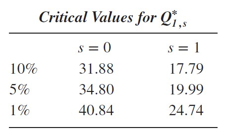

Например, если $r=1$, $Q^*_{r,s}=35$, тогда нулевую гипотезу $r=0$ можно отвергнуть на 5% уровне значимости.


## Пример на методологию Йохансена.

Будем использовать искусственно сгенерированные данные.

**Шаг 1**. Попробуем определить порядок коинтеграции и количество лагов в коинтеграционном соотношении. Для этого нарисуем данные, чтобы понять, есть ли в них линейный тренд, и проведем тест на число лагов в коинтеграционном соотношении.

```{r}
# прочитаем данные
s <- read_excel('data/coint6.xls')
glimpse(s)

# нарисуем
plot(1:nrow(s), s$y, type='l', col='gray', 
     main='Динамика 3 рядов', xlab='Время', ylab='Значение ряда',
     ylim = c(-10, 1))
lines(1:nrow(s), s$y, type='p', 
     cex=0.5, pch=24, bg='gray', col='darkgrey')
lines(1:nrow(s), s$z, type='l', col='steelblue')
lines(1:nrow(s), s$z, type='p', 
     cex=0.5, pch=0, bg='steelblue', col='steelblue')
lines(1:nrow(s), s$w, type='l', col='orange')
lines(1:nrow(s), s$w, type='p', 
     cex=0.5, pch=1, bg='orange', col='orange')
legend("bottomleft", 
       legend=c("y", "z", "w"),
       col=c("gray", "steelblue", "orange"), 
       lty=1, cex=0.8)

# непохоже, чтобы был линейный тренд, предположим, что коинтеграция порядка 1
# не будем дифференцировать и попробуем определить количество лагов в 
# коинтеграционном векторе, протестируем, значимы ли лаги 2-4
var_r <- VAR(s, p=1, type="const")
var_u <- VAR(s, p=4, type="const")

# сохраним ковариационные матрицы остатков моделей
sigma_r <- summary(var_r)$covres
sigma_u <- summary(var_u)$covres

# посчитаем тестовую статистику
# число наблюдений
T <- 100
# число параметров в неограниченной системе
c <- 4*9 + 3 + (9+3)/2
# статистика
chi_obs <- (T-c)*( log(det(sigma_r))- log(det(sigma_u)) ) 
chi_obs
# число ограничений
df <- 3 * 9
# наблюдаемая статистика 2, критическая статистика 40, разницы между 4 и 1 лагом нет
qchisq(p=0.95, df=df)
# поэтому оставляем 1 лаг


# посмотрим, какой лаг нам советуют информационные критерии
VARselect(s)
# 1 лаг
```

**Шаг 2**. Оценим модель вида $\bigtriangleup x_t = A_0 + \pi x_{t-1} + \pi_1 \bigtriangleup x_{t-1} + \varepsilon_t$.

```{r}
# проведем тест на коинтеграцию (lambda trace)
jo.ci = ca.jo(s,type="trace", K=2)
summary(jo.ci)
# проведем тест на коинтеграцию (lambda trace)
lambda_max <- ca.jo(s,type="eigen", K=2)
summary(lambda_max)
# сами собственные значения матрицы
jo.ci@lambda

# трансформируем VECM в VAR
var.ci = vec2var(jo.ci,r=1) 
var.ci

# нарисуем остатки
vecm_errors <- var.ci$resid
colnames(vecm_errors) <- c("y", "z", "w")
vecm_errors <- data.frame(vecm_errors)
plot(1:nrow(vecm_errors), vecm_errors$y, type='l', col='gray', 
     main='Динамика остатков 3 рядов', xlab='Время', ylab='Значение ряда',
     ylim = c(-1, 1))
lines(1:nrow(vecm_errors), vecm_errors$y, type='p', 
     cex=0.5, pch=24, bg='gray', col='darkgrey')
lines(1:nrow(vecm_errors), vecm_errors$z, type='l', col='steelblue')
lines(1:nrow(vecm_errors), vecm_errors$z, type='p', 
     cex=0.5, pch=0, bg='steelblue', col='steelblue')
lines(1:nrow(vecm_errors), vecm_errors$w, type='l', col='orange')
lines(1:nrow(vecm_errors), vecm_errors$w, type='p', 
     cex=0.5, pch=1, bg='orange', col='orange')
lines(1:nrow(vecm_errors), rep(0, nrow(vecm_errors)), type='l', 
       col='black')
legend("bottomleft", 
       legend=c("y", "z", "w"),
       col=c("gray", "steelblue", "orange"), 
       lty=1, cex=0.8)
```

Проверим то, что нам посчитал софт. $T=98$ (100 наблюдений за вычетом двух лагов). Протестируем гипотезу об отсутствии коинтеграции:
$$
\lambda_{trace}(0) = - T [ln (1-\lambda_1) + (1-\lambda_2) + (1-\lambda_3)] = \\
-98 [ln (1-0.326) + (1-0.14032) + (1-0.033168)] = 56.786
$$

Близко к тому, что посчитал $R$, но не совсем совпадает. Видимо, софт считает как-то по-другому немного. На уровне значимости $5\%$ мы можем отвергнуть гипотезу об отсутствии коинтеграции, у нас в системе один коинтеграционный вектор. 

*Шаг 3*. Проанализируем нормализованный коинтеграционный вектор и коэффициенты скорости подстройки. Соответственно, так как у нас 1 коинтеграционный вектор, мы берем первый столбец из матрицы собственных векторов (первый вектор) и видим, что он близок к ожидаемому нами вектору $(0, -1, -1, 1$. Первый столбец loading matrix - веса, с которыми коинтеграционные векторы входят в уравнения, то есть коэффициенты скорости подстройки переменных к коинтеграционным соотношениям. 

Мы можем провести следующие тесты:

* Гипотеза $\beta_0=0$ налагает одно ограничение на коинтеграционный вектор. Поэтому можно провести $LR$-тест, статистика будет иметь $\chi^2$ распределение с 1 степенью свободы. Наблюдаемое значение статистики $\chi^2=0.011$ не значимо на любом разумном уровне значимости, поэтому мы не можем отвергнуть нулевую гипотезу. Как я понял, мы снова берем ковариационные матрицы ошибок из двух оценок систем (с константой и без) и сравниваем их между собой. То есть, тест показал, что в данной модели мы можем игнорировать константы в любой их форме.
*
*


Вопрос в том, как в R добавлять лаги разностей в VECM.


Вот про константу и линейный тренд не до конца понял, разобраться еще раз.


